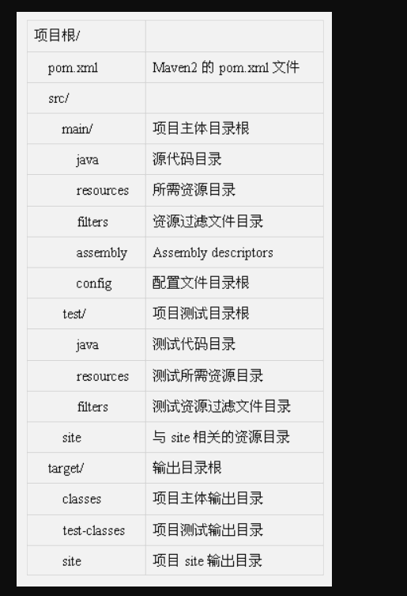

# 1. maven的概念：
**Maven（项目管理和整合工具）**
Maven是基于项目对象模型(POM project object model)，可以通过一小段描述信息（配置）来管理项目的构建，报告和文档的软件项目管理工具
# 2. POM（工程对象模型）：配置文件
   - Dependency：依赖可由maven
   - Coordinates：（坐标）
```
<dependency>
            <groupId>org.springframework.cloud</groupId>
            <artifactId>spring-cloud-commons</artifactId>
            <version>2.1.1.RELEASE</version>
        </dependency>
```
# 3. 在命令行里运行maven项目
命令：mvn archetype:generate -DgroupId=com.xie.www -DartifactId=example -Dpackage=com.xie.www -Dversion=1.0-SNAPSHOT -DarchetypeArtifactId=maven-archetype-webapp
命令解释：
mvn 【核心命令】
archetype:generate 【创建项目】
-DgroupId=com.lewis.seckill【一般使用包名法，域名的反写】
-DartifactId=seckill【项目的名称】 
-Dpackage=com.lewis.seckill【】
-Dversion=1.0-SNAPSHOT【版本号】
-DarchetypeArtifactId=maven-archetype-webapp【表示创建的maven是Java项目】
# 4. maven的项目结构


