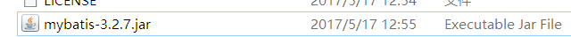
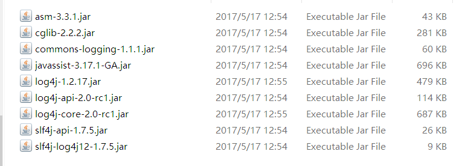
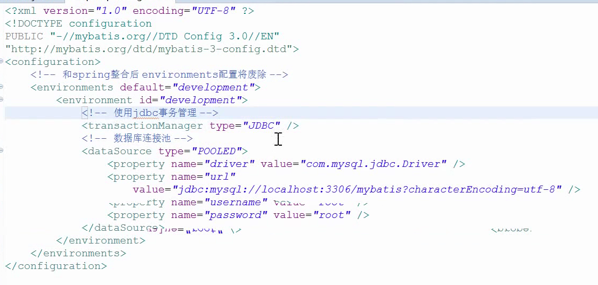
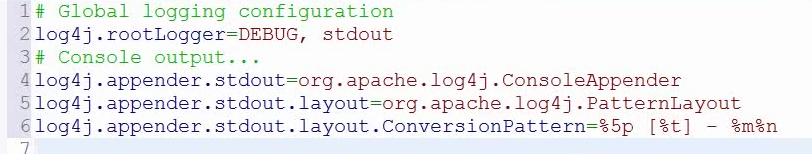
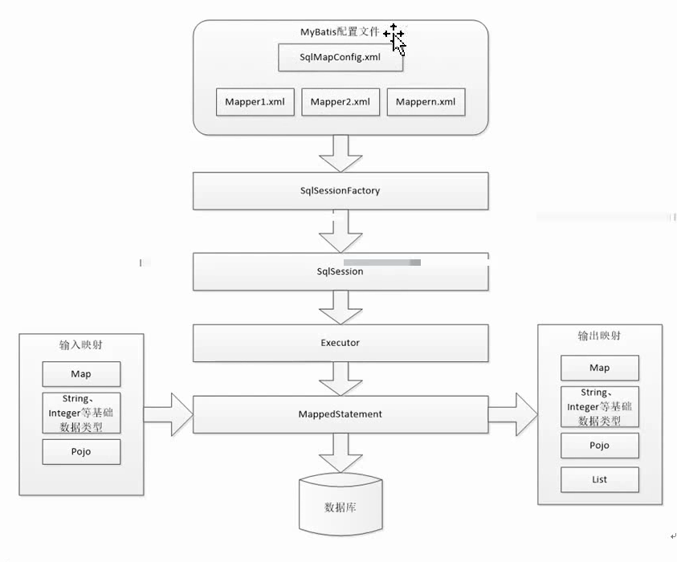
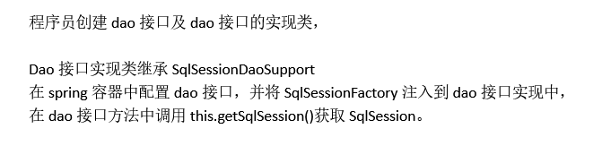
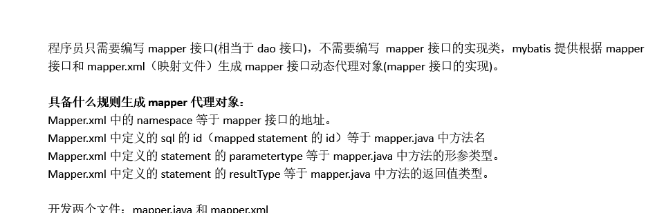
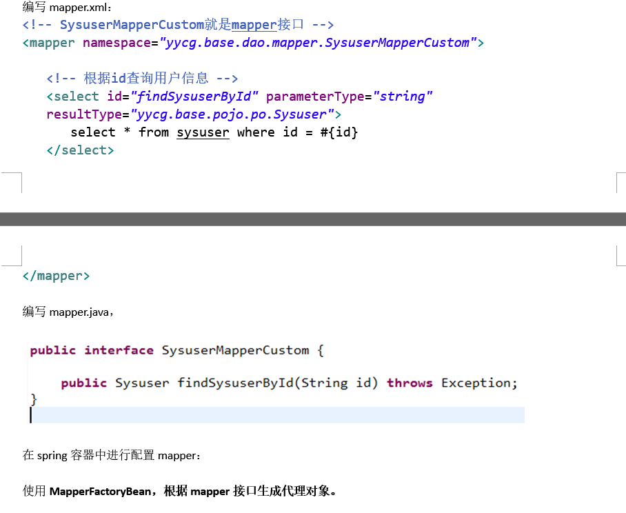
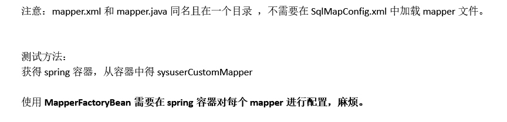
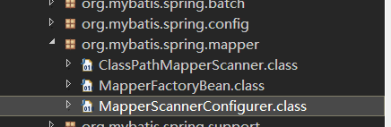

## 1.1. 如何使用
## 1.2. 导入必须的jar包


## 1.3. 配置SalMapConfig.xml文件

## 1.4. 配置log4j.properties

## 1.5. MyBatis架构体系

## 1.6. 动态代理dao开发规则
- namespace必需是接口的全路径名
- 接口的方法名必需与映射文件的sql id一致
- 接口的输入参数必需与映射文件的parameterType类型一致
- 接口的返回类型必须与映射文件的resultType类型一致
另一种说法：
```
Mapper.xml中的namespace等于mapper接口的地址。
Mapper.xml中定义的sql的id（mapped statement的id）等于mapper.java中方法名
Mapper.xml中定义的statement的parametertype等于mapper.java中方法的形参类型。
Mapper.xml中定义的statement的resultType等于mapper.java中方法的返回值类型。
```

# 2. Spring和mybatis整合,dao开发
## 2.1. 方法一

## 2.2. 方法二
- Mapper动态代理（推荐）





- 使用mapper自动扫描器
即使用mybaits和spring整合包中提供的mapper扫描器，自动扫描mapper，生成动态代理对象，在spring容器注册。

开发两个文件：mapper.java和mapper.xml，注意：mapper.xml和mapper.java同名且在一个目录