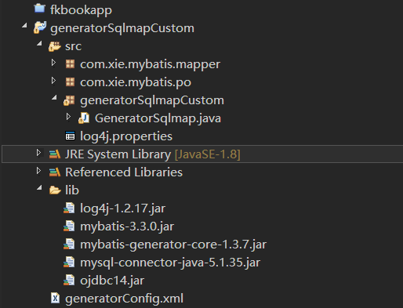

# 1. MyBatis的逆向工程的配置
## 1.1. 项目结构

## 1.2. GeneratorSqlmapCustom.java的代码
```
package generatorSqlmapCustom;

import java.io.File;
import java.io.IOException;
import java.util.ArrayList;
import java.util.List;

import org.mybatis.generator.api.MyBatisGenerator;
import org.mybatis.generator.config.Configuration;
import org.mybatis.generator.config.xml.ConfigurationParser;
import org.mybatis.generator.exception.XMLParserException;
import org.mybatis.generator.internal.DefaultShellCallback;

public class GeneratorSqlmap {

    public void generator() throws Exception{

        List<String> warnings = new ArrayList<String>();
        boolean overwrite = true;
        //指定 逆向工程配置文件
        File configFile = new File("generatorConfig.xml"); 
        ConfigurationParser cp = new ConfigurationParser(warnings);
        Configuration config = cp.parseConfiguration(configFile);
        DefaultShellCallback callback = new DefaultShellCallback(overwrite);
        MyBatisGenerator myBatisGenerator = new MyBatisGenerator(config,
                callback, warnings);
        myBatisGenerator.generate(null);

    } 
    
    
    public static void main(String[] args) throws Exception {
        try {
            GeneratorSqlmap generatorSqlmap = new GeneratorSqlmap();
            generatorSqlmap.generator();
        } catch (Exception e) {
            e.printStackTrace();
        }
                
    }
    
}
```

## 1.3. generatorConfig.xml的代码
```
<?xml version="1.0" encoding="UTF-8"?>
<!DOCTYPE generatorConfiguration
  PUBLIC "-//mybatis.org//DTD MyBatis Generator Configuration 1.0//EN"
  "http://mybatis.org/dtd/mybatis-generator-config_1_0.dtd">

<generatorConfiguration>
    <context id="testTables" targetRuntime="MyBatis3">
        <commentGenerator>
            <!-- 是否去除自动生成的注释 true：是 ： false:否 -->
            <property name="suppressAllComments" value="true" />
        </commentGenerator>
     <!--    数据库连接的信息：驱动类、连接地址、用户名、密码 -->
        <!-- <jdbcConnection driverClass="com.mysql.jdbc.Driver"
            connectionURL="jdbc:mysql://localhost:3306/test" userId="root"
            password="123">
        </jdbcConnection> -->
        <jdbcConnection driverClass="oracle.jdbc.OracleDriver"
            connectionURL="jdbc:oracle:thin:@192.168.233.1:1521:ada"
             userId="system" password="root">
        </jdbcConnection>

        <!-- 默认false，把JDBC DECIMAL 和 NUMERIC 类型解析为 Integer，为 true时把JDBC DECIMAL 和 
            NUMERIC 类型解析为java.math.BigDecimal -->
        <javaTypeResolver>
            <property name="forceBigDecimals" value="false" />
        </javaTypeResolver>

        <!-- targetProject:生成PO类的位置 -->
        <javaModelGenerator targetPackage="com.xie.mybatis.po"
            targetProject=".\src">
            <!-- enableSubPackages:是否让schema作为包的后缀 -->
            <property name="enableSubPackages" value="false" />
            <!-- 从数据库返回的值被清理前后的空格 -->
            <property name="trimStrings" value="true" />
        </javaModelGenerator>
        <!-- targetProject:mapper映射文件生成的位置 -->
        <sqlMapGenerator targetPackage="com.xie.mybatis.mapper" 
            targetProject=".\src">
            <!-- enableSubPackages:是否让schema作为包的后缀 -->
            <property name="enableSubPackages" value="false" />
        </sqlMapGenerator>
        <!-- targetPackage：mapper接口生成的位置 -->
        <javaClientGenerator type="XMLMAPPER"
            targetPackage="com.xie.mybatis.mapper" 
            targetProject=".\src">
            <!-- enableSubPackages:是否让schema作为包的后缀 -->
            <property name="enableSubPackages" value="false" />
        </javaClientGenerator>
        <!-- 指定数据库表 -->
        <table schema="" tableName="sysuser"></table>
        

        <!-- 有些表的字段需要指定java类型
         <table schema="" tableName="">
            <columnOverride column="" javaType="" />
        </table> -->
    </context>
</generatorConfiguration>


```