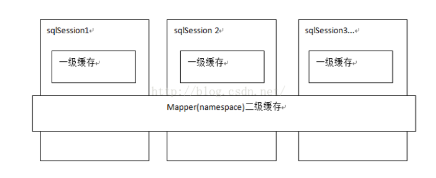
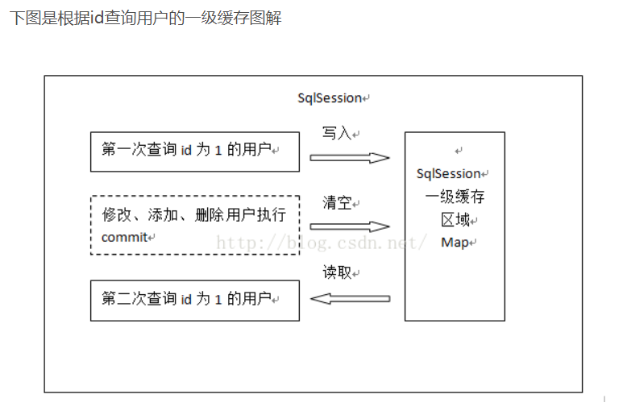
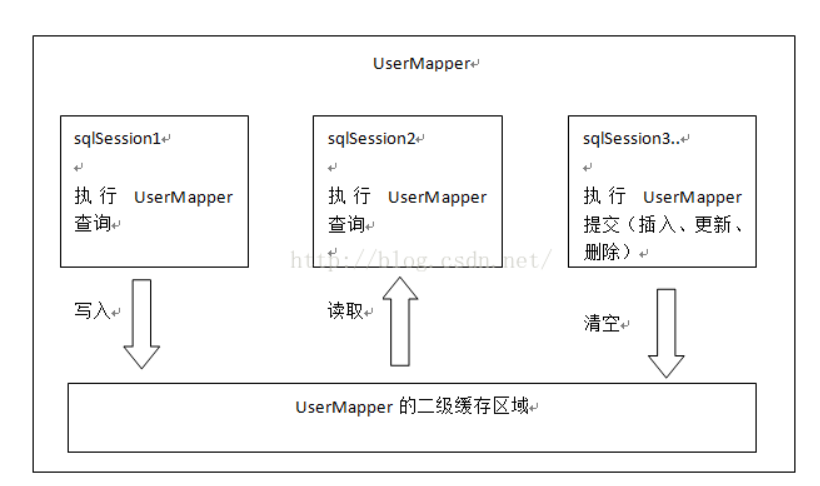

# 1. 一级缓存和二级缓存


# 2. 一级缓存
一级缓存是SqlSession级别的缓存。在操作数据库时需要构造 sqlSession对象，在对象中有一个(内存区域)数据结构（HashMap）用于存储缓存数据。不同的sqlSession之间的缓存数据区域（HashMap）是互相不影响的。

一级缓存的作用域是同一个SqlSession，在同一个sqlSession中两次执行相同的sql语句，第一次执行完毕会将数据库中查询的数据写到缓存（内存），第二次会从缓存中获取数据将不再从数据库查询，从而提高查询效率。当一个sqlSession结束后该sqlSession中的一级缓存也就不存在了。Mybatis默认开启一级缓存
# 3. 二级缓存
二级缓存是mapper级别的缓存，多个SqlSession去操作同一个Mapper的sql语句，多个SqlSession去操作数据库得到数据会存在二级缓存区域，多个SqlSession可以共用二级缓存，二级缓存是跨SqlSession的。

二级缓存是多个SqlSession共享的，其作用域是mapper的同一个namespace，不同的sqlSession两次执行相同namespace下的sql语句且向sql中传递参数也相同即最终执行相同的sql语句，第一次执行完毕会将数据库中查询的数据写到缓存（内存），第二次会从缓存中获取数据将不再从数据库查询，从而提高查询效率。Mybatis默认没有开启二级缓存需要在setting全局参数中配置开启二级缓存。

如果缓存中有数据就不用从数据库中获取，大大提高系统性能
# 4. 一级缓存工作原理


第一次发起查询用户id为1的用户信息，先去找缓存中是否有id为1的用户信息，如果没有，从数据库查询用户信息。

得到用户信息，将用户信息存储到一级缓存中。

 

如果sqlSession去执行commit操作（执行插入、更新、删除），清空SqlSession中的一级缓存，这样做的目的为了让缓存中存储的是最新的信息，避免脏读。

 

第二次发起查询用户id为1的用户信息，先去找缓存中是否有id为1的用户信息，缓存中有，直接从缓存中获取用户信息。
# 5. 二级缓存原理



首先开启mybatis的二级缓存。


sqlSession1去查询用户id为1的用户信息，查询到用户信息会将查询数据存储到二级缓存中。


如果SqlSession3去执行相同 mapper下sql，执行commit提交，清空该 mapper下的二级缓存区域的数据。


sqlSession2去查询用户id为1的用户信息，去缓存中找是否存在数据，如果存在直接从缓存中取出数据。


二级缓存与一级缓存区别，二级缓存的范围更大，多个sqlSession可以共享一个UserMapper的二级缓存区域。数据类型仍然为HashMap

UserMapper有一个二级缓存区域（按namespace分，如果namespace相同则使用同一个相同的二级缓存区），其它mapper也有自己的二级缓存区域（按namespace分）。

每一个namespace的mapper都有一个二缓存区域，两个mapper的namespace如果相同，这两个mapper执行sql查询到数据将存在相同的二级缓存区域中

## 5.1. 配置二级缓存
在核心配置文件SqlMapConfig.xml中加入

```
<setting name="cacheEnabled"value="true"/>

<!-- 全局配置参数，需要时再设置 -->

    <settings>

       <!-- 开启二级缓存  默认值为true -->

    <setting name="cacheEnabled" value="true"/>

    </settings>
```
