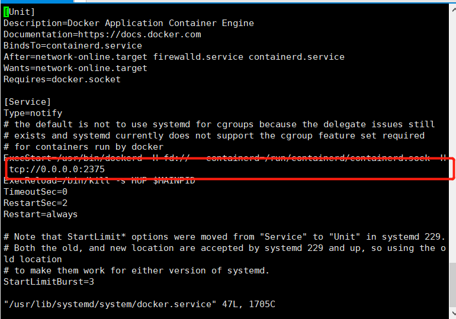
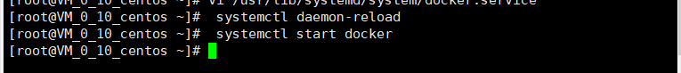
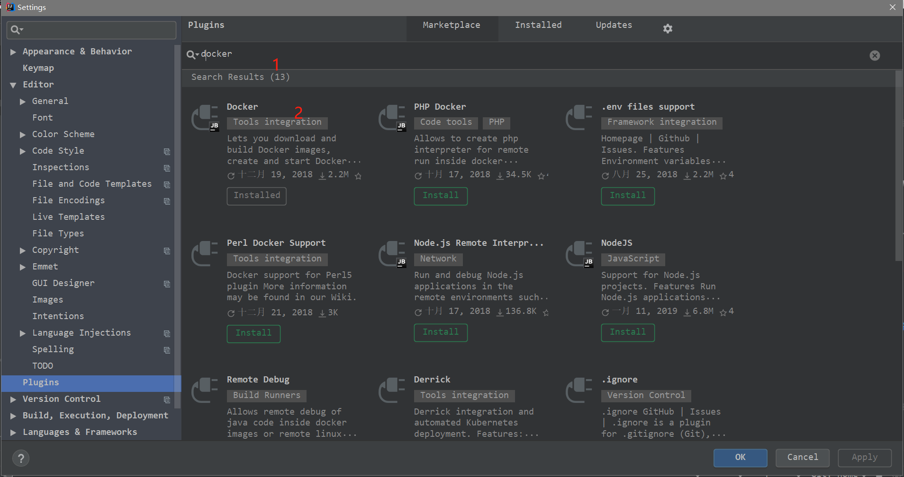
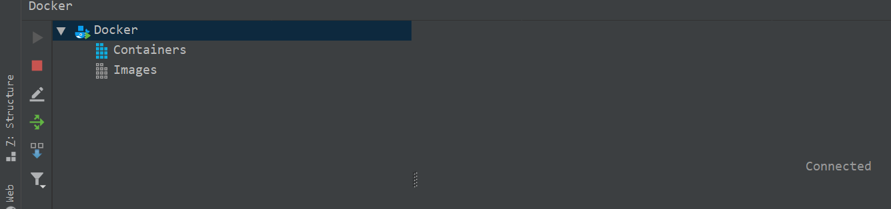
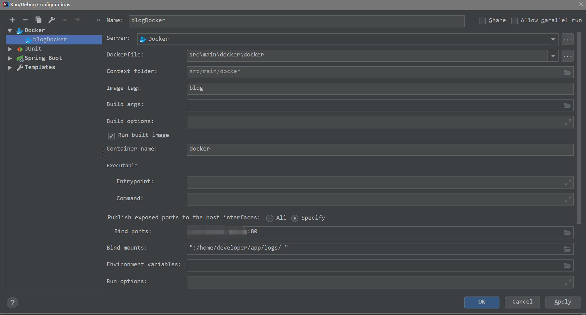

# 1. 腾讯云安装Docker
## 1.1. Docker安装
- 用xshell登陆腾讯云
-在命令上输入
```
curl -sSL https://get.docker.com/ | sh
```
考虑到这里可能会慢,可以用以下命令加快速度
```
curl -sSL https://get.daocloud.io/docker | sh
```
## 1.2. 配置Docker端口
```
  vi /usr/lib/systemd/system/docker.service
```
在找到 ExecStart，在最后面添加 -H tcp://0.0.0.0:2375，如下图所示


## 1.3. 重新启动Docker
```
 systemctl daemon-reload
 systemctl start docker
```


## 1.4. 开放防火墙
```
firewall-cmd --zone=public --add-port=2375/tcp --permanent  
```
## 1.5. 在IDEA搜索插件

安装后重启,既可安装IDEA             
## 1.6. 在腾讯云开放相关的端口规则

我上面是配置2375端口,成功的话则显示下面图片


# 2. IDEA项目
## 2.1. 配置pom文件
```
  <build>
        <plugins>
            <plugin>
                <groupId>org.springframework.boot</groupId>
                <artifactId>spring-boot-maven-plugin</artifactId>
                <configuration>
                    <!-- fork:如果没有该配置，这个devtools不会起作用，即应用不会restart -->
                    <fork>true</fork>
                </configuration>
            </plugin>
            <plugin>
                <groupId>com.spotify</groupId>
                <artifactId>docker-maven-plugin</artifactId>
                <version>1.0.0</version>
                <configuration>
                    <dockerDirectory>src/main/docker</dockerDirectory>
                    <resources>
                        <resource>
                            <targetPath>/</targetPath>
                            <directory>${project.build.directory}</directory>
                            <include>${project.build.finalName}.jar</include>
                        </resource>
                    </resources>
                </configuration>
            </plugin>
            <plugin>
                <artifactId>maven-antrun-plugin</artifactId>
                <executions>
                    <execution>
                        <phase>package</phase>
                        <configuration>
                            <tasks>
                                <copy todir="src/main/docker" file="target/${project.artifactId}-${project.version}.${project.packaging}"></copy>
                            </tasks>
                        </configuration>
                        <goals>
                            <goal>run</goal>
                        </goals>
                    </execution>
                </executions>
            </plugin>
        </plugins>
    </build>
```
## 2.2. 在src/main目录下创建docker目录，并创建Dockerfile文件
```
FROM openjdk:8-jdk-alpine
ADD *.jar app.jar
ENTRYPOINT ["java","-Djava.security.egd=file:/dev/./urandom","-jar","/app.jar"]
```
## 2.3. 在resource目录下创建application.properties文件
```
logging.config=classpath:logback.xml
logging.path=/home/developer/app/logs/
server.port=8990
```
## 2.4. 增加配置


命令解释：
```
Image tag : 指定镜像名称和tag，镜像名称为 docker-demo，tag为1.1
Bind ports : 绑定宿主机端口到容器内部端口。格式为[宿主机端口]:[容器内部端口]
Bind mounts : 将宿主机目录挂到到容器内部目录中。
格式为[宿主机目录]:[容器内部目录]。这个springboot项目会将日志打印在容器 /home/developer/app/logs/ 目录下，将宿主机目录挂载到容器内部目录后，那么日志就会持久化容器外部的宿主机目录中。
```
## 2.5. 运行


