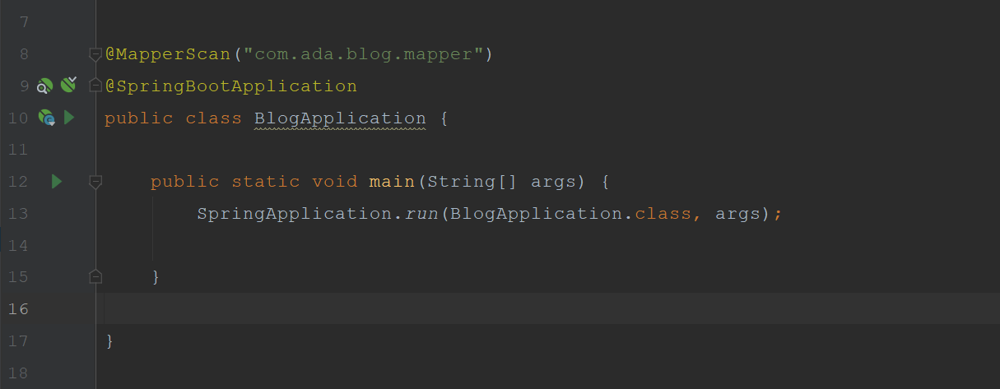
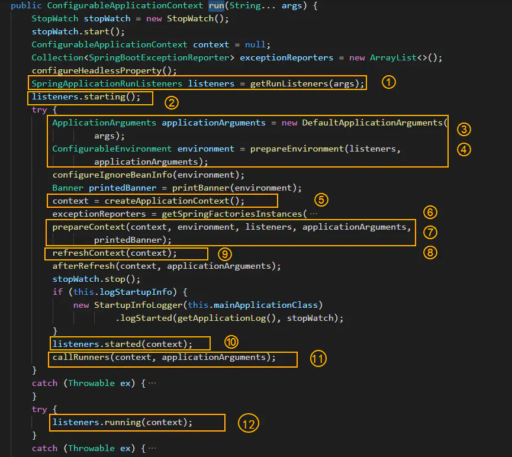
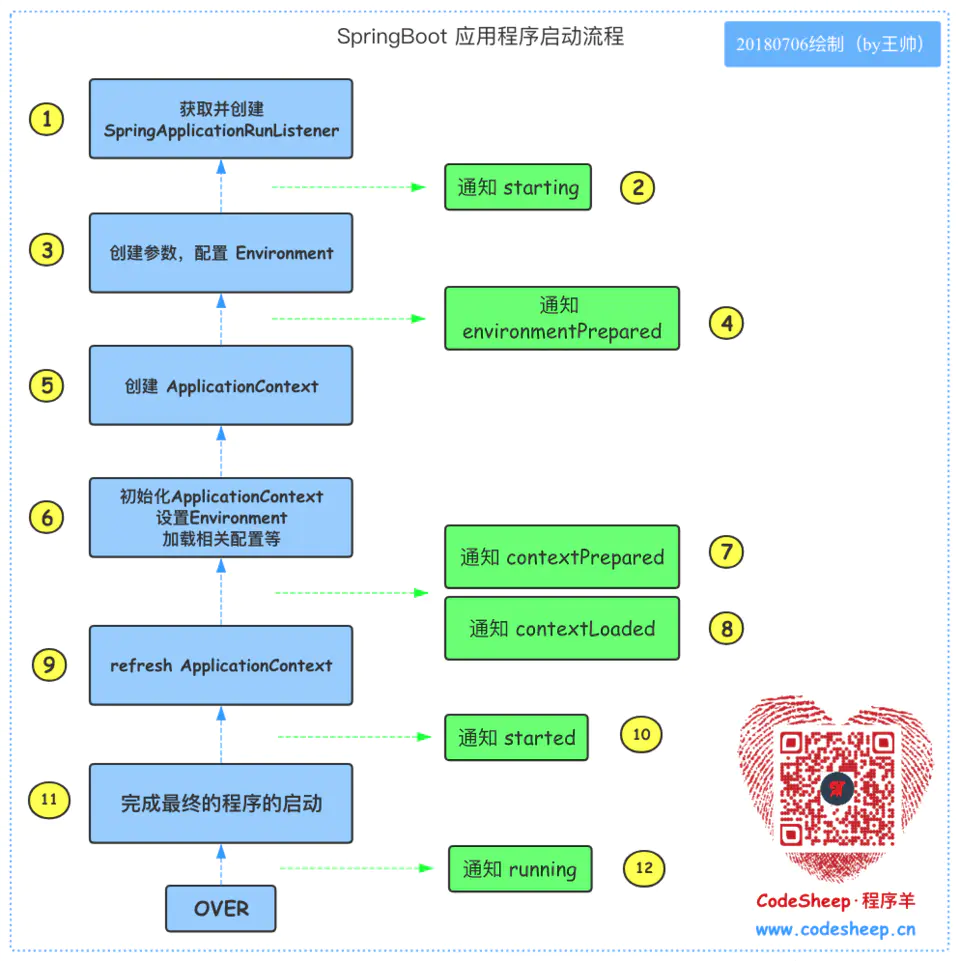

# 1. Spring Boot的启动流程


```
@SpringBootApplication
public class BlogApplication {
	public static void main( String[] args ) {
		// SpringApplication.run( BlogApplication.class args ); // 这是传统SpringBoot应用的启动，一行代码搞定，内部默认做了很多事
		SpringApplication app = new SpringApplication( BlogApplication.class );
		app.setXXX( ... ); // 用户自定的扩展在此 ！！！
		app.run( args );
	}
}
```




- 通过 SpringFactoriesLoader 加载 META-INF/spring.factories 文件，获取并创建 SpringApplicationRunListener 对象
- 然后由 SpringApplicationRunListener 来发出 starting 消息
- 创建参数，并配置当前 SpringBoot 应用将要使用的 Environment
- 完成之后，依然由 SpringApplicationRunListener 来发出 environmentPrepared 消息
- 创建 ApplicationContext
- 始化 ApplicationContext，并设置 Environment，加载相关配置等
- 由 SpringApplicationRunListener 来发出 contextPrepared 消息，告知SpringBoot 应用使用的 ApplicationContext 已准备OK
- 将各种 beans 装载入 ApplicationContext，继续由 SpringApplicationRunListener 来发出 contextLoaded 消息，告知 SpringBoot 应用使用的 ApplicationContext 已装填OK
- refresh ApplicationContext，完成IoC容器可用的最后一步
- 由 SpringApplicationRunListener 来发出 started 消息
完成最终的程序的启动
由 SpringApplicationRunListener 来发出 running 消息，告知程序已运行起来了
至此，全流程结束！