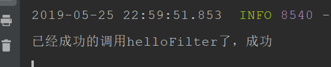

# 1. springboot整合web
## 1.1. 整合json
```
那这样就可以返回json数据
@RestController
public class HelloController {	

    @RequestMapping("/")
    public Map<String ,Object>index() {
        Map<String ,Object> map = new HashMap<String,Object>();
        map.put("msg","test json data");
        return map;
    }
}
```

# 2. springboot整合filter
## 2.1. 使用注解

首先在main方法中添加如下@ServletComponentScan
```
@SpringBootApplication
@ServletComponentScan
public class DemoApplication {
    public static void main(String[] args) {
        SpringApplication.run(DemoApplication.class, args);
    }

}
```

然后在这样写
```
@WebFilter(filterName = "helloFilter",urlPatterns = "/hello")
public class HelloFilter implements Filter {
    @Override
    public void init(FilterConfig filterConfig) throws ServletException {
    }
    
    @Override
    public void doFilter(ServletRequest servletRequest, ServletResponse servletResponse, FilterChain filterChain) throws IOException, ServletException {
        System.out.println("已经成功的调用helloFilter了，成功");
    }

    @Override
    public void destroy() {
    }
}

```

如下图：打印成功

## 2.2. 使用方法
首先，上面的方法还是先写HelloFilter.java方法
```
public class HelloFilter implements Filter {

    @Override
    public void init(FilterConfig filterConfig) throws ServletException {
    }

    @Override
    public void doFilter(ServletRequest servletRequest, ServletResponse servletResponse, FilterChain filterChain) throws IOException, ServletException {
        System.out.println("已经成功的调用myFilter了，成功");
    }

    @Override
    public void destroy() {
    }
}

```

然后main文件里面是这样的：
```
@SpringBootApplication
public class DemoApplication {
    public static void main(String[] args) {
        SpringApplication.run(DemoApplication.class, args);
    }

    @Bean
    public FilterRegistrationBean getFilterRegistrationBean(){
        FilterRegistrationBean bean = new FilterRegistrationBean(new HelloFilter());
        bean.addUrlPatterns("/hell");
        return bean;
    }
}
```

# 3. springboot整合servlet
## 3.1. 使用注解方式
main方法同上：
定义的servlet注解改为
```
@WebServlet(name="xxxx",urlPatterns="xxxx")
```
## 3.2. 使用方法
main方法的方法改为如下，其他注解去掉：
```
@Bean
    public ServletRegistrationBean getServletRegistrationBean(){
        ServletRegistrationBean bean = new ServletRegistrationBean(new SecondServlet());
        bean.addUrlMappings("/servlet");
        return bean ;
    }

```

# 4. springboot整合Listener
## 4.1. 使用注解方式
main方法同上：
定义的Listener注解改为(得继承ServletContextListener)
```
@WebListener
```
## 4.2. 使用方法
main方法的方法改为如下，其他注解去掉：
```
@Bean
    public ServletListenerRegistrationBean getServletListenerRegistrationBean(){
        ServletListenerRegistrationBean bean = new ServletListenerRegistrationBean(new SecondServlet());
        bean.addUrlMappings("/servlet");
        return bean ;
    }

```
# 5. springboot整合Thymeleaf
首先，在pom.xml中添加依赖
```
 <dependency>
            <groupId>org.springframework.boot</groupId>
            <artifactId>spring-boot-starter-thymeleaf</artifactId>
            <scope>test</scope>
        </dependency>
```
配置Controller层。然后编写html标签
```
<!DOCTYPE html>
<html lang="en" xmlns:th="http://www.w3.org/1999/xhtml">
<head>
    <meta charset="UTF-8">
    <title>Thymeleaf</title>
</head>
<body>

<span th:text="hello"></span>
<hr>
<span th:text="${msg}"></span>
</body>
</html>
```
# 6. Springboot整合mybatis
添加依赖：
```
mybatis整合包
<dependency>
			<groupId>org.mybatis.spring.boot</groupId>
			<artifactId>mybatis-spring-boot-starter</artifactId>
			<version>1.3.0</version>
		</dependency>
		
mysql的驱动
<dependency>
			<groupId>mysql</groupId>
			<artifactId>mysql-connector-java</artifactId>
			<version>5.1.35</version>
		</dependency>

连接池
<dependency>
			<groupId>com.alibaba</groupId>
			<artifactId>druid-spring-boot-starter</artifactId>
			<version>1.1.0</version>
		</dependency>

```
在application.properties中配置
```
spring.datasource.driverClassName=com.mysql.jdbc.Driver
spring.datasource.url=jdbc:mysql://localhost:3306:/ada
spring.datasource.username=root
spring.datasource.password=123

spring.datasource.type = com.alibaba.druid.pool.DruidDataSource
mybatis.type-aliases-package= com.ada.demo.pojo;
```