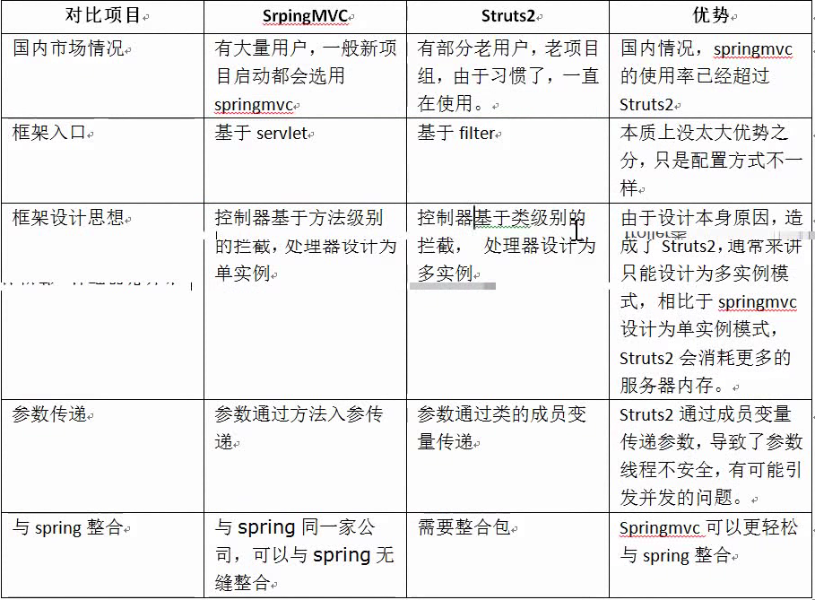
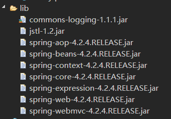

# 1. SpringMVC和strut2的区别

# 2. SpringMVC的配置
## 2.1. 加载相关的jar包

## 2.2. 创建类
## 2.3. web.xml的配置
```
<?xml version="1.0" encoding="UTF-8"?>
<web-app xmlns:xsi="http://www.w3.org/2001/XMLSchema-instance" xmlns="http://java.sun.com/xml/ns/javaee" xsi:schemaLocation="http://java.sun.com/xml/ns/javaee http://java.sun.com/xml/ns/javaee/web-app_2_5.xsd" id="WebApp_ID" version="2.5">
  <display-name>01-springmvc</display-name>
  <welcome-file-list>
    <welcome-file>index.html</welcome-file>
    <welcome-file>index.htm</welcome-file>
    <welcome-file>index.jsp</welcome-file>
    <welcome-file>default.html</welcome-file>
    <welcome-file>default.htm</welcome-file>
    <welcome-file>default.jsp</welcome-file>
  </welcome-file-list>
  
  <!--核心控制器的配置  -->
  <servlet>
  	<servlet-name>springmvc</servlet-name>
  	<servlet-class>org.springframework.web.servlet.DispatcherServlet</servlet-class>
  	
  	<!-- 加载springmvc核心配置文件 -->
  	<init-param>
  		<param-name>contextConfigLocation</param-name>
  		<param-value>classpath:springmvc.xml</param-value>
  	</init-param>
  </servlet>
  
  <servlet-mapping>
  	<servlet-name>springmvc</servlet-name>
  	<url-pattern>*.action</url-pattern>
  </servlet-mapping>
</web-app>
```
## 2.4. SpringMVC的配置

```
<?xml version="1.0" encoding="UTF-8"?>
<beans xmlns="http://www.springframework.org/schema/beans"
	xmlns:xsi="http://www.w3.org/2001/XMLSchema-instance" xmlns:p="http://www.springframework.org/schema/p"
	xmlns:context="http://www.springframework.org/schema/context"
	xmlns:mvc="http://www.springframework.org/schema/mvc"
	xsi:schemaLocation="http://www.springframework.org/schema/beans http://www.springframework.org/schema/beans/spring-beans-4.0.xsd
        http://www.springframework.org/schema/mvc http://www.springframework.org/schema/mvc/spring-mvc-4.0.xsd
        http://www.springframework.org/schema/context http://www.springframework.org/schema/context/spring-context-4.0.xsd">

	<!-- 配置controller扫描包 -->
	<context:component-scan base-package="com.itheima.springmvc.controller" />
</beans>
```