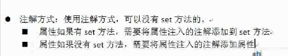
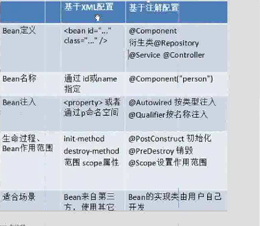

# 1. IoC思想

- 首先想说说**IoC（Inversion of Control，控制倒转）**。这是spring的核心，贯穿始终。所谓IoC，对于spring框架来说，就是由spring来负责控制对象的生命周期和对象间的关系。
- 举个简单的例子，我们是如何找女朋友的？常见的情况是，我们到处去看哪里有长得漂亮身材又好的mm，然后打听她们的兴趣爱好、qq号、电话号、ip号、iq号………，想办法认识她们，投其所好送其所要，然后嘿嘿……这个过程是复杂深奥的，我们必须自己设计和面对每个环节。传统的程序开发也是如此，在一个对象中，如果要使用另外的对象，就必须得到它（自己new一个，或者从JNDI中查询一个），使用完之后还要将对象销毁（比Connection等），对象始终会和其他的接口或类藕合起来。

- 那么IoC是如何做的呢？有点像通过婚介找女朋友，在我和女朋友之间引入了一个第三者：婚姻介绍所。婚介管理了很多男男女女的资料，我可以向婚介提出一个列表，告诉它我想找个什么样的女朋友，比如长得像李嘉欣，身材像林熙雷，唱歌像周杰伦，速度像卡洛斯，技术像齐达内之类的，然后婚介就会按照我们的要求，提供一个mm，我们只需要去和她谈恋爱、结婚就行了。简单明了，如果婚介给我们的人选不符合要求，我们就会抛出异常。整个过程不再由我自己控制，而是有婚介这样一个类似容器的机构来控制。

Spring所倡导的开发方式就是如此，所有的类都会在spring容器中登记，告诉spring你是个什么东西，你需要什么东西，然后spring会在系统运行到适当的时候，把你要的东西主动给你，同时也把你交给其他需要你的东西。所有的类的创建、销毁都由spring来控制，也就是说控制对象生存周期的不再是引用它的对象，而是spring。对于某个具体的对象而言，以前是它控制其他对象，现在是所有对象都被spring控制，所以这叫控制反转。

- IoC的一个重点是在系统运行中，动态的向某个对象提供它所需要的其他对象。这一点是通过**DI（Dependency Injection，依赖注入）**来实现的。比如对象A需要操作数据库，以前我们总是要在A中自己编写代码来获得一个Connection对象，有了spring我们就只需要告诉spring，A中需要一个Connection，至于这个Connection怎么构造，何时构造，A不需要知道。在系统运行时，spring会在适当的时候制造一个Connection，然后像打针一样，注射到A当中，这样就完成了对各个对象之间关系的控制。A需要依赖Connection才能正常运行，而这个Connection是由spring注入到A中的，依赖注入的名字就这么来的。
## 1.1. IOC：控制反转，将对象的创建权反转给Spring
利用**工厂+反射+配置文件**的方式实现程序的解耦合
IOC和DI ，DI:依赖注入，前提必须要有IOC的环境，Spring管理这个类的时候将类的依赖的属性注入（设置）进来

## 1.2. Spring IoC总览

Spring的IoC容器在实现控制反转和依赖注入的过程中,可以划分为两个阶段:

- 容器启动阶段
- Bean实例化阶段

这两个阶段中,IoC容器分别作了以下这些事情:

这里可能会完全搞不懂上面这些东西是什么,不过不要紧,这里只是给大家一个基本的印象,知道Spring的IoC容器在实现控制反转和依赖注入功能的时候不是一蹴而就的,也分了两个阶段,并且大致对两个阶段所做的事情有一个印象,下面我要对每一个阶段的每一项工作都进行深入的讲解,请大家耐心的看下去.

## 1.3. 容器启动阶段的讲解

### 1.3.1. IOC的技术实现方式

“伙计，来杯啤酒！”当你来到酒吧，想要喝杯啤酒的时候，通常会直接招呼服务生，让他为你送来一杯清凉解渴的啤酒。同样地，作为被注入对象，要想让IoC容器为其提供服务，并将所需要的被依赖对象送过来，也需要通过某种方式通知对方。

如果你是酒吧的常客，或许你刚坐好，服务生已经将你最常喝的啤酒放到了你面前
如果你是初次或偶尔光顾，也许你坐下之后还要招呼服务生，“Waiter,Tsingdao, please.”
还有一种可能，你根本就不知道哪个牌子是哪个牌子，这时，你只能打手势或干脆画出商标图来告诉服务生你到底想要什么了吧！

不管怎样，你终究会找到一种方式来向服务生表达你的需求，以便他为你提供适当的服务。那么，在IoC模式中，被注入对象又是通过哪些方式来通知IoC容器为其提供适当服务的呢?

常用的有两种方式：构造方法注入和setter方法注入，还有一种已经退出历史舞台的接口注入方式，下面就比较一下三种注入方式：

- 接口注入。从注入方式的使用上来说，接口注入是现在不甚提倡的一种方式，基本处于“退役状态”。因为它强制被注入对象实现不必要的接口，带有侵入性。而构造方法注入和setter方法注入则不需要如此。

#### 1.3.1.1. 构造方法注入
- 这种注入方式的优点就是，对象在构造完成之后，即已进入就绪状态，可以马上使用。缺点就是，当依赖对象比较多的时候，构造方法的参数列表会比较长。而通过反射构造对象的时候，对相同类型的参数的处理会比较困难，维护和使用上也比较麻烦。而且在Java中，构造方法无法被继承，无法设置默认值。对于非必须的依赖处理，可能需要引入多个构造方法，而参数数量的变动可能造成维护上的不便。

#### 1.3.1.2. setter方法注入
因为方法可以命名，所以setter方法注入在描述性上要比构造方法注入好一些。 另外，setter方法可以被继承，允许设置默认值，而且有良好的IDE支持。缺点当然就是对象无法在构造完成后马上进入就绪状态。其实，这些操作都是由IoC容器来做的，我们所要做的，就是调用IoC容器来获得对象而已。

### 1.3.2. IoC容器及IoC容器如何获取对象间的依赖关系

Spring中提供了两种IoC容器：

BeanFactory
ApplicationContext

这两个容器间的关系如下图：

我们可以看到，ApplicationContext是BeanFactory的子类，所以，ApplicationContext可以看做更强大的BeanFactory，他们两个之间的区别如下：

#### 1.3.2.1. BeanFactory
- 基础类型IoC容器，提供完整的IoC服务支持。如果没有特殊指定，默认采用延迟初始化策略（lazy-load）。只有当客户端对象需要访问容器中的某个受管对象的时候，才对该受管对象进行初始化以及依赖注入操作。所以，相对来说，容器启动初期速度较快，所需要的资源有限。对于资源有限，并且功能要求不是很严格的场景，BeanFactory是比较合适的IoC容器选择。

#### 1.3.2.2. ApplicationContext。
- ApplicationContext在BeanFactory的基础上构建，是相对比较高级的容器实现，除了拥有BeanFactory的所有支持，ApplicationContext还提供了其他高级特性，比如事件发布、国际化信息支持等，ApplicationContext所管理的对象，在该类型容器启动之后，默认全部初始化并绑定完成。所以，相对于BeanFactory来说，ApplicationContext要求更多的系统资源，同时，因为在启动时就完成所有初始化，容器启动时间较之BeanFactory也会长一些。在那些系统资源充足，并且要求更多功能的场中，ApplicationContext类型的容器是比较合适的选择。

但是我们无论使用哪个容器，我们都需要通过某种方法告诉容器关于对象依赖的信息，只有这样，容器才能合理的创造出对象，否则，容器自己也不知道哪个对象依赖哪个对象，如果胡乱注入，那不是创造出一个四不像。理论上将我们可以通过任何方式来告诉容器对象依赖的信息，比如我们可以通过语音告诉他，但是并没有人实现这样的代码，所以我们还是老老实实使用Spring提供的方法吧：

- 通过最基本的文本文件来记录被注入对象和其依赖对象之间的对应关系
`- 通过描述性较强的XML文件格式来记录对应信息`
- 通过编写代码的方式来注册这些对应信息
`- 通过注解方式来注册这些对应信息`

虽然提供了四种方式，但是我们一般只使用xml文件方式和注解方式，所以，就重点讲解这两种方式。
### 1.3.3. 万里长征第一步：加载配置文件信息

我们在介绍了一些基本的概念后，终于要迎来容器创造对象的第一步，那就是加载配置文件信息，我们已经知道我们主要通过xml文件和注解的方式来告诉容器对象间的依赖信息，那么容器怎么才能从xml配置文件中得到对象依赖的信息呢？且听我慢慢道来。（这里的容器指的是

BeanFactory

，至于ApplicationContext，以后会有相应的讲解）

在BeanFactory容器中，每一个注入对象都对应一个BeanDefinition实例对象，该实例对象负责保存注入对象的所有必要信息，包括其对应的对象的class类型、是否是抽象类、构造方法参数以及其他属性等。当客户端向BeanFactory请求相应对象的时候，BeanFactory会通过这些信息为客户端返回一个完备可用的对象实例。

那么BeanDefinition实例对象的信息是从哪而来呢？这里就要引出一个专门加载解析配置文件的类了，他就是BeanDefinitionReader，对应到xml配置文件，就是他的子类XmlBeanDefinitionReader，XmlBeanDefinitionReader负责读取Spring指定格式的XML配置文件并解析，之后将解析后的文件内容映射到相应的BeanDefinition。在我们了解了怎么得到对象依赖的信息，并知道这些信息最终保存在BeanDefinition之后，我们可能会想，那么容器怎么通过这些信息创造出一个可用的对象了呢？

### 1.3.4. 笼统讲解容器中对象的创建和获取

我们把容器创造一个对象的过程称为Bean的注册，实现Bean的注册的接口为BeanDefinitionRegistry，其实BeanFactory只是一个接口，他定义了如何获取容器内对象的方法，我们所说的BeanFactory容器，其实是这个接口的是实现类，但是具体的BeanFactory实现类同时也会实现BeanDefinitionRegistry接口，这样我们才能通过容器注册对象和获取对象。我们通过BeanDefinitionRegistry的rsgisterBeanDefinition(BeanDefinition beandefinition)方法来进行Bean的注册。

打个比方说，BeanDefinitionRegistry就像图书馆的书架，所有的书是放在书架上的。虽然你还书或者借书都是跟图书馆（也就是BeanFactory）打交道，但书架才是图书馆存放各类图书的地方。所以，书架相对于图书馆来说，就是它的BeanDefinitionRegistry。

下面是BeanFactory、BeanDefinitionRegistry以及DefaultListableBeanFactory（一个具体的容器）的关系图：

好了，我们来总结一下一个Bean是如何注册到容器中，然后被我们获取的：首先我们需要配置该Bean的依赖信息，通常我们配置在xml文件中，然后我们通过XmlBeanDefinitionReader读取文件内容，然后将文件内容映射到相应的BeanDefinition，然后我们可以通过BeanFactory和BeanDefinitionRegistry的具体实现类,比如DefaultListableBeanFactory实现Bean的注册和获取。这里放一段代码来演示一下这个过程：
# 2. SpringIOC的注解开发（重点）
## 2.1. IOC注解开发的准备的jar包

## 2.2. IOC引入约束
	* 在src中新建一个xml文件，之后引入约束， 使用注解开发需要引入context约束，约束文件的目录（G:\编程学习\API-JAR\Spring相关JAR包\spring-framework-4.2.4.RELEASE-dist\spring-framework-4.2.4.RELEASE\docs\spring-framework-reference\html\xsd-configuration.html）

## 2.3. 使用注解需要在xml之后配置扫描

# 3. 注解方式设置属性的值
## 3.1. 注解方式
 

# 4. SpringIOC的注解的详解
## 4.1. @Conponent：组件
	修饰一个类，将这个类交给Spring管理
	这个注解有三个衍生的注解（即功能类似)
              @Controller: web层        
              @Service:   service层       
              @Repository:   dao层
## 4.2. 属性注入的注解
	   普通属性：@Value("值")
   	    对象类型属性：@Autowired(但是按照类型完成属性注入  )加上@qualifier（value="名称"）就可以是实现按名称注入
	      对象类型属性：@Resource（name=" 名称"），按照名称完成属性的注入（一般使用这个）
	  
## 4.3. Bean的其他的注解
	* Bean作用范围的注解
         @Scope            
         singleton:默认          
         prototype:多例          
         request:           
         session:             
         globalsession:
         
## 4.4. IOC的xml和注解开发的比较
  

	* xml：适用于任何场景
	* 注解：这个类不是自己提供的

