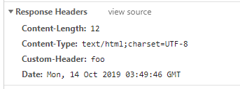

# 1. ResponseEntity
ResponseEntity继承了HttpEntity，是HttpEntity的子类且可以添加HttpStatus状态码（推测HttpEntity不能添加HttpStatus状态码）。被用于RestTemplate和Controller层方法

## 1.1. 区分
- ResponseEntity ：标识整个http相应：状态码、头部信息、响应体内容(spring)
- @ResponseBody：加在请求处理方法上，能够处理方法结果值作为http响应体（springmvc）
- @ResponseStatus：加在方法上、返回自定义http状态码(spring)

# 2. 使用
## 2.1. 设置http响应头
```
@Controller
public class TestResponseController {
    @GetMapping("/hello")
    ResponseEntity<String> hello() 
    {//设置http响应头
        HttpHeaders httpHeaders= new HttpHeaders();
        httpHeaders.add("Custom-Header", "foo");
        return new ResponseEntity<>("Hello World!",httpHeaders, HttpStatus.OK);
    }
}
```
## 2.2. 效果
访问http://localhost:8080/hello，即可看到效果

## 2.3. 设置http响应体
可以能使用BodyBuilder status(HttpStatus status)和BodyBuilder status(int status) 方法设置http状态
```
 @GetMapping("/age/{id}")
    ResponseEntity<String> age(@PathVariable("id") int yearOfBirth) {
        HttpHeaders headers = new HttpHeaders();
        headers.add("Custom-Header", "ada");
        return ResponseEntity.status(HttpStatus.OK)
                .body("Your age is " + yearOfBirth);
    }
```
访问:http://localhost:8080/age/11

