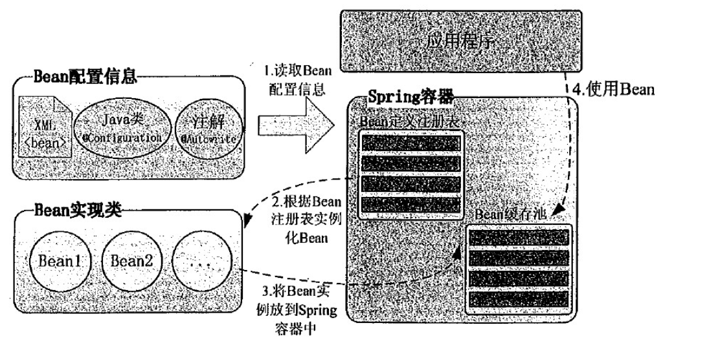

# 1. bean的定义
## 1.1. bean是什么
```
bean就是spring管理的类
```
- 那些组成应用程序的主体及由Spring IoC容器所管理的对象，称为bean
## 1.2. bean和普通对象区别
- bean就是由IoC容器初始化、装配及管理的对象，除此之外，bean就与应用程序中的其他对象没有什么区别了
- bean的定义以及bean相互间的依赖关系将通过配置元数据来描述
## 1.3. bean是单例
- Spring中的bean默认都是**单例**的
- 这些单例Bean在多线程程序下如何保证线程安全呢？例如对于Web应用来说，Web容器对于每个用户请求都创建一个单独的Sevlet线程来处理请求，引入Spring框架之后，每个Action都是单例的，那么对于Spring托管的单例Service Bean，如何保证其安全呢？
- Spring的单例是基于BeanFactory也就是Spring容器的，单例Bean在此容器内只有一个，Java的单例是基于JVM，每个JVM内只有一个实例

# 2. bean与spring容器的关系


- Spring容器根据Bean配置信息建立注册表实例化Bean
Bean配置信息定义了Bean的实现及依赖关系,Spring容器根据各种形式的Bean配置信息在容器内部建立Bean定义注册表，然后根据注册表加载、实例化Bean，并建立Bean和Bean的依赖关系
- 将这些准备就绪的Bean放到Bean缓存池中，以供外层的应用程序进行调用。

# 3. bean配置
## 3.1. 基于xml配置Bean
```
<?xml version="1.0" encoding="UTF-8" ?>
<beans   xmlns="http://www.springframework.org/schema/beans" 
         xmlns:xsi="http://www.w3.org/2001/XMLSchema-instance"
         xsi:schemaLocation="http://www.springframework.org/schema/beans 
         http://www.springframework.org/schema/beans/spring-beans-3.0.xsd">
     <bean id="car" name="#car1" class="com.baobaotao.simple.Car"></bean>  
     <bean id="boss" class="com.baobaotao.simple.Boss"></bean>
</beans>
```

## 3.2. 使用注解定义Bean
Spring容器成功启动的三大要件分别是：

-  Bean定义信息
- Bean实现类
- Spring本身

如果采用基于XML的配置，Bean定义信息和Bean实现类本身是分离的，而采用基于注解的配置方式时，Bean定义信息即通过在Bean实现类上标注注解实现。

```
package com.baobaotao.anno;

import org.springframework.stereotype.Component;
import org.springframework.stereotype.Repository;
//①通过Repository定义一个DAO的Bean

@Component("userDao")
public class UserDao {

}
```

在①处，我们使用@Component注解在UserDao类声明处对类进行标注，它可以被Spring容器识别，Spring容器自动将POJO转换为容器管理的Bean。

它和以下的XML配置是等效的：

`<bean id="userDao" class="com.baobaotao.anno.UserDao"/>`
除了@Component以外，Spring提供了3个功能基本和@Component等效的注解，它们分别用于对DAO、Service及Web层的Controller进行注解，所以也称这些注解为Bean的衍型注解：（类似于xml文件中定义Bean<bean id=" " class=" "/>

- @Repository：用于对DAO实现类进行标注；
- @Service：用于对Service实现类进行标注；
- @Controller：用于对Controller实现类进行标注；
之所以要在@Component之外提供这三个特殊的注解，是为了让注解类本身的用途清晰化，此外Spring将赋予它们一些特殊的功能
## 3.3. 基于java类提供Bean定义信息
在普通的POJO类中只要标注@Configuration注解，就可以为spring容器提供Bean定义的信息了，每个标注了@Bean的类方法都相当于提供了一个Bean的定义信息。

```
package com.baobaotao.conf;

import org.springframework.context.annotation.Bean;
import org.springframework.context.annotation.Configuration;
//①将一个POJO标注为定义Bean的配置类
@Configuration
public class AppConf {
        //②以下两个方法定义了两个Bean，以提供了Bean的实例化逻辑
    @Bean
    public UserDao userDao(){
       return new UserDao();    
    }
    
    @Bean
    public LogDao logDao(){
        return new LogDao();
    }
    //③定义了logonService的Bean
    @Bean
    public LogonService logonService(){
        LogonService logonService = new LogonService();
                //④将②和③处定义的Bean注入到LogonService Bean中
        logonService.setLogDao(logDao());
        logonService.setUserDao(userDao());
        return logonService;
    }
}
```

# 4. bean注入
一种是在XML中配置，此时分别有属性注入、构造函数注入和工厂方法注入；另一种则是使用注解的方式注入 @Autowired,@Resource,@Required。
## 4.1. XML方式注入
### 4.1.1. 属性注入
- 属性注入即通过**setXxx()方法**注入Bean的属性值或依赖对象
由于属性注入方式具有可选择性和灵活性高的优点，因此属性注入是实际应用中最常采用的注入方式。

属性注入要求Bean提供一个默认的构造函数，并为需要注入的属性提供对应的Setter方法。Spring先调用Bean的默认构造函数实例化Bean对象，然后通过反射的方式调用Setter方法注入属性值。
```
package com.baobaotao.anno;

import org.springframework.beans.factory.BeanNameAware;

public class LogonService implements BeanNameAware{

    private LogDao logDao;

    private UserDao userDao;

    public void setUserDao(UserDao userDao) {
        this.userDao = userDao;
    }

    public void setLogDao(LogDao logDao) {
        this.logDao = logDao;
    }
    
    public LogDao getLogDao() {
        return logDao;
    }
    public UserDao getUserDao() {
        return userDao;
    }
    
    public void setBeanName(String beanName) {
        System.out.println("beanName:"+beanName);        
    }
    
    public void initMethod1(){
        System.out.println("initMethod1");
    }
    public void initMethod2(){
        System.out.println("initMethod2");
    }
    
}

bean中的配置
<?xml version="1.0" encoding="UTF-8" ?>
<beans xmlns="http://www.springframework.org/schema/beans"
    xmlns:xsi="http://www.w3.org/2001/XMLSchema-instance" 
    xmlns:context="http://www.springframework.org/schema/context"
    xsi:schemaLocation="http://www.springframework.org/schema/beans 
         http://www.springframework.org/schema/beans/spring-beans-3.0.xsd
         http://www.springframework.org/schema/context
         http://www.springframework.org/schema/context/spring-context-3.0.xsd"
       default-autowire="byName"
         >
    <bean id="logDao" class="com.baobaotao.anno.LogDao"/>
    <bean id="userDao" class="com.baobaotao.anno.UserDao"/>
   <bean class="com.baobaotao.anno.LogonService">
       <property name="logDao" ref="logDao"></property>
       <property name="userDao" ref="userDao"></property>
   </bean>
</beans>
```

### 4.1.2. 构造方法注入
```
package com.baobaotao.anno;

import org.springframework.beans.factory.BeanNameAware;

public class LogonService implements BeanNameAware{

    public LogonService(){}

    public LogonService(LogDao logDao, UserDao userDao) {
        this.logDao = logDao;
        this.userDao = userDao;
    }

    private LogDao logDao;

    private UserDao userDao;

    public void setUserDao(UserDao userDao) {
        this.userDao = userDao;
    }

    public void setLogDao(LogDao logDao) {
        this.logDao = logDao;
    }
    
    public LogDao getLogDao() {
        return logDao;
    }
    public UserDao getUserDao() {
        return userDao;
    }
    
    public void setBeanName(String beanName) {
        System.out.println("beanName:"+beanName);        
    }
    
    public void initMethod1(){
        System.out.println("initMethod1");
    }
    public void initMethod2(){
        System.out.println("initMethod2");
    }
    
}
```
- bean的配置

```
<?xml version="1.0" encoding="UTF-8" ?>
<beans xmlns="http://www.springframework.org/schema/beans"
    xmlns:xsi="http://www.w3.org/2001/XMLSchema-instance" 
    xmlns:context="http://www.springframework.org/schema/context"
    xsi:schemaLocation="http://www.springframework.org/schema/beans 
         http://www.springframework.org/schema/beans/spring-beans-3.0.xsd
         http://www.springframework.org/schema/context
         http://www.springframework.org/schema/context/spring-context-3.0.xsd"
       default-autowire="byName">

    <bean id="logDao" class="com.baobaotao.anno.LogDao"/>
    <bean id="userDao" class="com.baobaotao.anno.UserDao"/>
   <bean class="com.baobaotao.anno.LogonService">
      <constructor-arg  ref="logDao"></constructor-arg>
       <constructor-arg ref="userDao"></constructor-arg>
   </bean>

</beans>
```

### 4.1.3. 工厂方法注入
```
package com.baobaotao.ditype;

public class CarFactory {
   public Car createHongQiCar(){
       Car car = new Car();
       car.setBrand("红旗CA72");
       return car;
   }
   
   public static Car createCar(){
       Car car = new Car();
       return car;
   }
}
bean的配置
<?xml version="1.0" encoding="UTF-8" ?>
<beans xmlns="http://www.springframework.org/schema/beans"
    xmlns:xsi="http://www.w3.org/2001/XMLSchema-instance" 
    xmlns:p="http://www.springframework.org/schema/p"
    xsi:schemaLocation="http://www.springframework.org/schema/beans 
         http://www.springframework.org/schema/beans/spring-beans-3.0.xsd">

    <!-- 工厂方法-->
    <bean id="carFactory" class="com.baobaotao.ditype.CarFactory" />
    <bean id="car5" factory-bean="carFactory" factory-method="createHongQiCar">
    </bean>


</beans>
```

## 4.2. 注解方式注入

### 4.2.1. 使用@Autowired进行自动注入
- 如果容器中没有一个和标注变量类型匹配的Bean，Spring容器启动时将报NoSuchBeanDefinitionException的异常。如果希望Spring即使找不到匹配的Bean完成注入也不用抛出异常，那么可以使用@Autowired(required=false)进行标注：
```
@Service
public class LogonService implements BeanNameAware{
    @Autowired(required=false)
    private LogDao logDao;
        ...
}
```
### 4.2.2. 使用@Qualifier指定注入Bean的名称
如果容器中有一个以上匹配的Bean时，则可以通过@Qualifier注解限定Bean的名称，如下所示：
```
@Service
public class LogonService implements BeanNameAware{
    @Autowired(required=false)
    private LogDao logDao;
    //①注入名为UserDao，类型为UserDao的Bean
    @Autowired
    @Qualifier("userDao")
    private UserDao userDao;
}
```

### 4.2.3. 对标准注解的支持
此外，Spring还支持@Resource和@Inject注解，这两个标准注解和@Autowired注解的功能类型，都是对类变量及方法入参提供自动注入的功能。@Resource要求提供一个Bean名称的属性，如果属性为空，则自动采用标注处的变量名或方法名作为Bean的名称。


补充：
关于Autowired和@Resource

- @Autowired注入是按照类型注入的，只要配置文件中的bean类型和需要的bean类型是一致的，这时候注入就没问题。但是如果相同类型的bean不止一个，此时注入就会出现问题，Spring容器无法启动。 
- @Resourced标签是按照bean的名字来进行注入的，如果我们没有在使用@Resource时指定bean的名字，同时Spring容器中又没有该名字的bean,这时候@Resource就会退化为@Autowired即按照类型注入，这样就有可能违背了使用@Resource的初衷。所以建议在使用@Resource时都显示指定一下bean的名字@Resource(name="xxx") 

 让@Resource和@Autowired生效的几种方式
 
- 在xml配置文件中显式指定 
<!-- 为了使用Autowired标签，我们必须在这里配置一个bean的后置处理器 --> 
   ` <bean class="org.springframework.beans.factory.annotation.AutowiredAnnotationBeanPostProcessor" />  ` 
   
      <!-- 为了使用@Resource标签，这里必须配置一个后置处理器 --> 
 `   <bean class="org.springframework.context.annotation.CommonAnnotationBeanPostProcessor" />   `

- 在xml配置文件中使用context:annotation-config 

`<context:annotation-config />`


- 在xml配置文件中使用context:component-scan 

`<context:component-scan base-package="com.baobaotao.anno"/>`