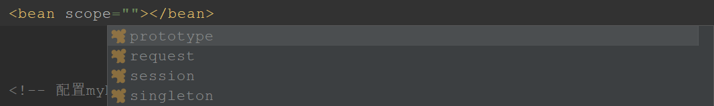
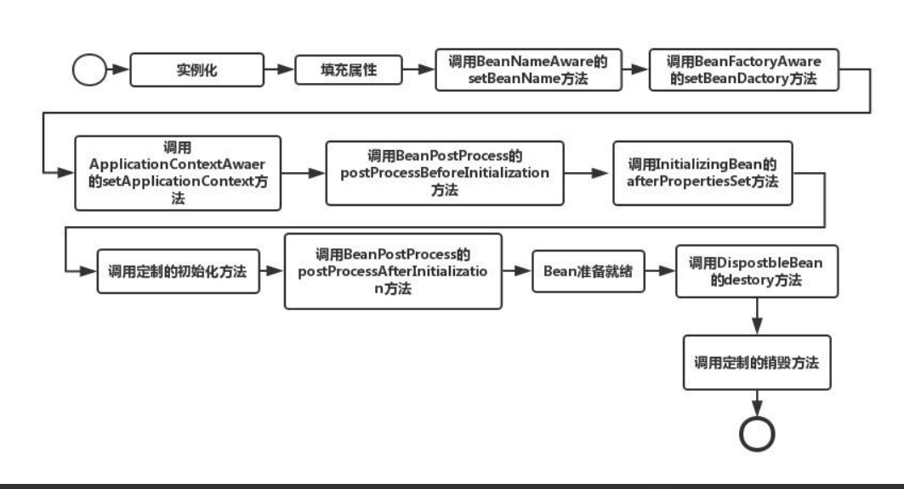
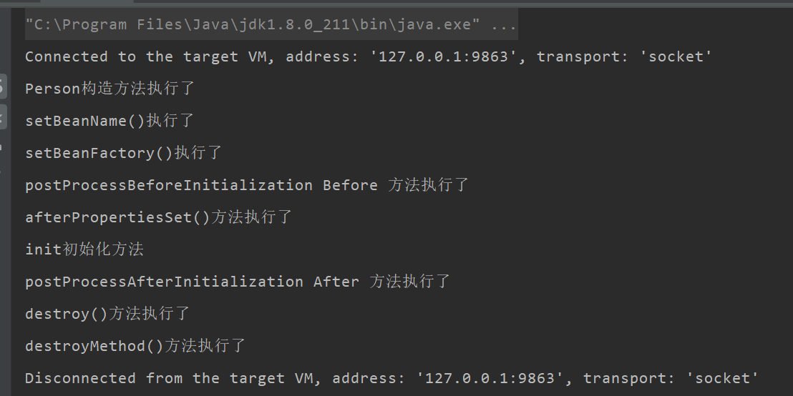

# 1. bean的作用域
在idea中,bean的作用域有以下几个选择


- prototype
每次从容器中调用Bean时,都会返回一个新的实例,即每次调用getBean()时,相当于执行了new xxxBean()
- request
每次HTTP请求都会创建一个新的Bean,该作用域仅适用于WebApplicationContext环境
- session
同一个HTTP Session共享一个Bean,不同Session使用不同的Bean,该作用域仅适用于WebApplicationContext环境
- singleton
在Spring IoC容器中仅仅存在一个Bean实例,Bean以单例的模式存在**(默认值)**
## 1.1. singleton
- 当一个bean的作用域为Singleton，那么Spring IoC容器中只会存在一个共享的bean实例，并且所有对bean的请求，只要id与该bean定义相匹配，则只会返回bean的同一实例
- **Singleton是单例类型，就是在创建起容器时就同时自动创建了一个bean的对象**，不管你是否使用，他都存在了，每次获取到的对象都是同一个对象。注意，Singleton作用域是Spring中的缺省作用域。要在XML中将bean定义成singleton，可以这样配置：
```
<bean id="mySecurity" class="com.cms.security.MySecurity" scope="singleton"/>
```
## 1.2. prototype
- 当一个bean的作用域为Prototype，表示一个bean定义对应多个对象实例
- Prototype作用域的bean会导致在每次对该bean请求（将其注入到另一个bean中，或者以程序的方式调用容器的getBean()方法）时都会创建一个新的bean实例
- **Prototype是原型类型，它在我们创建容器的时候并没有实例化，而是当我们获取bean的时候才会去创建一个对象，而且我们每次获取到的对象都不是同一个对象**。根据经验，对有状态的bean应该使用prototype作用域，而对无状态的bean则应该使用singleton作用域。在XML中将bean定义成prototype，可以这样配置：

```
<bean id="account" class="com.foo.DefaultAccount" scope="prototype"/>  
 或者
<bean id="account" class="com.foo.DefaultAccount" singleton="false"/> 
```
## 1.3. request
- 当一个bean的作用域为Request，表示在一次HTTP请求中，一个bean定义对应一个实例
- 即每个HTTP请求都会有各自的bean实例，它们依据某个bean定义创建而成。该作用域仅在基于web的Spring ApplicationContext情形下有效。考虑下面bean定义：

```
<bean id="loginAction" class=cn.csdn.LoginAction" scope="request"/>
```
1
　　针对每次HTTP请求，Spring容器会根据loginAction bean的定义创建一个全新的LoginAction bean实例，且该loginAction bean实例仅在当前HTTP request内有效
　　因此可以根据需要放心的更改所建实例的内部状态，而其他请求中根据loginAction bean定义创建的实例，将不会看到这些特定于某个请求的状态变化。当处理请求结束，request作用域的bean实例将被销毁。

## 1.4. session
- 当一个bean的作用域为Session，表示在一个HTTP Session中，一个bean定义对应一个实例
- 该作用域仅在基于web的Spring ApplicationContext情形下有效。考虑下面bean定义：

```
<bean id="userPreferences" class="com.foo.UserPreferences" scope="session"/>
```
1
　　针对某个HTTP Session，Spring容器会根据userPreferences bean定义创建一个全新的userPreferences bean实例，且该userPreferences bean仅在当前HTTP Session内有效。
　　与request作用域一样，可以根据需要放心的更改所创建实例的内部状态，而别的HTTP Session中根据userPreferences创建的实例，将不会看到这些特定于某个HTTP Session的状态变化。当HTTP Session最终被废弃的时候，在该HTTP Session作用域内的bean也会被废弃掉
# 2. bean的生命周期
## 2.1. 图解


## 2.2. 过程

1.  Bean容器在配置文件中找到Spring Bean的定义。
2. Bean容器使用Java Reflection API创建Bean的实例。
3. 如果声明了任何属性，声明的属性会被设置。如果属性本身是Bean，则将对其进行解析和设置。
4. 如果Bean类实现BeanNameAware接口，则将通过传递Bean的名称来调用setBeanName()方法。
5. 如果Bean类实现BeanClassLoaderAware接口，则将通过传递加载此Bean的ClassLoader对象的实例来调用setBeanClassLoader()方法。
6. 如果Bean类实现BeanFactoryAware接口，则将通过传递BeanFactory对象的实例来调用setBeanFactory()方法。
7. 如果有任何与BeanFactory关联的BeanPostProcessors对象已加载Bean，则将在设置Bean属性之前调用postProcessBeforeInitialization()方法。
8. 如果Bean类实现了InitializingBean接口，则在设置了配置文件中定义的所有Bean属性后，将调用afterPropertiesSet()方法。
9. 如果配置文件中的Bean定义包含init-method属性，则该属性的值将解析为Bean类中的方法名称，并将调用该方法。
10. 如果为Bean Factory对象附加了任何Bean 后置处理器，则将调用postProcessAfterInitialization()方法。
11. 如果Bean类实现DisposableBean接口，则当Application不再需要Bean引用时，将调用destroy()方法。
12. 如果配置文件中的Bean定义包含destroy-method属性，那么将调用Bean类中的相应方法定义。
# 3. bean生命周期代码演示
## 3.1. 项目结构图

## 3.2. 代码
- Application.java
```
public class Application {
    public static void main(String[] args) {
        ApplicationContext context = new ClassPathXmlApplicationContext("spring-config.xml");
        ((ClassPathXmlApplicationContext) context).destroy();
    }
}
```
- MyBeanPostProcessor.java
```
public class MyBeanPostProcessor implements BeanPostProcessor {
    /**4.postProcessBeforeInitialization*/
    public Object postProcessBeforeInitialization(Object bean, String beanName) throws BeansException {
        System.out.println("postProcessBeforeInitialization Before 方法执行了");
        return bean;
    }

    /**7.postProcessAfterInitialization*/
    public Object postProcessAfterInitialization(Object bean, String beanName) throws BeansException {
        System.out.println("postProcessAfterInitialization After 方法执行了");
        return bean;
    }
}
```
- Person.java
```
public class Person implements InitializingBean, DisposableBean, BeanFactoryAware, BeanNameAware {

    private String name;

    public void setName(String name) {
        this.name = name;
    }

    public String getName() {
        return name;
    }


    /**
     * 1.构造方法
     */
    public Person() {
        System.out.println("Person构造方法执行了");
    }

    /**
     * 2.BeanNameAware
     */
    public void setBeanName(String s) {
        System.out.println("setBeanName()执行了");
    }

    /**
     * 3.BeanFactoryAware
     */
    public void setBeanFactory(BeanFactory beanFactory) throws BeansException {
        System.out.println("setBeanFactory()执行了");
    }

    /**
     * 5
     */
    public void afterPropertiesSet() throws Exception {
        System.out.println("afterPropertiesSet()方法执行了");
    }

    /**
     * 6
     */
    public void init() {
        System.out.println("init初始化方法");
    }

    /**
     * 8
     */
    public void destroy() throws Exception {
        System.out.println("destroy()方法执行了");
    }

    /**
     * 9
     */
    public void destroyMethod() {
        System.out.println("destroyMethod()方法执行了");
    }
}
```

- spring-config.xml

``` 
<?xml version="1.0" encoding="UTF-8"?>
<beans xmlns="http://www.springframework.org/schema/beans"
       xmlns:xsi="http://www.w3.org/2001/XMLSchema-instance"
       xsi:schemaLocation="http://www.springframework.org/schema/beans http://www.springframework.org/schema/beans/spring-beans.xsd">

    <bean name="myBeanPostProcessor" class="MyBeanPostProcessor" />
    <bean name="personBean" class="Person"
          init-method="init" destroy-method="destroyMethod">
        <property name="name" value="Ada" />
    </bean>

</beans>
```
## 3.3. 结果

# 4. 源码
## 4.1. AnnotationConfigApplicationContext
首先我们来到AnnotationConfigApplicationContext的构造方法：

```
    //根据参数类型可以知道，其实可以传入多个annotatedClasses，但是这种情况出现的比较少
    public AnnotationConfigApplicationContext(Class<?>... annotatedClasses) {
        //调用无参构造函数，会先调用父类GenericApplicationContext的构造函数
        //父类的构造函数里面就是初始化DefaultListableBeanFactory，并且赋值给beanFactory
        //本类的构造函数里面，初始化了一个读取器：AnnotatedBeanDefinitionReader read，一个扫描器ClassPathBeanDefinitionScanner scanner
        //scanner的用处不是很大，它仅仅是在我们外部手动调用 .scan 等方法才有用，常规方式是不会用到scanner对象的
        this();
        //把传入的类进行注册，这里有两个情况，
        //传入传统的配置类
        //传入bean（虽然一般没有人会这么做
        //看到后面会知道spring把传统的带上@Configuration的配置类称之为FULL配置类，不带@Configuration的称之为Lite配置类
        //但是我们这里先把带上@Configuration的配置类称之为传统配置类，不带的称之为普通bean
        register(annotatedClasses);
        //刷新
        refresh();
    }
```
- 进入refresh方法，refresh方法中有一个finishBeanFactoryInitialization小方法，这个方法是用来实例化懒加载单例Bean的，也就是我们的Bean都是在这里被创建出来的（当然我这里说的的是绝大部分情况是这样的）：

```
finishBeanFactoryInitialization(beanFactory);
```
- 我们再进入finishBeanFactoryInitialization这方法，里面有一个beanFactory.preInstantiateSingletons()方法：

```
        //初始化所有的非懒加载单例
        beanFactory.preInstantiateSingletons();
```
- 我们尝试再点进去，这个时候你会发现这是一个接口，好在它只有一个实现类，所以可以我们来到了他的唯一实现，实现类就是org.springframework.beans.factory.support.DefaultListableBeanFactory，这里面是一个循环，我们的Bean就是循环被创建出来的，我们找到其中的getBean方法：

```
getBean(beanName);
```
- 这里有一个分支，如果Bean是FactoryBean，如何如何，如果Bean不是FactoryBean如何如何，好在不管是不是FactoryBean，最终还是会调用getBean方法，所以我们可以毫不犹豫的点进去，点进去之后，你会发现，这是一个门面方法，直接调用了doGetBean方法：

```
    return doGetBean(name, null, null, false);
```
- 再进去，不断的深入，接近我们要寻找的东西。
这里面的比较复杂，但是有我在，我可以直接告诉你，下一步我们要进入哪里，我们要进入

```
if (mbd.isSingleton()) {

                    //getSingleton中的第二个参数类型是ObjectFactory<?>，是一个函数式接口，不会立刻执行，而是在
                    //getSingleton方法中，调用ObjectFactory的getObject，才会执行createBean
                    sharedInstance = getSingleton(beanName, () -> {
                        try {
                            return createBean(beanName, mbd, args);
                        }
                        catch (BeansException ex) {
                            destroySingleton(beanName);
                            throw ex;
                        }
                    });
                    bean = getObjectForBeanInstance(sharedInstance, name, beanName, mbd);
                }
```
- 这里面的createBean方法，再点进去啊，但是又点不进去了，这是接口啊，但是别慌，这个接口又只有一个实现类，所以说 没事，就是干，这个实现类为org.springframework.beans.factory.support.AbstractAutowireCapableBeanFactory。

- 这个实现的方法里面又做了很多事情，我们就不去看了，我就是带着大家找到那几个生命周期的回调到底定义在哪里就OK了。
```

    Object beanInstance = doCreateBean(beanName, mbdToUse, args);//创建bean，核心
            if (logger.isDebugEnabled()) {
                logger.debug("Finished creating instance of bean '" + beanName + "'");
            }
            return beanInstance;
```
- 再继续深入doCreateBean方法，这个方法又做了一堆一堆的事情，但是值得开心的事情就是 我们已经找到了我们要寻找的东西了。

## 4.2. 创建实例
首先是创建实例，位于：

```
instanceWrapper = createBeanInstance(beanName, mbd, args);//创建bean的实例。核心
```
## 4.3. 填充属性
其次是填充属性，位于：

```
populateBean(beanName, mbd, instanceWrapper);//填充属性，炒鸡重要
```
在填充属性下面有一行代码：

```
    exposedObject = initializeBean(beanName, exposedObject, mbd);
```
继续深入进去。

## 4.4. aware系列接口的回调
aware系列接口的回调位于initializeBean中的invokeAwareMethods方法：

```
invokeAwareMethods(beanName, bean);
```

```
private void invokeAwareMethods(final String beanName, final Object bean) {
        if (bean instanceof Aware) {
            if (bean instanceof BeanNameAware) {
                ((BeanNameAware) bean).setBeanName(beanName);
            }
            if (bean instanceof BeanClassLoaderAware) {
                ClassLoader bcl = getBeanClassLoader();
                if (bcl != null) {
                    ((BeanClassLoaderAware) bean).setBeanClassLoader(bcl);
                }
            }
            if (bean instanceof BeanFactoryAware) {
                ((BeanFactoryAware) bean).setBeanFactory(AbstractAutowireCapableBeanFactory.this);
            }
        }
    }
```
- BeanPostProcessor的postProcessBeforeInitialization方法
BeanPostProcessor的postProcessBeforeInitialization方法位于initializeBean的

```
if (mbd == null || !mbd.isSynthetic()) {
            wrappedBean = applyBeanPostProcessorsBeforeInitialization(wrappedBean, beanName);
        }
 ```
 
 ```
    @Override
    public Object applyBeanPostProcessorsBeforeInitialization(Object existingBean, String beanName)
            throws BeansException {

        Object result = existingBean;
        for (BeanPostProcessor processor : getBeanPostProcessors()) {
            Object current = processor.postProcessBeforeInitialization(result, beanName);
            if (current == null) {
                return result;
            }
            result = current;
        }
        return result;
    }
```
- afterPropertiesSet init-method
afterPropertiesSet init-method位于initializeBean中的

```
    invokeInitMethods(beanName, wrappedBean, mbd);
```
这里面调用了两个方法，一个是afterPropertiesSet方法，一个是init-method方法：

```
    ((InitializingBean) bean).afterPropertiesSet();
```
```
invokeCustomInitMethod(beanName, bean, mbd);
```
- BeanPostProcessor的postProcessAfterInitialization方法
BeanPostProcessor的postProcessAfterInitialization方法位于initializeBean的

```
if (mbd == null || !mbd.isSynthetic()) {
            wrappedBean = applyBeanPostProcessorsAfterInitialization(wrappedBean, beanName);
        }
```
```
    public Object applyBeanPostProcessorsAfterInitialization(Object existingBean, String beanName)
            throws BeansException {

        Object result = existingBean;
        for (BeanPostProcessor processor : getBeanPostProcessors()) {
            Object current = processor.postProcessAfterInitialization(result, beanName);
            if (current == null) {
                return result;
            }
            result = current;
        }
        return result;
    }
```
当然在实际的开发中，应该没人会去销毁Spring的应用上下文把，所以剩余的两个销毁的回调就不去找了


