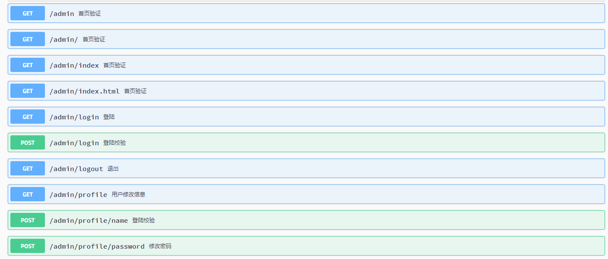

# 1. 先添加依赖
```
        <dependency>
            <groupId>io.springfox</groupId>
            <artifactId>springfox-swagger2</artifactId>
            <version>2.9.2</version>
        </dependency>
        <dependency>
            <groupId>io.springfox</groupId>
            <artifactId>springfox-swagger-ui</artifactId>
            <version>2.9.2</version>
       </dependency>
```
# 2. 添加配置类
```
@Configuration
@EnableSwagger2
public class SwaggerConfig {

    @Bean
    public Docket helloApi() {
        return new Docket(DocumentationType.SWAGGER_2)
                .apiInfo(apiInfo())
                .select()
                .apis(RequestHandlerSelectors.basePackage("info.einverne.springboot.demo"))
                .paths(PathSelectors.any())
                .build();
    }

    private ApiInfo apiInfo() {
        return new ApiInfoBuilder()
                // 文档标题
                .title("API 文档")
                // 文档描述
                .description("https://github.com/einverne/thrift-swift-demo/tree/master/spring-boot-demo")
                .termsOfServiceUrl("https://github.com/einverne/thrift-swift-demo/tree/master/spring-boot-demo")
                .version("v1")
                .build();
    }
}
```
通过@Configuration注解，让 Spring 来加载该类配置。再通过@EnableSwagger2注解来启用 Swagger2。

- apiInfo() 用来创建 API 的基本信息，展现在文档页面中。
- select() 函数返回一个 ApiSelectorBuilder 实例用来控制哪些接口暴露给 Swagger ，这里使用定义扫描包路径来定义， Swagger 会扫描包下所有 Controller 的定义并产生文档内容，除了被 @ApiIgnore 注解的接口。

# 3. 参数说明
## 3.1. Api 注解
- @Api 注解用于类上，说明类作用

```
value url
description
tags 设置该值，value 会被覆盖
basePath 基本路径不可配置
position
produces “application/json”
consumes “application/json”
protocols http, https, wss
authorizations 认证
hidden 是否在文档隐藏
```
## 3.2. ApiOperation 注解
- 标记在方法上，对一个操作或 HTTP 方法进行描述。具有相同路径的不同操作会被归组为同一个操作对象。不同的 HTTP 请求方法及路径组合构成一个唯一操作。此注解的属性有：

```
value 对操作的简单说明，长度为 120 个字母，60 个汉字。
notes 对操作的详细说明。
httpMethod HTTP 请求的动作名，可选值有：”GET”, “HEAD”, “POST”, “PUT”, “DELETE”, “OPTIONS” and “PATCH”。
code 默认为 200，有效值必须符合标准的 HTTP Status Code Definitions
```
## 3.3. ApiImplicitParams
注解 ApiImplicitParam 的容器类，以数组方式存储。

## 3.4. ApiImplicitParam
- 对 API 的单一参数进行注解。虽然注解 @ApiParam 同 JAX-RS 参数相绑定，但这个 @ApiImplicitParam 注解可以以统一的方式定义参数列表，也是在 Servelet 及非 JAX-RS 环境下，唯一的方式参数定义方式。注意这个注解 @ApiImplicitParam 必须被包含在注解 @ApiImplicitParams 之内。可以设置以下重要参数属性：

```
name 参数名称
value 参数的简短描述
required 是否为必传参数
dataType 参数类型，可以为类名，也可以为基本类型（String，int、boolean 等）
paramType 参数的传入（请求）类型，可选的值有 path, query, body, header or form。
@RequestBody 这样的场景请求参数无法使用 @ApiImplicitParam 注解进行描述
```

## 3.5. ApiParam
- 增加对参数的元信息说明。这个注解只能被使用在 JAX-RS 1.x/2.x 的综合环境下。其主要的属性有：

```
required 是否为必传参数
value 参数简短说明
```
## 3.6. ApiModel
- 提供对 Swagger model 额外信息的描述。在标注 @ApiOperation 注解的操作内，所有的类将自动被内省（introspected），但利用这个注解可以做一些更加详细的 model 结构说明。主要属性有：

```
value model 的别名，默认为类名
description model 的详细描述
```
## 3.7. ApiModelProperty
- 对 model 属性的注解，主要的属性值有：

```
value 属性简短描述
example 属性的示例值
required 是否为必须值
hidden 隐藏该属性
```
## 3.8. ApiResponse
- 响应配置
```
code http 状态码
message 描述
```
# 4. 结果
访问链接：http://localhost:8080/swagger-ui.html
