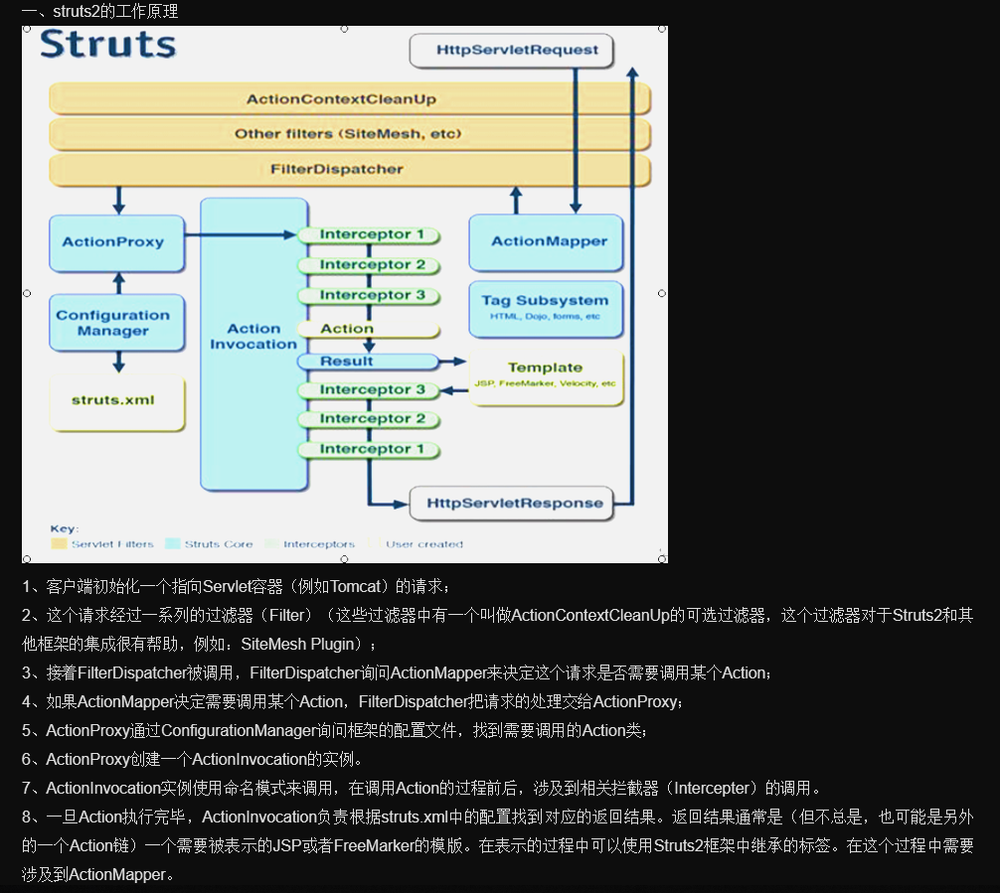
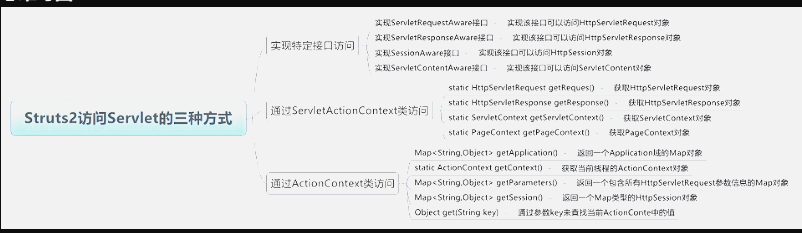

# 1. Struts的工作原理

# 2. action类
- action类是Struts的核心，也被称为业务控制器
- Web应用之中最需要访问的是HTTPServletRequest，HttpSession，ServletContext。
- （1）Struts提供了ActionContext来访问Servlet API
       （2）Action直接访问Servlet API
         ServletContextAware:
         ServletRequestAware:
         ServletResponseAware:
       (3)使用ServletActionContext访问

Servlet API
# 3. Action的配置
（1）零配置：指不用XML文件而使用@注解来实现Action零配置
注意：使用零配置只能用“类名！方法名.action”
# 4. 拦截器