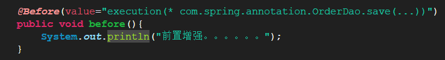

# 1. Spring的AOP的基于AspectJ注解开发 
## 1.1. 新建工程
导入相关的jar包，新建xml文件，然后在applicationContext.xml之中加入
<aop:aspectj-autoproxy />
## 1.2. Spring的注解AOP的通知类型
@Before：前置通知

@afeterReturning:后置通知

@Around：环绕通知

@AfterThrowing：；异常通知

@After：最终通知
# 2. Spring的JDBC的模板的使用
