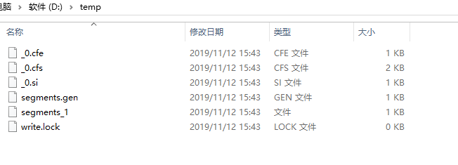

# 1. 入门案例
## 1.1. 案例结构


- Article
```
@Getter
@Setter
@ToString
public class Article {
    private Integer id;
    private String title;
    private String content;
    private String author;

    public Article(Integer id, String title, String content, String author) {
        super();
        this.id = id;
        this.title = title;
        this.content = content;
        this.author = author;
    }
}
```
- Indexer

```
public class Indexer {
    public static void main(String[] args) throws IOException {

        //添加一条记录（模拟）
        Article article = new Article(1, "基于Java的全文索引/检索引擎", "Lucene不是一个完整的全文索引应用，而是是一个用Java写的全文索引引擎工具包，它可以方便的嵌入到各种应用中实现针对应用的全文索引/检索功能", "ada");

        //建立索引
        // 1、把Article转换为Doucement对象
        Document document = new Document();
        //根据实际情况，使用不同的Field来对原始内容建立索引， Store.YES表示是否存储字段原始内容
        document.add(new LongField("id", article.getId(), Field.Store.YES));
        document.add(new StringField("author", article.getAuthor(), Field.Store.YES));
        document.add(new TextField("title", article.getTitle(), Field.Store.YES));
        document.add(new TextField("content", article.getContent(), Field.Store.NO));

        // 2、建立索引
        // 指定索引库的位置，本例为项目根目录下D:\temp
        Directory directory = FSDirectory.open(new File("D:/temp"));

        // 分词器，不同的分词器有不同的规则
        Analyzer analyzer = new StandardAnalyzer();
        /** 由于Lucene2.9之后,其索引的格式就不会再兼容Lucene的所有版本了,所以在创建索引前,要指定其所匹配的Lucene版本号
         这里通过IndexWriterConfig()构造方法的Version.LATEST参数值指明索引所匹配的版本号,并使用了Lucene的标准分词器
         */
        IndexWriterConfig indexWriterConfig = new IndexWriterConfig(Version.LATEST, analyzer);
        IndexWriter indexWriter = new IndexWriter(directory, indexWriterConfig);
        // 通过IndexWriter添加文档到索引中
        indexWriter.addDocument(document);
        indexWriter.close();
    }
}

```
- Searcher

```
public class Searcher {
    public static void main(String[] args) throws IOException, ParseException {
        // 搜索条件(不区分大小写)
        String queryString = "Java";

        Directory directory = FSDirectory.open(new File("D:/temp"));
        Analyzer analyzer = new StandardAnalyzer();

        // 1、把查询字符串转为查询对象(存储的都是二进制文件，普通的String肯定无法查询，因此需要转换)
        // 只在标题里面查询
        QueryParser queryParser = new QueryParser("title", analyzer);
        Query query = queryParser.parse(queryString);

        // 2、查询，得到中间结果
        IndexReader indexReader = DirectoryReader.open(directory);
        IndexSearcher indexSearcher = new IndexSearcher(indexReader);
        // 根据指定查询条件查询，只返回前n条结果
        TopDocs topDocs = indexSearcher.search(query, 100);
        //总结果数
        int count = topDocs.totalHits;
        // 按照得分进行排序后的前n条结果的信息
        ScoreDoc[] scoreDocs = topDocs.scoreDocs;

        List<Article> articalList = new ArrayList<Article>();
        // 3、处理中间结果
        for(ScoreDoc scoreDoc :scoreDocs){
            float score = scoreDoc.score;
            int docId = scoreDoc.doc;

            // 根据编号取出真正的Document数据
            Document doc = indexSearcher.doc(docId);

            // 把Document转成Article
            Article artical = new Article(
                    Integer.parseInt(doc.getField("id").stringValue()),//需要转为int型
                    doc.getField("title").stringValue(),
                    null,
                    doc.getField("author").stringValue()
            );

            articalList.add(artical);
        }

        indexReader.close();


        // 显示结果
        System.out.println("总结果数量为:" + articalList.size());
        for (Article artical : articalList) {
            System.out.println("id="+artical.getId());
            System.out.println("title="+artical.getTitle());
            System.out.println("content="+artical.getContent());
        }
        }
    }
```
## 1.2. 测试结果



