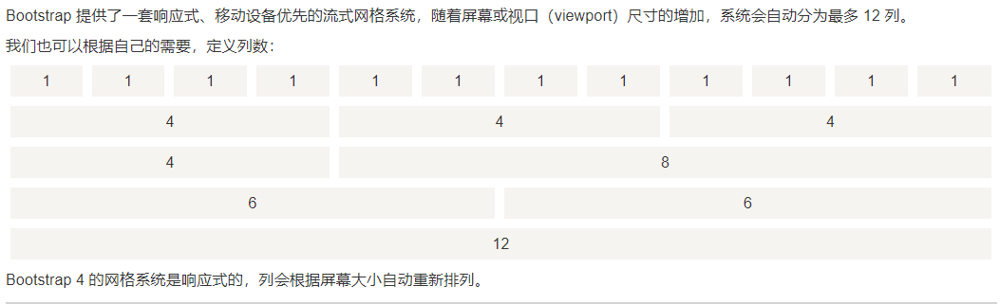
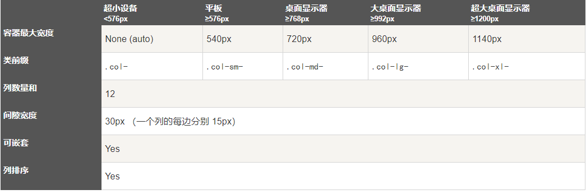

# 1. Bootstrap4 网格系统


# 2. 网格类
Bootstrap 4 网格系统有以下 5 个类:

```
.col- 针对所有设备
.col-sm- 平板 - 屏幕宽度等于或大于 576px
.col-md- 桌面显示器 - 屏幕宽度等于或大于 768px)
.col-lg- 大桌面显示器 - 屏幕宽度等于或大于 992px)
.col-xl- 超大桌面显示器 - 屏幕宽度等于或大于 1200px)
```
## 2.1. 网格系统规则
Bootstrap4 网格系统规则:

网格每一行需要放在设置了 .container (固定宽度) 或 .container-fluid (全屏宽度) 类的容器中，这样就可以自动设置一些外边距与内边距。
使用行来创建水平的列组。
内容需要放置在列中，并且只有列可以是行的直接子节点。
预定义的类如 .row 和 .col-sm-4 可用于快速制作网格布局。
列通过填充创建列内容之间的间隙。 这个间隙是通过 .rows 类上的负边距设置第一行和最后一列的偏移。
网格列是通过跨越指定的 12 个列来创建。 例如，设置三个相等的列，需要使用用三个.col-sm-4 来设置。
Bootstrap 3 和 Bootstrap 4 最大的区别在于 Bootstrap 4 现在使用 flexbox（弹性盒子） 而不是浮动。 Flexbox 的一大优势是，没有指定宽度的网格列将自动设置为等宽与等高列 。 如果您想了解有关Flexbox的更多信息，可以阅读我们的CSS Flexbox教程。
下表总结了 Bootstrap 网格系统如何在不同设备上工作的：


# 3. Bootstrap4 网格基本结构
```
<!-- 第一个例子：控制列的宽度及在不同的设备上如何显示 -->
<div class="row">
  <div class="col-*-*"></div>
</div>
<div class="row">
  <div class="col-*-*"></div>
  <div class="col-*-*"></div>
  <div class="col-*-*"></div>
</div>
 
<!-- 第二个例子：或让 Bootstrap 者自动处理布局 -->
<div class="row">
  <div class="col"></div>
  <div class="col"></div>
  <div class="col"></div>
</div>
```

第一个例子：创建一行(<div class="row">)。然后， 添加是需要的列( .col-*-* 类中设置)。 第一个星号 (*) 表示响应的设备: sm, md, lg 或 xl, 第二个星号 (*) 表示一个数字, 同一行的数字相加为 12。

第二个例子: 不在每个 col 上添加数字，让 bootstrap 自动处理布局，同一行的每个列宽度相等： 两个 "col" ，每个就为 50% 的宽度。三个 "col"每个就为 33.33% 的宽度，四个 "col"每个就为 25% 的宽度，以此类推。同样，你可以使用 .col-sm|md|lg|xl 来设置列的响应规则。

接下来我们可以看看实例

- 平板、桌面、大桌面显示器、超大桌面显示器
以下实例在平板、桌面、大桌面显示器、超大桌面显示器的宽度比例为分别为：25%/75%、50%/50%、33.33%/66.67%、16.67/83.33%, 在移动手机等小型设备上会堆叠显示。

实例
```
<div class="container-fluid">
  <div class="row">
    <div class="col-sm-3 col-md-6 col-lg-4 col-xl-2">
      <p>RUNOOB</p>
    </div>
    <div class="col-sm-9 col-md-6 col-lg-8 col-xl-10">
      <p>菜鸟教程</p>
    </div>
  </div>
</div>
```

- 偏移列
偏移列通过 offset-*-* 类来设置。第一个星号( * )可以是 sm、md、lg、xl，表示屏幕设备类型，第二个星号( * )可以是 1 到 11 的数字。

为了在大屏幕显示器上使用偏移，请使用 .offset-md-* 类。这些类会把一个列的左外边距（margin）增加 * 列，其中 * 范围是从 1 到 11。

例如：.offset-md-4 是把.col-md-4 往右移了四列格。

```
实例
<div class="row">
  <div class="col-md-4">.col-md-4</div>
  <div class="col-md-4 offset-md-4">.col-md-4 .offset-md-4</div>
</div>
<div class="row">
  <div class="col-md-3 offset-md-3">.col-md-3 .offset-md-3</div>
  <div class="col-md-3 offset-md-3">.col-md-3 .offset-md-3</div>
</div>
<div class="row">
  <div class="col-md-6 offset-md-3">.col-md-6 .offset-md-3</div>
</div>
```