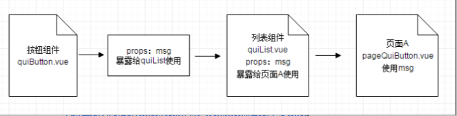

# 1. 复用组件
接下来我们会详细分析下如何完成由多个组件组成一个复用组件的开发流程
# 2. 列表组件quiList.vue
本节我们主要要完成这样一个列表功能，每一行的列表是一个组件，列表内可能出现按钮组件或者箭头组件，点击按钮组件可以自定义事件，同时可以根据不同的参数来决定当前列表是带按钮的列表or带箭头的列表
如图：


- quiList.vue

```
//quiList.vue
<template>
  <div class="qui-list">
    <span class="list-tips">{{tipsText}}</span>
    <qui-btn v-on:btnClickEvent="btnClickEvent" :msg=msg class="small"></qui-btn>
  </div>
</template>

<script>
  import quiButton from '../components/quiButton.vue'
  export default{
    props:{
      msg: {
        default: '下载'
      },
      tipsText: {
        default: '默认的文案'
      }
    },
    components: {
      'qui-btn': quiButton
    }，
    methods:{
      btnClickEvent:function(){
          alert('按钮点击事件')
      }
    }
  }
</script>
```
上面的知识点基本上就是我们之前学过的，只不过记住quiList本身是一个组件，而在这个组件里面，我们又引入了按钮组件quiButton，也就是组件内引用组件，实际上就是组件的嵌套，注意到这里：msg=msg的使用，这里冒号表示绑定的是一个变量msg，然后这个属性通过props暴露出去(本身在按钮中就暴露了msg给列表组件使用)，借用下面一张图理解下：


至于点击事件，也是我们之前学习过的事件的绑定。现在引入一个新问题，是否有一个参数，可以决定列表组件的右侧是放置按钮组件呢？还是箭头组件

# 3. 动态组件
Vue中提供了一些特定关键字：is和特定的结构<component>来生成动态组件，让我们修改下script里面的内容先：

```
<script>
  import quiButton from '../components/quiButton.vue'
  import quiArrow from '../components/quiArrow.vue'
  export default{
    props:{
      msg: {
        default: '下载'
      },
      tipsText: {
        default: '默认的文案'
      },
      currentView:{
        default: 'qui-btn'
      }
    },
    components: {
      'qui-btn': quiButton,
      'qui-arrow': quiArrow
    },
    methods: {
      clickEvent: function () {

      }
    }
  }
</script>
```
首先我们先Import多一个箭头组件，在components中添加一个自定义标签‘qui-arrow’，注意到我们多了一个currentView的自定义属性，默认值是qui-btn，现在再看看template标签里面写什么：

```
<template>
  <div class="qui-list">
    <span class="list-tips">{{tipsText}}</span>
    <component :is="currentView" v-on:btnClickEvent="clickEvent" :msg=msg class="small"  keep-alive></component>
  </div>
</template>
```
我们把qui-btn标签去掉了，取而代之的是一个component标签，这是Vue自带的一个标签，可以把它当作一个容器，这个容器可以用来装按钮，也可以用来装箭头。决定这个容器装的是哪个组件的关键代码在于：is="currentView"，当currentView的值为qui-btn的时候，这个容器就是按钮组件，当它是qui-arrow的时候，就是箭头组件。而我们刚才给这个变量定义的默认值是qui-btn

keep-alive关键字保持这个组件在内存中是常驻的，由于动态组件可能需要动态切换，这样保持组件活跃可以减少组件变化时候的内存消耗

可以看到我们的component上还保留着按钮的点击事件和msg信息，这些没有关系，只要箭头组件中不出现同样的变量就不会发生冲突

```
<qui-list tipsText="自定义文案，默认右边是按钮" msg="弹层"></qui-list>
<qui-list v-on:btnClickEvent="test"></qui-list>
<qui-list ref="child1" tipsText="最右边是箭头" currentView="qui-arrow"></qui-list>
```
使用列表组件的时候，只需要给暴露出来的currentView指定一个值，就可以决定右侧是按钮还是箭头了。注意最后一个qui-list上有一个ref的属性，这个属性代表组件集合，当页面中有很多组件的时候，可以通过几种方法来获取对应的某个组件的信息：

```
console.log(this.$children[0].msg);//通过数组获取
console.log(this.$refs.child1.msg);//通过对象集合获取
```
其实关于动态组件，不一定要用：is+component来实现，在Vue中有一个指令叫做v-if / v-else / v-else-if，统称判断指令，配合展示指令v-show，可以根据指定的值来决定对应的组件是否应该展示，另外这种做法我不展示了，就当做一个作业吧，有兴趣的还是建议实战一下，毕竟我们也只是教大家入门学习，后面还是希望大家能够自己去扩展学习。

# 4. 生命周期
这里简单讲一下什么是组件的生命周期，上面我们通过refs来获取组件对象的信息，那么在什么时候或者说哪个时机点去做这件事呢，组件从引用到调用到销毁（比较少操作）有以下几个关键回调函数：

```
<script>
  export default {
    components: {
      'qui-list': quiList
    },
    beforeCreate:function(){},//组件实例化之前
    created:function(){},//组件实例化了
    beforeMount:function(){},//组件写入dom结构之前
    mounted:function(){//组件写入dom结构了
      console.log(this.$children);
      console.log(this.$refs);
    },
    beforeUpdate:function(){},//组件更新前
    updated:function(){},//组件更新比如修改了文案
    beforeDestroy:function(){},//组件销毁之前
    destroyed:function(){}//组件已经销毁
  }
</script>
```
所以要想使用refs的内容，就需要在组件写入dom之后才能开始调用哦！


文章来源于：https://cloud.tencent.com/developer/article/1020416