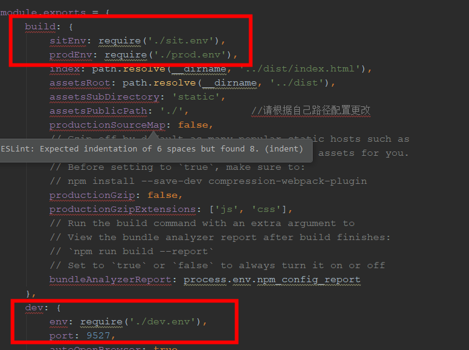

# 1. Vue(八)之懒加载
调用语句：
```
<router-link to='/baseData/dictionary'></router-link>
```

很多人在这里会想到用懒加载来加载组件，代码如下：

```
{path:'/medicalSvc',name:'医疗服务',component:resolve => require(['../components/medicalData/medicalServe'], resolve),},

```
但是如果你构建的是系统类项目，有上百个路由，这样的话 当你用webpack hot进行代码热更新的时候，速度就会超级慢，此时解决方法就是让他在开发环境下不要懒加载，在生产环境下再进行懒加载。我们首先要定义一个变量

```
const _import = require('./_import_' + process.env.NODE_ENV);
```

process.env是读取系统环境变量的，比如你在启动服务的时候，设置环境变量为production或者development，那么在程序里面就可以通过process.env.NODE_ENV获取。此时你就需要再写两个文件(注意文件的名称命名)分别导出不同环境下的文件目录如：

```
*_production.js:  
module.exports = file => () => import('@/views/' + file + '.vue')

*_develope.js: 
module.exports = file => require('@/views/' + file + '.vue')
```


import文件
然后将组件路径定义为：

```
{path:'/app/customerSource',component:_import('customerSource')},
```

那么又是怎么设置环境变量为production或者development值的呢，是在配置文件index.js下
