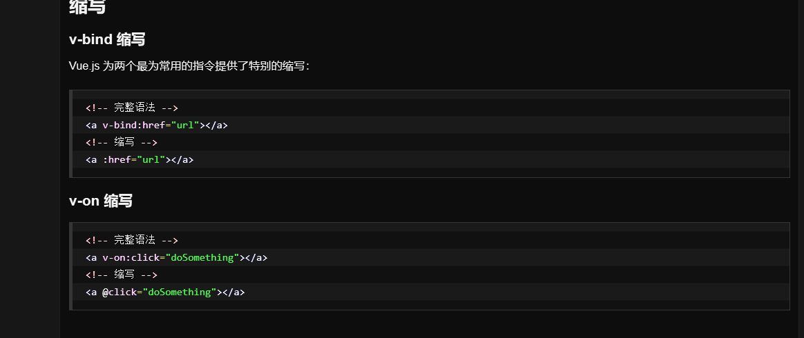
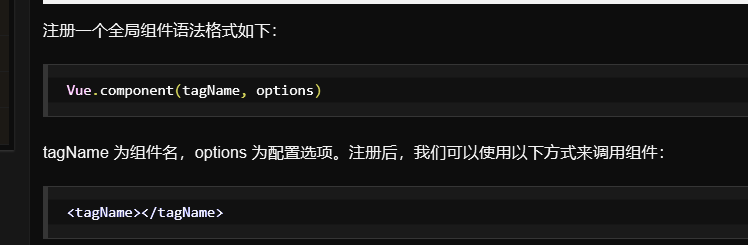
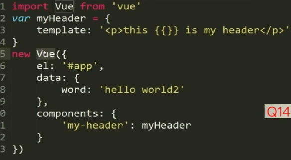

# 1. 语法
```
每个 Vue 应用都需要通过实例化 Vue 来实现。
语法格式如下:
var vm = new Vue({
  // 选项
})
```
# 2. 指令
指令是带有 v- 前缀的特殊属性。
## 2.1. 常见的v指令
### 2.1.1. v-if
条件判断使用 v-if 指令
### 2.1.2. v-for
循环
### 2.1.3. 计算属性
computed
### 2.1.4. v-model 
指令用来在 input、select、text、checkbox、radio 等表单控件元素上创建双向数据绑定，根据表单上的值，自动更新绑定的元素的值。
按钮的事件我们可以使用 v-on 监听事件，并对用户的输入进行响应。
### 2.1.5. v-on:click
它用于监听 DOM 事件：
### 2.1.6. v-bind
指令将该元素的 href 属性与表达式 url 的值绑定。
# 3. 缩写
## 3.1. v-bind 缩写
Vue.js 为两个最为常用的指令提供了特别的缩写：


```
<!-- 完整语法 -->
<a v-bind:href="url"></a>
<!-- 缩写 -->
<a :href="url"></a>
```
## 3.2. v-on 缩写
```
<!-- 完整语法 -->
<a v-on:click="doSomething"></a>
<!-- 缩写 -->
<a @click="doSomething"></a>
```
# 4. 组件
1.全局组件

局部组件
    