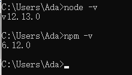
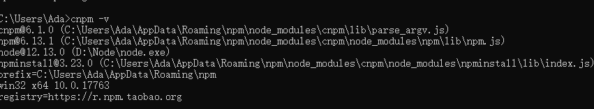
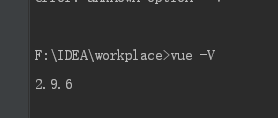
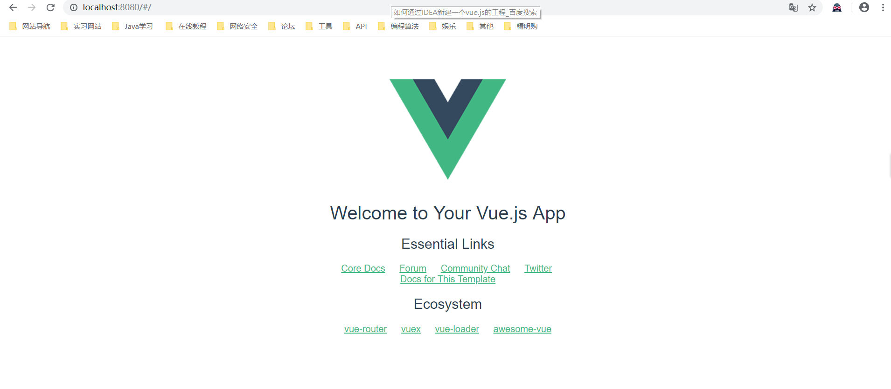
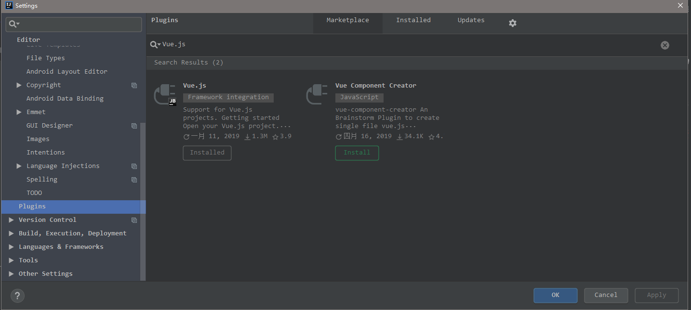
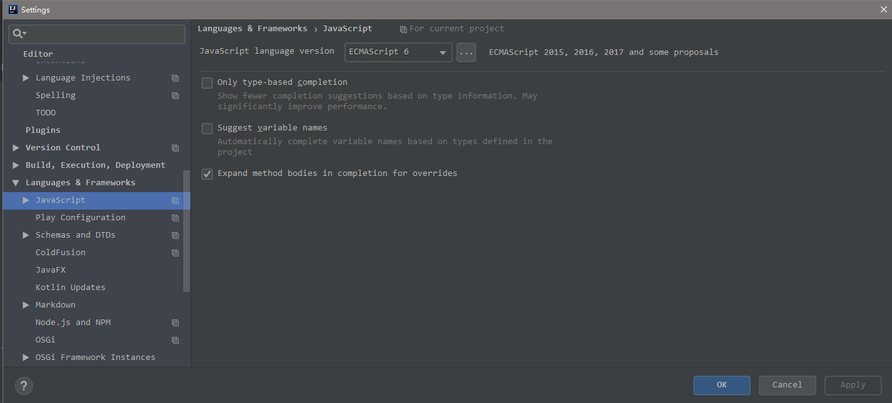
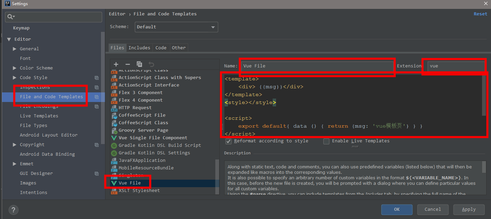

# 1. 安装node.js
- node.js下载地址：https://nodejs.org/en/download/
用中文网比较下载比较快：http://nodejs.cn/download/


 - 安装后检查是否成功：（如出现以上图示就是成功了）

# 2. 在IDEA中配置vue

## 2.1. 安装 vue-cli

安装好了 node，我们可以直接全局安装 vue-cli：

```
npm install -g vue-cli
```
但是这种安装方式比较慢，推荐使用国内镜像来安装，所以我们先设置 cnpm：

```
npm install -g cnpm --registry=https://registry.npm.taobao.org
```
如果安装失败，可以使用 `npm cache clean `清理缓存，然后再重新安装。后面的安装过程中，如有安装失败的情况，也需要先清理缓存

同样可以使用` cnpm -v` 查看是否安装成功


## 2.2. 新建web工程之后，在命令行中输入
```
npm i -g cnpm --registry=https://registry.npm.taobao.org
```

等待下载完成以后，继续安装vue的脚手架工具，在Terminal内继续输入以下命令
```
npm i -g vue-cli
测试是否安装成功：
vue -V
```
如图即安装成功



脚手架安装完成后，初始化包结构,继续输入：
```
vue init webpack demo(项目名)
```
demo为你前面新建的项目名。初始化会进行设置。可参考此处设置。
```
? Project name vue
? Project description A vue.js project
? Author ada
? Vue build standalone
? Install vue-router? Yes
? Use ESLint to lint your code? No
? Set up unit tests No
? Setup e2e tests with Nightwatch? No
? Should we run `npm install` for you after the project has been created? (recommended) no

   vue-cli · Generated "demo".

# Project initialization finished!

```

初始化完成后。依次在Terminal输入图片内的文字
```
To get started:

  cd vue
  npm install (or if using yarn: yarn)
  npm run dev

Documentation can be found at https://vuejs-templates.github.io/webpack
提示成功:

 DONE  Compiled successfully in 7516ms                                                                  12:16:22

 I  Your application is running here: http://localhost:8080

```



# 3. IDEA导入vue项目和配置







