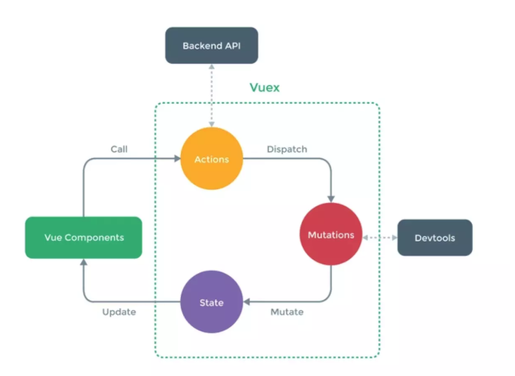

# 1. Vuex是什么
Vux 是一个专门为vue.js 应用程序开发的状态管理模式。它采用集中式存储管理应用的所有组件状态，并以相应的规则保证状态以一种可预测的方式发生变化

# 2. 使用场景
- 多个视图使用于同一状态
传参的方法对于多层嵌套的组件将会非常繁琐，并且对于兄弟组件间的状态传递无能为力


- 不同视图需要变更同一状态：
采用父子组件直接引用或者通过事件来变更和同步状态的多份拷贝，通常会导致无法维护的代
## 2.1. 数据流层


- Vuex简化流程可以理解为：
View components -> actions(dispatch方式) -> mutations(commit方式) -> state -> View components
而 getters则可以理解为computed，作为state的计算属性

- 注意
```
1. 数据流都是单向的

2. 组件能够调用action

3. action用来派发mutation

4. 只有mutation可以改变状态

5. store是响应式的，无论state什么时候更新，组件都将同步更新

```


