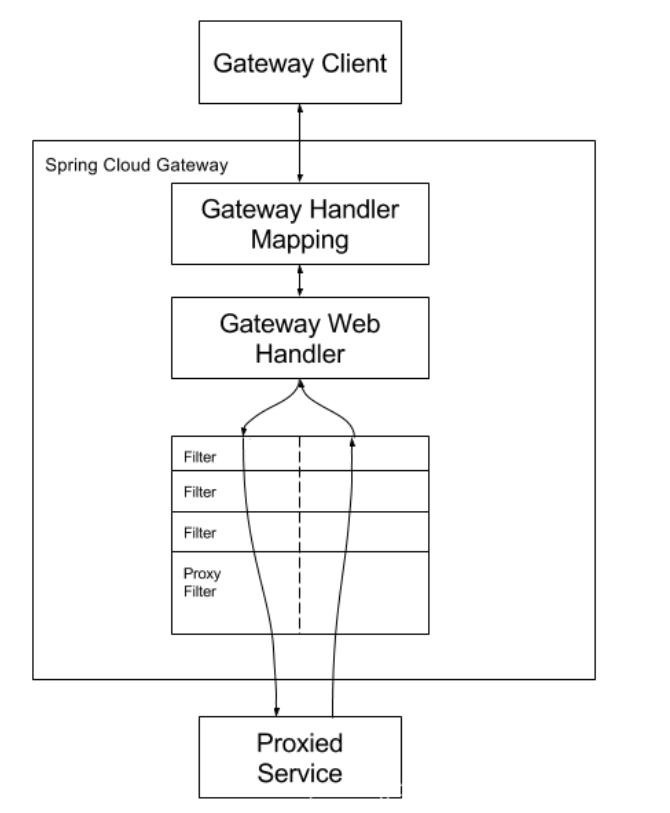

# 1. Spring Cloud Gateway 是什么
Spring Cloud Gateway **基于 Spring Boot 2**， 是 Spring Cloud 的 全新 项目， 该项 目 提供 了 一个 构建 在 Spring 生态 之上 的 API 网关， 包括 Spring 5、 Spring Boot 2 和 Project Reactor。 Spring Cloud Gateway 旨在 提供 一种 **简单 而 有效 的 途径 来 转发 请求**， 并为 它们 提供 横 切 关注 点， 例如： 安全性、 监控/ 指标 和 弹性
# 2. Spring Cloud Gateway 特性
- 基于 Java 8 编码
- 基于Spring Framework 5，Project Reactor和Spring Boot 2.0构建
- 支持动态路由，能够匹配任何请求属性上的路由。
- 支持 内置 到 Spring Handler 映射 中的 路 由 匹配
- 支持 基于 HTTP 请求 的 路 由 匹配（ Path、 Method、 Header、 Host 等）；
- 集成了Hystrix断路器
- 过滤器 作用于 匹配 的 路 由
- 过滤器可以修改 HTTP 请求和HTTP 响应（ 增加/ 修改 头部、 增加/ 修改 请求 参数、 改写 请求 路径 等）
- 支持 Spring Cloud DiscoveryClient 配置路由，与服务发现与注册配合使用
- 支持限流
- 支持地址重写
# 3. Spring Cloud Gateway 词汇
- Route（路由）: 路由网关的基本构建块 
它由ID，目标URI，谓词集合和过滤器集合定义。 如果聚合谓词为真，则匹配路由

- Predicate: 这是一个Java 8函数谓词
输入类型是Spring Framework ServerWebExchange。 这允许开发人员匹配HTTP请求中的任何内容，例如标头或参数。

- Filter: 这些是使用特定工厂构建的Spring Framework GatewayFilter实例。 这里，可以在发送下游请求之前或之后修改请求和响应

# 4. Spring Cloud Gateway 与 Zuul的区别
在 Finchley 正式版之前，Spring Cloud 推荐的网关是 Netflix 提供的Zuul：

- Zuul 1.x，是一个基于阻塞 I/ O 的 API Gateway

- Zuul 1.x 基于Servlet 2. 5，使用阻塞架构，它不支持任何长连接，如 WebSocket。 Zuul 的设计模式和Nginx较像，每次 I/ O 操作都是从工作线程中选择一个执行，请求线程被阻塞到工作线程完成，但是差别是Nginx 用C++ 实现，Zuul 用 Java 实现，而 JVM 本身会有第一次加载较慢的情况，使得Zuul 的性能相对较差。

- Zuul 2.x，基于 Netty 非阻塞、支持长连接，但 Spring Cloud 目前还没有整合。 Zuul 2.x的性能较 Zuul 1.x 有较大提升。在性能方面，根据官方提供的基准测试， Spring Cloud Gateway 的 RPS（每秒请求数）是Zuul 的 1. 6 倍。

- Spring Cloud Gateway 建立 在 Spring Framework 5、 Project Reactor 和 Spring Boot 2 之上， 使用 非 阻塞 API。

- Spring Cloud Gateway 还 支持 WebSocket， 并且 与 Spring 紧密 集成， 拥有 更好 的 开发 体验

# 5. Spring Cloud Gateway 工作流程


客户端向 Spring Cloud Gateway 发出请求。然后在 Gateway Handler Mapping 中找到与请求相匹配的路由，将其发送到 Gateway Web Handler。Handler 再通过指定的过滤器链来将请求发送到我们实际的服务执行业务逻辑，然后返回。
过滤器之间用虚线分开是因为过滤器可能会在发送代理请求之前（“pre”）或之后（“post”）执行业务逻辑

# 6. Spring Cloud Gateway 默认路由规则
路由格式：

```
http://GATEWAY_HOST:GATEWAY_PORT/UPPER_SERVICEID/**


GATEWAY_HOST：网关主机
GATEWAY_PORT：网关端口
UPPER_SERVICEID：应用在注册中心的唯一serviceId,默认大写访问，同时serviceId中不要包含【/】
```

事例：

http://localhost:9000/EUREKA-CLIENT@192.168.1.101@8000/api/users

备注： Spring Cloud Gateway需要Spring Boot和Spring Webflux提供的Netty运行时。
它不能在传统的Servlet容器中工作或构建为WAR