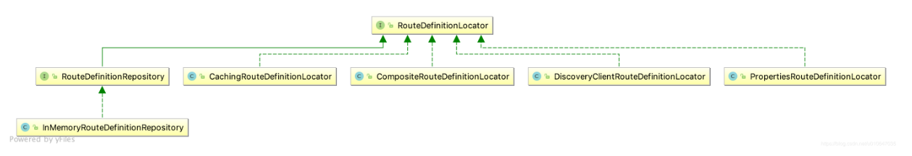

# 1. 路由定义定位器 RouteDefinitionLocator
RouteDefinitionLocator 是路由定义定位器的顶级接口，它的主要作用就是读取路由的配置信息（org.springframework.cloud.gateway.route.RouteDefinition）。它有五种不同的实现类，如图


# 2. RouteDefinitionLocator
```
public interface RouteDefinitionLocator {
    Flux<RouteDefinition> getRouteDefinitions();
}
```

通过 RouteDefinitionLocator 的类图，可以看出该接口有多个实现类：

- PropertiesRouteDefinitionLocator：基于属性配置
- DiscoveryClientRouteDefinitionLocator：基于服务发现
- CompositeRouteDefinitionLocator：组合方式
- CachingRouteDefinitionLocator：缓存方式
其中还有一个接口 RouteDefinitionRepository 继承自RouteDefinitionLocator，用于对路由定义的操作（保存、删除路由定义）

# 3. RouteDefinition
RouteDefinition 作为GatewayProperties中的属性，在网关启动的时候读取配置文件中的相关配置信息

```
@Validated
public class RouteDefinition {
    
    @NotEmpty
    private String id = UUID.randomUUID().toString();
    
   
    @NotEmpty
    @Valid
    private List<PredicateDefinition> predicates = new ArrayList();
    
   
    @Valid
    private List<FilterDefinition> filters = new ArrayList();
    
 
    @NotNull
    private URI uri;
    
    
    private int order = 0;

    public RouteDefinition() {
    }

    public RouteDefinition(String text) {
        int eqIdx = text.indexOf(61);
        if (eqIdx <= 0) {
            throw new ValidationException("Unable to parse RouteDefinition text '" + text + "', must be of the form name=value");
        } else {
            this.setId(text.substring(0, eqIdx));
            String[] args = StringUtils.tokenizeToStringArray(text.substring(eqIdx + 1), ",");
            this.setUri(URI.create(args[0]));

            for(int i = 1; i < args.length; ++i) {
                this.predicates.add(new PredicateDefinition(args[i]));
            }

        }
    }
   ----------------------省略----------------------------
}
```

在 RouteDefinition 中，主要有五个属性：

- id：路由id，默认为uuid

- predicates：PredicateDefinition 路由断言定义列表

- filters：FilterDefinition 过滤器定义列表

- uri：URI 转发地址

- order：优先级
进入断言和路由器属性可以看到他们是一个 Map 数据结构，可以存放多个对应的 键值对数组

# 4. RouteDefinitionRepository & InMemoryRouteDefinitionRepository

RouteDefinitionRepository 接口中的方法用来对RouteDefinition进行增、删、查操作
```

public interface RouteDefinitionRepository extends RouteDefinitionLocator, RouteDefinitionWriter {
}
```
```
//读取路由定义信息
public interface RouteDefinitionLocator {

	Flux<RouteDefinition> getRouteDefinitions();
}
```


```
//对路由定会进行保存和删除操作
public interface RouteDefinitionWriter {
    Mono<Void> save(Mono<RouteDefinition> route);

    Mono<Void> delete(Mono<String> routeId);
}
```
RouteDefinitionRepository 通过继承自 RouteDefinitionLocator、 RouteDefinitionWriter，封装了对路由定义信息的获取、增加、删除操作，在网关内置API端点接口时会用到这些操作。

InMemoryRouteDefinitionRepository 实现了 RouteDefinitionRepository 接口，基于内存的路由定义仓库，同时也是唯一提供的实现类。我们可以根据需要自定义扩展，存放到其它的存储介质中。

```
public class InMemoryRouteDefinitionRepository implements RouteDefinitionRepository {
    private final Map<String, RouteDefinition> routes = Collections.synchronizedMap(new LinkedHashMap());

    public InMemoryRouteDefinitionRepository() {
    }

    //保存路由定义到内存中
    public Mono<Void> save(Mono<RouteDefinition> route) {
        return route.flatMap((r) -> {
            this.routes.put(r.getId(), r);
            return Mono.empty();
        });
    }
    //根据路由id从内存中删除指定路由定义
    public Mono<Void> delete(Mono<String> routeId) {
        return routeId.flatMap((id) -> {
            if (this.routes.containsKey(id)) {
                this.routes.remove(id);
                return Mono.empty();
            } else {
                return Mono.defer(() -> {
                    return Mono.error(new NotFoundException("RouteDefinition not found: " + routeId));
                });
            }
        });
    }

    //获取内存中路由定义列表
    public Flux<RouteDefinition> getRouteDefinitions() {
        return Flux.fromIterable(this.routes.values());
    }
}
```

# 5. PropertiesRouteDefinitionLocator 

**基于配置属性的路由定义定位器**

从配置文件 yaml或properties中读取路由配置信息，如代码所示

```
public class PropertiesRouteDefinitionLocator implements RouteDefinitionLocator {
    private final GatewayProperties properties;

    public PropertiesRouteDefinitionLocator(GatewayProperties properties) {
        this.properties = properties;
    }

    public Flux<RouteDefinition> getRouteDefinitions() {
        return Flux.fromIterable(this.properties.getRoutes());
    }
}
```
PropertiesRouteDefinitionLocator 通过构造函数传入 GatewayProperties 对象，然后从该对象中读取路由配置信息

# 6. DiscoveryClientRouteDefinitionLocator
**基于服务发现的路由定义定位器**
该类通过服务发现组件从注册中心获取服务信息，此时路由定义的源就是配置中心

```
public class DiscoveryClientRouteDefinitionLocator implements RouteDefinitionLocator {
    //服务发现客户端
    private final DiscoveryClient discoveryClient;
    //服务发现属性
    private final DiscoveryLocatorProperties properties;
    //路由id前缀
    private final String routeIdPrefix;

   ------------------------------省略--------------------------------
}
//服务发现属性对象
@ConfigurationProperties("spring.cloud.gateway.discovery.locator")
public class DiscoveryLocatorProperties {
   // 开启服务发现
   private boolean enabled = false; 
   // 路由前缀，默认为 discoveryClient. getClass(). getSimpleName() + "_". 
   private String routeIdPrefix; 
   // SpEL 表达式，判断网关是否集成一个服务，默认为 true 
   private String includeExpression = "true"; 
   // SpEL 表达式，为每个路由创建uri，默认为'lb://'+ serviceId 
   private String urlExpression = "'lb://'+ serviceId"; 
   // 在 断言 和 过滤器 中使用小写 serviceId，默认为 false
   private boolean lowerCaseServiceId = false;
    //路由断言定义列表
    private List<PredicateDefinition> predicates = new ArrayList();
    //过滤器定义列表
    private List<FilterDefinition> filters = new ArrayList();
  ------------------------------省略--------------------------------
}
在 DiscoveryLocatorProperties 定义了以上属性，要启用基于服务发现的路由定义定位器就必须设置

spring.cloud.gateway.discovery.locator.enabled= true
includeExpression 属性判断网关是否集成一个服务，默认为true，
根据 includeExpression 表达式，过滤不符合的 ServiceInstance。

DiscoveryClientRouteDefinitionLocator -> getRouteDefinitions()

@Override
	public Flux<RouteDefinition> getRouteDefinitions() {
        //对 includeExpression 和 urlExpression 的 表达式 处理
		SpelExpressionParser parser = new SpelExpressionParser();
		Expression includeExpr = parser.parseExpression(properties.getIncludeExpression());
		Expression urlExpr = parser.parseExpression(properties.getUrlExpression());

		Predicate<ServiceInstance> includePredicate;
		if (properties.getIncludeExpression() == null || "true".equalsIgnoreCase(properties.getIncludeExpression())) {
			includePredicate = instance -> true;
		} else {
			includePredicate = instance -> {
				Boolean include = includeExpr.getValue(evalCtxt, instance, Boolean.class);
				if (include == null) {
					return false;
				}
				return include;
			};
		}
        //通过注册中心查找服务组装路由定义信息
		return Flux.fromIterable(discoveryClient.getServices())
				.map(discoveryClient::getInstances)
				.filter(instances -> !instances.isEmpty())
				.map(instances -> instances.get(0))
				// 根据 includeExpression 表达式,过滤不符合的 ServiceInstance
				.filter(includePredicate)
				.map(instance -> {
					String serviceId = instance.getServiceId();

                    RouteDefinition routeDefinition = new RouteDefinition();
                    routeDefinition.setId(this.routeIdPrefix + serviceId);
					String uri = urlExpr.getValue(evalCtxt, instance, String.class);
					routeDefinition.setUri(URI.create(uri));

					final ServiceInstance instanceForEval = new DelegatingServiceInstance(instance, properties);
                    
                    //添加配置的断言表达式
					for (PredicateDefinition original : this.properties.getPredicates()) {
						PredicateDefinition predicate = new PredicateDefinition();
						predicate.setName(original.getName());
						for (Map.Entry<String, String> entry : original.getArgs().entrySet()) {
							String value = getValueFromExpr(evalCtxt, parser, instanceForEval, entry);
							predicate.addArg(entry.getKey(), value);
						}
						routeDefinition.getPredicates().add(predicate);
					}
                    
                    //添加配置的过滤器
                    for (FilterDefinition original : this.properties.getFilters()) {
                    	FilterDefinition filter = new FilterDefinition();
                    	filter.setName(original.getName());
						for (Map.Entry<String, String> entry : original.getArgs().entrySet()) {
							String value = getValueFromExpr(evalCtxt, parser, instanceForEval, entry);
							filter.addArg(entry.getKey(), value);
						}
						routeDefinition.getFilters().add(filter);
					}

                    return routeDefinition;
				});
	}

	String getValueFromExpr(SimpleEvaluationContext evalCtxt, SpelExpressionParser parser, ServiceInstance instance, Map.Entry<String, String> entry) {
		Expression valueExpr = parser.parseExpression(entry.getValue());
		return valueExpr.getValue(evalCtxt, instance, String.class);
	}

	private static class DelegatingServiceInstance implements ServiceInstance {

		final ServiceInstance delegate;
		private final DiscoveryLocatorProperties properties;

		private DelegatingServiceInstance(ServiceInstance delegate, DiscoveryLocatorProperties properties) {
			this.delegate = delegate;
			this.properties = properties;
		}

		@Override
		public String getServiceId() {
			if (properties.isLowerCaseServiceId()) {
				return delegate.getServiceId().toLowerCase();
			}
			return delegate.getServiceId();
		}

	
	}
```
从源码可以看出，getRouteDefinitions 方法通过服务发现客户端从注册中心获取服务信息，组装成RouteDefinition路由定义列表，并将配置中的路由断言和过滤应用到RouteDefinition 中

# 7. CachingRouteDefinitionLocator 
**基于缓存的路由定义定位器**
缓存方式的路由定义定位器，通过传入路由定义定位器获取路由定义并缓存到本地。通过监听路由刷新时间RefreshRoutesEvent 来刷新本地缓存的路由定义信息

```
public class CachingRouteDefinitionLocator implements RouteDefinitionLocator {
    //路由定义定位器
    private final RouteDefinitionLocator delegate;
    //路由定义信息
    private final Flux<RouteDefinition> routeDefinitions;
    //本地缓存集合
    private final Map<String, List> cache = new HashMap();

    public CachingRouteDefinitionLocator(RouteDefinitionLocator delegate) {
        this.delegate = delegate;
        this.routeDefinitions = CacheFlux.lookup(this.cache, "routeDefs", RouteDefinition.class).onCacheMissResume(() -> {
            return this.delegate.getRouteDefinitions();
        });
    }

    public Flux<RouteDefinition> getRouteDefinitions() {
        return this.routeDefinitions;
    }

    //刷新本地缓存，先清空本地缓存再获取一份新的路由定义信息存储
    public Flux<RouteDefinition> refresh() {
        this.cache.clear();
        return this.routeDefinitions;
    }
   //监听路由刷新事件，刷新本地缓存的路由定义信息
    @EventListener({RefreshRoutesEvent.class})
    void handleRefresh() {
        this.refresh();
    }
}
```

# 8. CompositeRouteDefinitionLocator 
**组合路由定义定位器**
组合方式路由定义定位器使用组合模式进行实现，组合多个 RouteDefinitionLocator 的实现，为获取路由定义信息 getRouteDefinitions 提供统一入口，组合的逻辑很简单，通过传入的路由定义定位器作为代理，具体的路由定义实际上是由传入的路由定义定位器产生。

```
public class CompositeRouteDefinitionLocator implements RouteDefinitionLocator {
    private final Flux<RouteDefinitionLocator> delegates;

    public CompositeRouteDefinitionLocator(Flux<RouteDefinitionLocator> delegates) {
        this.delegates = delegates;
    }

    public Flux<RouteDefinition> getRouteDefinitions() {
        return this.delegates.flatMap(RouteDefinitionLocator::getRouteDefinitions);
    }
}
```