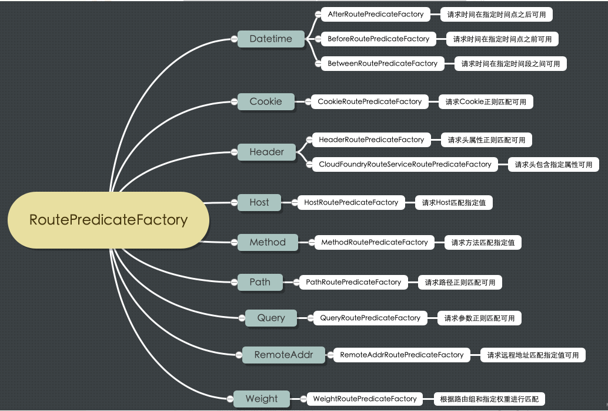

# 1. 路由谓词工厂 RoutePredicateFactory
Spring Cloud Gateway 创建 Route 对象时， 使用 RoutePredicateFactory 创建 Predicate 对象，Predicate 对象可以赋值给 Route。 Spring Cloud Gateway 包含许多内置的Route Predicate Factories。所有这些谓词都匹配HTTP请求的不同属性。多种谓词工厂可以组合，并通过逻辑and。

路由选择是通过Predicate函数式接口进行判断当前路由是否满足给定条件。


路由谓词工厂 RoutePredicateFactory 包含的主要实现类如图所示，可以看到该接口有多个实现类。抽象类 AbstractRoutePredicateFactory 实现了路由谓词工厂，但是没有实际的方法，具体的实现类都是继承自抽象类 AbstractRoutePredicateFactory 包括 Datetime、 请求的远端地址、 路由权重、 请求头、 Host 地址、 请求方法、 请求路径 和 请求参数等类型的路由断言
## 1.1. 路由谓词工厂 RoutePredicateFactory
按照功能对路由谓词工厂进行划分，可以划分为以下几种，如图所示


源码：
```
@FunctionalInterface
public interface RoutePredicateFactory<C> extends ShortcutConfigurable, Configurable<C> {
	String PATTERN_KEY = "pattern";

	// useful for javadsl
	default Predicate<ServerWebExchange> apply(Consumer<C> consumer) {
		C config = newConfig();
		consumer.accept(config);
		beforeApply(config);
		return apply(config);
	}

	default AsyncPredicate<ServerWebExchange> applyAsync(Consumer<C> consumer) {
		C config = newConfig();
		consumer.accept(config);
		beforeApply(config);
		return applyAsync(config);
	}

	default Class<C> getConfigClass() {
		throw new UnsupportedOperationException("getConfigClass() not implemented");
	}

	@Override
	default C newConfig() {
		throw new UnsupportedOperationException("newConfig() not implemented");
	}

	default void beforeApply(C config) {}

	Predicate<ServerWebExchange> apply(C config);

	default AsyncPredicate<ServerWebExchange> applyAsync(C config) {
		return toAsyncPredicate(apply(config));
	}

	default String name() {
		return NameUtils.normalizeRoutePredicateName(getClass());
	}

}

```
RoutePredicateFactory 接口继承自 ShortcutConfigurable 接口，ShortcutConfigurable 接口在多个实现类中都有出现，根据传入的具体 RouteDefinitionLocator 获取路由定义对象时，就用到了该接口中的默认方法。路由谓词的种类很多，不同的谓词需要的配置参数不一样，所以每种 路由谓词（断言）和过滤器的实现都会实现 ShortcutConfigurable 接口，来指定自身参数的个数和顺序

## 1.2. ShortcutConfigurable
ShortcutConfigurable 接口提供的默认方法，主要用于对过滤器和断言参数进行标准化处理，将表达式和生成的键进行转换。

```
public interface ShortcutConfigurable {

	enum ShortcutType {
		DEFAULT {
			@Override
			public Map<String, Object> normalize(Map<String, String> args, ShortcutConfigurable shortcutConf, SpelExpressionParser parser, BeanFactory beanFactory) {
				Map<String, Object> map = new HashMap<>();
				int entryIdx = 0;
				for (Map.Entry<String, String> entry : args.entrySet()) {
					String key = normalizeKey(entry.getKey(), entryIdx, shortcutConf, args);
					Object value = getValue(parser, beanFactory, entry.getValue());

					map.put(key, value);
					entryIdx++;
				}
				return map;
			}
		},

		GATHER_LIST {
			@Override
			public Map<String, Object> normalize(Map<String, String> args, ShortcutConfigurable shortcutConf, SpelExpressionParser parser, BeanFactory beanFactory) {
				Map<String, Object> map = new HashMap<>();
				// field order should be of size 1
				List<String> fieldOrder = shortcutConf.shortcutFieldOrder();
				Assert.isTrue(fieldOrder != null
								&& fieldOrder.size() == 1,
						"Shortcut Configuration Type GATHER_LIST must have shortcutFieldOrder of size 1");
				String fieldName = fieldOrder.get(0);
				map.put(fieldName, args.values().stream()
						.map(value -> getValue(parser, beanFactory, value))
						.collect(Collectors.toList()));
				return map;
			}
		};

		public abstract Map<String, Object> normalize(Map<String, String> args, ShortcutConfigurable shortcutConf,
													  SpelExpressionParser parser, BeanFactory beanFactory);
	}

	static String normalizeKey(String key, int entryIdx, ShortcutConfigurable argHints, Map<String, String> args) {
	    /*************************(1)*********************************/
		// RoutePredicateFactory has name hints and this has a fake key name
		// replace with the matching key hint
		if (key.startsWith(NameUtils.GENERATED_NAME_PREFIX) && !argHints.shortcutFieldOrder().isEmpty()
				&& entryIdx < args.size() && entryIdx < argHints.shortcutFieldOrder().size()) {
			key = argHints.shortcutFieldOrder().get(entryIdx);
		}
		return key;
	}

	static Object getValue(SpelExpressionParser parser, BeanFactory beanFactory, String entryValue) {
		/*************************(2)*********************************/

		Object value;
		String rawValue = entryValue;
		if (rawValue != null) {
			rawValue = rawValue.trim();
		}
		if (rawValue != null && rawValue.startsWith("#{") && entryValue.endsWith("}")) {
		/*************************(3)*********************************/

			// assume it's spel
			StandardEvaluationContext context = new StandardEvaluationContext();
			context.setBeanResolver(new BeanFactoryResolver(beanFactory));
			Expression expression = parser.parseExpression(entryValue, new TemplateParserContext());
			value = expression.getValue(context);
		} else {
			value = entryValue;
		}
		return value;
	}

	default ShortcutType shortcutType() {
		return ShortcutType.DEFAULT;
	}

	/**
	 * Returns hints about the number of args and the order for shortcut parsing.
	 * @return
	 */
	default List<String> shortcutFieldOrder() {
	/*************************(4)*********************************/

		return Collections.emptyList();
	}

	default String shortcutFieldPrefix() {
		return "";
	}

}
```
以上代码主要做了以下工作：

- 对键进行标准化处理，因为键有可能是自动生成，当键以_ genkey_ 开头时， 表明是自动生成的。

- 获取真实值，需要传入 Spring EL 解析器、Bean工厂等工具类。

- 对传入的 entryValue 是一个表达式的情况进行处理，这里默认是 Spring EL 表达式。

- 返回有关参数数量和解析顺序的提示

# 2. Datetime 类型的路由谓词工厂
Datetime 类型的路由谓词工厂有三种，分别为：

AfterRoutePredicateFactory： 接收一个日期参数，判断请求日期是否晚于指定日志

BeforeRoutePredicateFactory： 接收一个日期参数，判断请求日期是否早于指定日志

BetweenRoutePredicateFactory： 接收两个日期参数，判断请求日期是否在指定时间段内

以 AfterRoutePredicateFactory 为例，介绍 Datetime 类型的断言工厂的应用：

```
spring:
    cloud: 
        gateway:
            routes: 
            - id: after_route_id
            uri: http://www.baidu.com
            predicates: 
            - After= 2018-12-30T23:59:59.789+08:00[Asia/Shanghai]
```

上面的配置文件指定了路由的断言，谓词关键字是 After ，表示请求时间必须晚于上海时间 2018年12月30日 23:59:59 才可用

# 3. 基于远程地址（RemoteAttr）的路由谓词工厂
RemoteAddrRoutePredicateFactory 属于根据请求IP进行路由类型，接收 CIDR表示 法（IPv4或IPv6）的字符串列表（列表最小长度为1）作为参数， 例如 192.168.0.1/ 16， 其中 192. 168. 0. 1 是 IP 地址， 16 是 子 网 掩 码。

```
spring: 
    cloud:
        gateway: 
            routes:
            -id: remoteaddr_ route_id
            uri: http://www.baidu.com
            predicates:
            -RemoteAddr=192.168.1.1/24
```

以上配置表示如果请求的远程地址是 192.168.1.10，将会匹配该路由。

// RemoteAddrRoutePredicateFactory.java

```
@Override
	public Predicate<ServerWebExchange> apply(Config config) {
        List<IpSubnetFilterRule> sources = convert(config.sources);

		return exchange -> {
		    //获取请求中的远程地址
			InetSocketAddress remoteAddress = config.remoteAddressResolver.resolve(exchange);
			if (remoteAddress != null) {
				String hostAddress = remoteAddress.getAddress().getHostAddress();
				String host = exchange.getRequest().getURI().getHost();

				if (log.isDebugEnabled() && !hostAddress.equals(host)) {
					log.debug("Remote addresses didn't match " + hostAddress + " != " + host);
				}
                //遍历配置好的 RemoteAddr 列表， 如果远程地址在列表中则匹配成功
				for (IpSubnetFilterRule source : sources) {
					if (source.matches(remoteAddress)) {
						return true;
					}
				}
			}

			return false;
		};
	}

	private void addSource(List<IpSubnetFilterRule> sources, String source) {
		if (!source.contains("/")) { 
		//当 RemoteAddr 没有子网掩码时，默认为/32
			source = source + "/32";
		}

		String[] ipAddressCidrPrefix = source.split("/",2);
		String ipAddress = ipAddressCidrPrefix[0];
		int cidrPrefix = Integer.parseInt(ipAddressCidrPrefix[1]);
        //根据 ip 和 子网，确定 RemoteAddr 的范围，并加入到 sources 中
		sources.add(new IpSubnetFilterRule(ipAddress, cidrPrefix, IpFilterRuleType.ACCEPT));
	}
```

基于远程地址匹配的路由断言实现，首先获取配置文件中的 RemoteAttr 列表，然后将配置的 RemoteAttr 列表转换成 sources 列表，主要是根据IP地址和子网掩码确定地址范围，最后判断请求的远程地址是否在设置的 IP 列表中

# 4. 基于路由权重（weigth）的谓词工厂
Spring Cloud Gateway 提供了基于路由权重的断言工厂，配置时指定分组和权重值 即可。WeightRoutePredicateFactory 实现了路由权重的功能，按照路由权重选择 同一个分组中的路由。

```
spring:
  cloud:
    gateway:
      locator:
        enabled: true
      routes:
        -id: weight_route1
          uri: http://www.baidu1.com
          order: 6000
          predicates:
          -Weight= group3, 1
          -Path=/ weight/**
          filters:
          -StripPrefix= 2
        -id: weight_route2
          uri: http://www.baidu2.com
          order: 6000
          predicates: 
          -Path=/ weight/** 
          -Weight= group3, 9 
          filters: 
          -StripPrefix=1
```

如上配置了两个对于 / weight/** 路径转发的路由定义，这两个路由是同一个权重分组，且 weight_ route1 权重为 1， weight_ route2 权重为9。 对于10个访问/ weight/** 路径的请求来说，将会有9个路由到 weight_ route2，1个路由到 weight_ route1。

## 4.1. WeightRoutePredicateFactory 权重算法实现过程
weight_ route1： group3, 1 
weight_ route2： group3, 9
实现过程为：

```
构造 weights（group3）数组：weights=[ 1， 9]

normalize： weights= weights/ sum（ weights）=[ 0. 1， 0. 9]

计算区间范围： ranges= weights. collect（ 0，（ s， w）-> s+ w）=[ 0， 0. 1， 1. 0]

生成 随机数： r= random（）

搜索随机数所在的区间： i= integer s. t. r>= ranges[ i]&& r< ranges[ i+ 1]

选择相应的路由： routes[ i]
```

网关应用服务在启动时会发布 WeightDefinedEvent，在 WeightCalculatorWebFilter 过滤器中定义了该时间监听器，当接收到时间 WeightDefinedEvent 时，会自动添加 WeightConfig 到权重配置中。请求在经过 WeightCalculatorWebFilter 时会 生成 一个 随机数， 根据随机数所在的区间选择对应分组的路由。

// WeightRoutePredicateFactory.java

```
@Override
	public Predicate<ServerWebExchange> apply(Config config) {
        List<IpSubnetFilterRule> sources = convert(config.sources);

		return exchange -> {
			InetSocketAddress remoteAddress = config.remoteAddressResolver.resolve(exchange);
			if (remoteAddress != null) {
				String hostAddress = remoteAddress.getAddress().getHostAddress();
				String host = exchange.getRequest().getURI().getHost();

				if (log.isDebugEnabled() && !hostAddress.equals(host)) {
					log.debug("Remote addresses didn't match " + hostAddress + " != " + host);
				}

				for (IpSubnetFilterRule source : sources) {
					if (source.matches(remoteAddress)) {
						return true;
					}
				}
			}

			return false;
		};
	}
```
当应用到配置的路由断言 WeightRoutePredicate 时，会根据 ServerWebExchange 中的 WEIGHT_ ATTR 值，判断当前的 routeId 与对应分组的 routeId 是否一致


# 5. 基于Cookie的谓词工厂
CookieRoutePredicateFactory 是 Cookie 类型的路由断言工厂，接收两个参数： cookie 名字和一个正则表达式。 此谓词匹配具有给定名称且值与正则表达式匹配的cookie。

```
spring:
  cloud:
    gateway:
      routes:
      - id: cookie_route
        uri: http://example.org
        predicates:
        - Cookie=chocolate, ch.p
```
此路由匹配请求有一个名为chocolate的cookie，其值与ch.p正则表达式匹配。

# 6. 基于Header的谓词工厂
Header Route Predicate Factory有两个参数，标题名称和正则表达式。此谓词与具有给定名称且值与正则表达式匹配的标头匹配。

```
spring:
  cloud:
    gateway:
      routes:
      - id: header_route
        uri: http://example.org
        predicates:
        - Header=X-Request-Id, \d+
```
如果请求具有名为X-Request-Id的标头，则该路由匹配，其值与\ d +正则表达式匹配（具有一个或多个数字的值）。

# 7. 基于Host的谓词工厂
Host Route Predicate Factory采用一个参数：主机名模式。该模式是一种Ant样式模式“.”作为分隔符。此谓词匹配与模式匹配的Host标头。

```
spring:
  cloud:
    gateway:
      routes:
      - id: host_route
        uri: http://www.baidu.com
        predicates:
        - Host=**.testhost.org
```
如果请求的主机头具有值 **.testhost.org，则此路由将匹配。

# 8. 基于Method请求方法的谓词工厂
Method Route Predicate Factory采用一个参数：要匹配的HTTP方法。

```
spring:
  cloud:
    gateway:
      routes:
      - id: method_route
        uri: http://example.org
        predicates:
        - Method=GET
```
如果请求的 Method 为 GET，则匹配该路由。

# 9. 基于Path请求路径的谓词工厂
PathRoutePredicateFactory 是基于请求路径的路由断言工厂，接收一个参数： Spring 的 PathMatcher 模式串。

```
spring:
  cloud:
    gateway:
      routes:
      - id: host_route
        uri: http://example.org
        predicates:
        - Path=/foo/{segment}
```
如果请求路径是 /foo/1 或者/foo/bar，将会匹配该路由。

# 10. 基于Query请求参数的路由工厂
QueryRoutePredicateFactory 是请求参数的路由断言工厂，接收两个参数： 一个 必须的请求param 和一个可选的正则表达式。

```
spring:
  cloud:
    gateway:
      routes:
      - id: query_route
        uri: http://example.org
        predicates:
        - Query=baz, ba.
```
如果请求中包含baz查询参数，且其值匹配 ba. 正则表达式，将会匹配该路由

