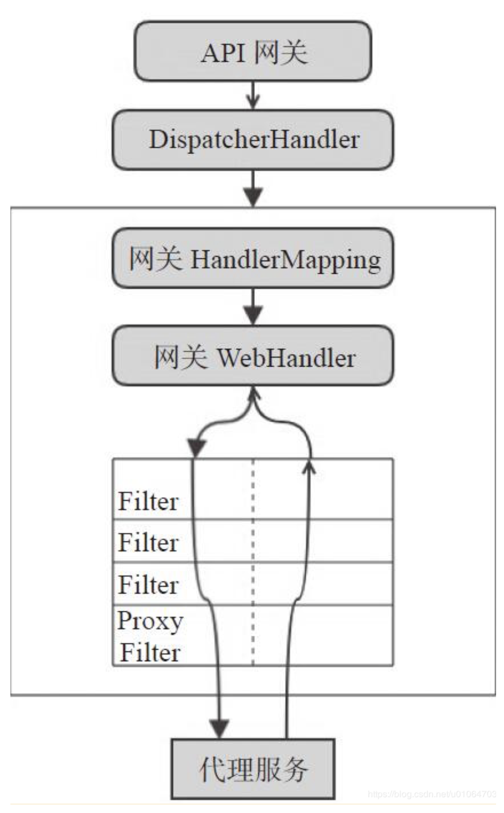
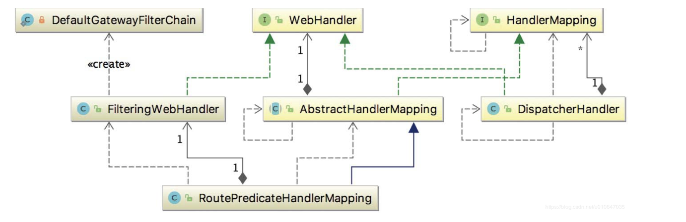

# 1. Spring Cloud Gateway 网关处理流程概述


- 请求发送到网关， DispatcherHandler 是HTTP请求的中央分发器，将请求匹配到响应的HandlerMapping；

- 请求与处理器之间有一个映射关系，网关将会对请求进行路由，handler会匹配到RoutePredicateHandlerMapping，以匹配到对应的Route

- 接着请求到达网关的web处理器，该WebHandler 代理了一系列网关过滤器和全局过滤器的实例，此时会对请求头或响应头进行处理

- 最后转发到具体的代理服务

# 2. Spring Cloud Gateway 初始化
```
当启动网关服务时，引入的Spring Cloud Gateway 的starter将会自动加载一些配置：

# Auto Configure
org.springframework.boot.autoconfigure.EnableAutoConfiguration=\
# WebFlux 依赖检查配置类
org.springframework.cloud.gateway.config.GatewayClassPathWarningAutoConfiguration,\
# 网关核心自动配置类，配置路由规则、过滤器等
org.springframework.cloud.gateway.config.GatewayAutoConfiguration,\
# 客户端负载均衡自动配置类
org.springframework.cloud.gateway.config.GatewayLoadBalancerClientAutoConfiguration,\
# 网关指标自动配置类
org.springframework.cloud.gateway.config.GatewayMetricsAutoConfiguration,\
# redis 自动配置类
org.springframework.cloud.gateway.config.GatewayRedisAutoConfiguration,\
# 服务发现客户端自动配置类
org.springframework.cloud.gateway.discovery.GatewayDiscoveryClientAutoConfiguration
下面不会一一列出以上的配置，这里主要看一下设计网关属性的配置。GatewayProperties是网关配置中的核心配置属性类：
```

# 3. 源码
```
@ConfigurationProperties("spring.cloud.gateway")
@Validated
public class GatewayProperties {
    private final Log logger = LogFactory.getLog(this.getClass());
    @NotNull
    @Valid
    private List<RouteDefinition> routes = new ArrayList();
    private List<FilterDefinition> defaultFilters = new ArrayList();
    private List<MediaType> streamingMediaTypes;

    public GatewayProperties() {
        this.streamingMediaTypes = Arrays.asList(MediaType.TEXT_EVENT_STREAM, MediaType.APPLICATION_STREAM_JSON);
    }

    public List<RouteDefinition> getRoutes() {
        return this.routes;
    }

    public void setRoutes(List<RouteDefinition> routes) {
        this.routes = routes;
        if (routes != null && routes.size() > 0 && this.logger.isDebugEnabled()) {
            this.logger.debug("Routes supplied from Gateway Properties: " + routes);
        }

    }

    public List<FilterDefinition> getDefaultFilters() {
        return this.defaultFilters;
    }

    public void setDefaultFilters(List<FilterDefinition> defaultFilters) {
        this.defaultFilters = defaultFilters;
    }

    public List<MediaType> getStreamingMediaTypes() {
        return this.streamingMediaTypes;
    }

    public void setStreamingMediaTypes(List<MediaType> streamingMediaTypes) {
        this.streamingMediaTypes = streamingMediaTypes;
    }

    public String toString() {
        return "GatewayProperties{routes=" + this.routes + ", defaultFilters=" + this.defaultFilters + ", streamingMediaTypes=" + this.streamingMediaTypes + '}';
    }
}

```

GatewayProperties 有三个属性，分别是路由列表（对应路由定义对象RouteDefinition）、默认过滤器列表（对应过滤器对象FilterDefinition）、流媒体类型列表（对应流媒体对象MediaType）

# 4. 网关处理器


## 4.1. 请求分发器 DispatcherHandler

```
public class DispatcherHandler implements WebHandler, ApplicationContextAware {
    private static final Exception HANDLER_NOT_FOUND_EXCEPTION;
    private static final Log logger;
    @Nullable
    private List<HandlerMapping> handlerMappings;
    @Nullable
    private List<HandlerAdapter> handlerAdapters;
    @Nullable
    private List<HandlerResultHandler> resultHandlers;

    public DispatcherHandler() {
    }

    public DispatcherHandler(ApplicationContext applicationContext) {
        this.initStrategies(applicationContext);
    }

    @Nullable
    public final List<HandlerMapping> getHandlerMappings() {
        return this.handlerMappings;
    }

    public void setApplicationContext(ApplicationContext applicationContext) {
        this.initStrategies(applicationContext);
    }


//根据请求匹配对应的出列器
    public Mono<Void> handle(ServerWebExchange exchange) {
        if (logger.isDebugEnabled()) {
            ServerHttpRequest request = exchange.getRequest();
            logger.debug("Processing " + request.getMethodValue() + " request for [" + request.getURI() + "]");
        }

        return this.handlerMappings == null ? Mono.error(HANDLER_NOT_FOUND_EXCEPTION) : Flux.fromIterable(this.handlerMappings).concatMap((mapping) -> {
            return mapping.getHandler(exchange);
        }).next().switchIfEmpty(Mono.error(HANDLER_NOT_FOUND_EXCEPTION)).flatMap((handler) -> {
            return this.invokeHandler(exchange, handler);
        }).flatMap((result) -> {
            return this.handleResult(exchange, result);
        });
    }
    
  
    private Mono<HandlerResult> invokeHandler(ServerWebExchange exchange, Object handler) {
		if (this.handlerAdapters != null) {
			for (HandlerAdapter handlerAdapter : this.handlerAdapters) {
				if (handlerAdapter.supports(handler)) {
					return handlerAdapter.handle(exchange, handler);
				}
			}
		}
		return Mono.error(new IllegalStateException("No HandlerAdapter: " + handler));
	}

	private Mono<Void> handleResult(ServerWebExchange exchange, HandlerResult result) {
		return getResultHandler(result).handleResult(exchange, result)
				.onErrorResume(ex -> result.applyExceptionHandler(ex).flatMap(exceptionResult ->
						getResultHandler(exceptionResult).handleResult(exchange, exceptionResult)));
	}

	private HandlerResultHandler getResultHandler(HandlerResult handlerResult) {
		if (this.resultHandlers != null) {
			for (HandlerResultHandler resultHandler : this.resultHandlers) {
				if (resultHandler.supports(handlerResult)) {
					return resultHandler;
				}
			}
		}
		throw new IllegalStateException("No HandlerResultHandler for " + handlerResult.getReturnValue());
	}
}
```
DispatcherHandler 实现了 WebHandler 接口，WebHandler 接口是用来处理 Web请求的。在DispatcherHandler 的构造函数中会初始化 HandlerMapping，核心 处理 的方法是 handle（ ServerWebExchange exchange）， 而 HandlerMapping 是一个定义 了请求与处理器对象映射的接口且有多个实现类，如 ControllerEndpointHandlerMapping 和 RouterFunctionMapping。

invokeHandler 方法调用相应的 WebHandler，获取该WebHandler对应的适配器

## 4.2. 路由断言处理器 RoutePredicateHandlerMapping
RoutePredicateHandlerMapping 用于匹配具体的Route，并返回处理 Route 的 FilteringWebHandler

```
public class RoutePredicateHandlerMapping extends AbstractHandlerMapping {
    private final FilteringWebHandler webHandler;
    private final RouteLocator routeLocator;

    public RoutePredicateHandlerMapping(FilteringWebHandler webHandler, RouteLocator routeLocator, GlobalCorsProperties globalCorsProperties) {
        this.webHandler = webHandler;
        this.routeLocator = routeLocator;
        this.setOrder(1);
        this.setCorsConfigurations(globalCorsProperties.getCorsConfigurations());
    }
    ................................
}
```
RoutePredicateHandlerMapping 的构造函数接受两个参数，
FilteringWebHandler 网关过滤器 和 RouteLocator 路由定位器， setOrder（ 1） 用于设置该对象初始化的优先级。

Spring Cloud Gateway 的 GatewayWebfluxEndpoint 提供的 HTTP API 不需要经过 网关转发，它通过 RequestMappingHandlerMapping 进行请求匹配处理，因此需要将 RoutePredicateHandlerMapping 的优先级设置为 低于RequestMappingHandlerMapping


```
protected Mono<?> getHandlerInternal(ServerWebExchange exchange) {
 //设置网关处理器为 RoutePredicateHandlerMapping
        exchange.getAttributes().put(ServerWebExchangeUtils.GATEWAY_HANDLER_MAPPER_ATTR, this.getClass().getSimpleName());
        return this.lookupRoute(exchange).flatMap((r) -> {
            exchange.getAttributes().remove(ServerWebExchangeUtils.GATEWAY_PREDICATE_ROUTE_ATTR);
            if (this.logger.isDebugEnabled()) {
                this.logger.debug("Mapping [" + this.getExchangeDesc(exchange) + "] to " + r);
            }

            exchange.getAttributes().put(ServerWebExchangeUtils.GATEWAY_ROUTE_ATTR, r);
            return Mono.just(this.webHandler);
        }).switchIfEmpty(Mono.empty().then(Mono.fromRunnable(() -> {
            exchange.getAttributes().remove(ServerWebExchangeUtils.GATEWAY_PREDICATE_ROUTE_ATTR);
            if (this.logger.isTraceEnabled()) {
                this.logger.trace("No RouteDefinition found for [" + this.getExchangeDesc(exchange) + "]");
            }

        })));
    }

    //路由顺序匹配
    protected Mono<Route> lookupRoute(ServerWebExchange exchange) {
        return this.routeLocator.getRoutes().concatMap((route) -> {
            return Mono.just(route).filterWhen((r) -> {
                exchange.getAttributes().put(ServerWebExchangeUtils.GATEWAY_PREDICATE_ROUTE_ATTR, r.getId());
                return (Publisher)r.getPredicate().apply(exchange);
            }).doOnError((e) -> {
                this.logger.error("Error applying predicate for route: " + route.getId(), e);
            }).onErrorResume((e) -> {
                return Mono.empty();
            });
        }).next().map((route) -> {
            if (this.logger.isDebugEnabled()) {
                this.logger.debug("Route matched: " + route.getId());
            }
            //校验路由有效性
            this.validateRoute(route, exchange);
            return route;
        });
    }
```

以上为获取 handler 的方法，匹配请求的Route，并返回处理 Route的过滤器 FilteringWebHandler。

首先设置GATEWAY_ HANDLER_ MAPPER_ ATTR 为 RoutePredicateHandlerMapping 的类名

然后顺序匹配对应的 Route，RouteLocator 接口获取网关中定义的路由，并根据请求信息与路由定义的断言按照优先级匹配。

最后找到匹配的Route，并返回响应的处理器


## 4.3. 过滤器处理器 FilteringWebHandler
FilteringWebHandler 通过创建所请求 Route 对应的 GatewayFilterChain， 在网关进行过滤处理

```
public class FilteringWebHandler implements WebHandler {
    protected static final Log logger = LogFactory.getLog(FilteringWebHandler.class);
    private final List<GatewayFilter> globalFilters;

    public FilteringWebHandler(List<GlobalFilter> globalFilters) {
        this.globalFilters = loadFilters(globalFilters);
    }

    private static List<GatewayFilter> loadFilters(List<GlobalFilter> filters) {
        return (List)filters.stream().map((filter) -> {
        //适配 GatewayFilter
            FilteringWebHandler.GatewayFilterAdapter gatewayFilter = new FilteringWebHandler.GatewayFilterAdapter(filter);
            //是否实现了 Ordered，如果实现了，则返回OrderedGatewayFilter
            if (filter instanceof Ordered) {
                int order = ((Ordered)filter).getOrder();
                return new OrderedGatewayFilter(gatewayFilter, order);
            } else {
                return gatewayFilter;
            }
        }).collect(Collectors.toList());
    }

    public Mono<Void> handle(ServerWebExchange exchange) {
        Route route = (Route)exchange.getRequiredAttribute(ServerWebExchangeUtils.GATEWAY_ROUTE_ATTR);
        List<GatewayFilter> gatewayFilters = route.getFilters();
        List<GatewayFilter> combined = new ArrayList(this.globalFilters);
        //加入全局过滤器
        combined.addAll(gatewayFilters);
        //过滤器排序
        AnnotationAwareOrderComparator.sort(combined);
        logger.debug("Sorted gatewayFilterFactories: " + combined);
        //按照优先级对请求进行过滤
        return (new FilteringWebHandler.DefaultGatewayFilterChain(combined)).filter(exchange);
    }
}
```
全局变量 globalFilters 是Spring Cloud Gateway 定义的全局过滤器，构造函数通过传入全局过滤器，对过滤器进行适配。因为过滤器有优先级，loadFilters 该方法主要是判断过滤器是否实现了 Ordered 接口，如果实现了则返回OrderedGatewayFilter，否则返回适配的过滤器。最后将适配的过滤器加入全局过滤器，并对过滤器进行排序，根据优先级对请求进行处理。

## 4.4. 生成过滤器链
```
FilteringWebHandler 内部静态类 DefaultGatewayFilterChain

 private static class DefaultGatewayFilterChain implements GatewayFilterChain {
        private final int index;
        private final List<GatewayFilter> filters;

        public DefaultGatewayFilterChain(List<GatewayFilter> filters) {
            this.filters = filters;
            this.index = 0;
        }

        private DefaultGatewayFilterChain(FilteringWebHandler.DefaultGatewayFilterChain parent, int index) {
            this.filters = parent.getFilters();
            this.index = index;
        }

        public List<GatewayFilter> getFilters() {
            return this.filters;
        }

        public Mono<Void> filter(ServerWebExchange exchange) {
            return Mono.defer(() -> {
                if (this.index < this.filters.size()) {
                    GatewayFilter filter = (GatewayFilter)this.filters.get(this.index);
                    FilteringWebHandler.DefaultGatewayFilterChain chain = new FilteringWebHandler.DefaultGatewayFilterChain(this, this.index + 1);
                    return filter.filter(exchange, chain);
                } else {
                    return Mono.empty();
                }
            });
        }
    }
```
FilteringWebHandler 的 handle 方法，首先获取请求对应的路由过滤器和全局过滤器，并将两者合并。

然后对过滤器进行排序。

最后按照优先级生成过滤器链，对请求进行过滤处理。

过滤器链的生成是通过内部静态类 DefaultGatewayFilterChain 实现的，该类实现了GatewayFilterChain 接口，最后对请求按照过滤器优先级进行过滤