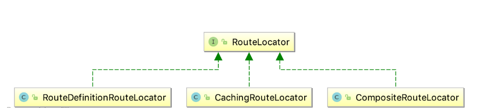
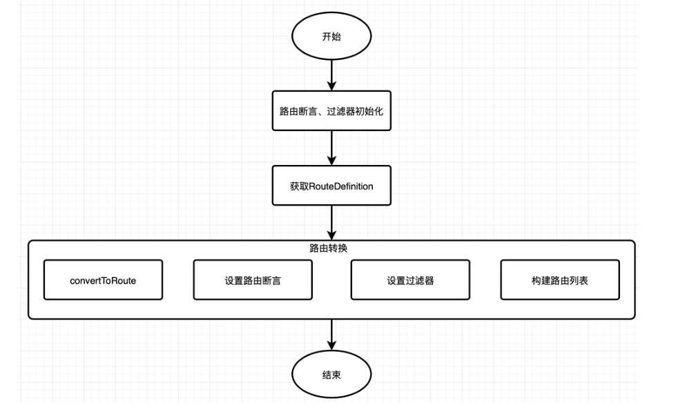

# 1. 路由定位器 RouteLocator
RouteLocator 路由定位器，顾名思义就是用来获取路由的方法。该路由定位器为顶级接口有多个实现类，如类图所示，本节会对其实现类一一进行介绍


通过类图可知，路由定位器接口有三种实现方法：

- RouteDefinitionRouteLocator 基于路由定义的定位器
- CachingRouteLocator 基于缓存的路由定位器
- CompositeRouteLocator 基于组合方式的路由定位器

# 2. RouteLocator 路由定位器
与上节学习的路由定义定位器接口类似，RouteLocator 路由定位器只有一个 getRoutes 方法，用来获取路由信息。

```
public interface RouteLocator {
    //获取路由对象
	Flux<Route> getRoutes();
}
```

## 2.1. Route 路由对象
Route 路由定义了路由断言、过滤器、路由地址及路由优先级等信息。当请求到达时，在转发到代理服务之前，会依次经过路由断言匹配路由 和 网关过滤器处理。

```
public class Route implements Ordered {

    //路由 Id 
    private final String id; 
    //路由地址 
    private final URI uri; 
    //路由的优先级 
    private final int order; 
    //路由断言，判断请求路径是否匹配
	private final AsyncPredicate<ServerWebExchange> predicate;
    //网关过滤器
	private final List<GatewayFilter> gatewayFilters;
    
    -----------------------省略-------------------------
}
```

# 3. RouteDefinitionRouteLocator
 基于路由定义的定位器
## 3.1. 初始化
RouteDefinitionRouteLocator 构造函数有多个参数：路由定义定位器、路由断言工厂、网关过滤器及网关配置对象。 根据传入的参数，设置 routeDefinitionLocator 和 网关配置，并初始化路由断言 和 网关过滤器。 RouteDefinitionRouteLocator 的实现方式是基于路由定义来获取路由，它实现了 RouteLocator 接口，用来获取路由信息。

```
public class RouteDefinitionRouteLocator implements RouteLocator, BeanFactoryAware, ApplicationEventPublisherAware {
	protected final Log logger = LogFactory.getLog(getClass());

	private final RouteDefinitionLocator routeDefinitionLocator;
	private final Map<String, RoutePredicateFactory> predicates = new LinkedHashMap<>();
	private final Map<String, GatewayFilterFactory> gatewayFilterFactories = new HashMap<>();
	private final GatewayProperties gatewayProperties;
	private final SpelExpressionParser parser = new SpelExpressionParser();
	private BeanFactory beanFactory;
	private ApplicationEventPublisher publisher;

	public RouteDefinitionRouteLocator(RouteDefinitionLocator routeDefinitionLocator,
									   List<RoutePredicateFactory> predicates,
									   List<GatewayFilterFactory> gatewayFilterFactories,
									   GatewayProperties gatewayProperties) {
		//设置路由定义定位器
		this.routeDefinitionLocator = routeDefinitionLocator;
		//初始化路由断言工厂
		initFactories(predicates);
		//初始化网关过滤器
		gatewayFilterFactories.forEach(factory -> this.gatewayFilterFactories.put(factory.name(), factory));
		this.gatewayProperties = gatewayProperties;
	}

	@Autowired
	private Validator validator;

	@Override
	public void setBeanFactory(BeanFactory beanFactory) throws BeansException {
		this.beanFactory = beanFactory;
	}

	@Override
	public void setApplicationEventPublisher(ApplicationEventPublisher publisher) {
		this.publisher = publisher;
	}

	private void initFactories(List<RoutePredicateFactory> predicates) {
		predicates.forEach(factory -> {
			String key = factory.name();
			if (this.predicates.containsKey(key)) {
				this.logger.warn("A RoutePredicateFactory named "+ key
						+ " already exists, class: " + this.predicates.get(key)
						+ ". It will be overwritten.");
			}
			this.predicates.put(key, factory);
			if (logger.isInfoEnabled()) {
				logger.info("Loaded RoutePredicateFactory [" + key + "]");
			}
		});
	}
    --------------------------------省略---------------------------------
}
```
此种方式的路由获取是通过 RouteDefinitionRouteLocator 获取 RouteDefinition 并将路由定义转换成路由对象
这里的routeDefinitionLocator是CompositeRouteDefinitionLocator，它组合了InMemoryRouteDefinitionRepository、PropertiesRouteDefinitionLocator、DiscoveryClientRouteDefinitionLocator三个RouteDefinitionLocator。

PropertiesRouteDefinitionLocator是直接使用GatewayProperties的getRoutes()获取，其是通过spring.cloud.gateway.routes配置得来

## 3.2. RouteDefinition 转换成 Route 的流程


RouteDefinitionRouteLocator.java

```
@Override
	public Flux<Route> getRoutes() {
		return this.routeDefinitionLocator.getRouteDefinitions()
				.map(this::convertToRoute)
				//TODO: error handling
				.map(route -> {
					if (logger.isDebugEnabled()) {
						logger.debug("RouteDefinition matched: " + route.getId());
					}
					return route;
				});


		/* TODO: trace logging
			if (logger.isTraceEnabled()) {
				logger.trace("RouteDefinition did not match: " + routeDefinition.getId());
			}*/
	}

	private Route convertToRoute(RouteDefinition routeDefinition) {
		AsyncPredicate<ServerWebExchange> predicate = combinePredicates(routeDefinition);
		List<GatewayFilter> gatewayFilters = getFilters(routeDefinition);

		return Route.async(routeDefinition)
				.asyncPredicate(predicate)
				.replaceFilters(gatewayFilters)
				.build();
	}
```
getRoutes() ：根据传入的 RouteDefinitionLocator 获取路由定义对象，使用map方法将每个 RouteDefinition 转换为 Route。

RouteDefinitionLocator#convertToRoute ：是具体的转换方法，转换过程中涉及到路由断言 和 网关过滤器的处理，最后构建为Route 对象。

此处网关过滤器处理包括两种，一种是默认过滤器，作用于所有路由；一种是指定路由的自定义过滤器。首先获取默认过滤器，根据过滤器名称获取对应的过滤器，最终转换成有优先级的OrderedGatewayFilter

## 3.3. convertToRoute##getFilters
getFilters 主要是利用loadGatewayFilters获取filter，使用AnnotationAwareOrderComparator进行排序
loadGatewayFilters利用工厂方法，使用GatewayFilterFactory根据config 获取具体的GatewayFilter实例

```
@SuppressWarnings("unchecked")
	private List<GatewayFilter> loadGatewayFilters(String id, List<FilterDefinition> filterDefinitions) {
		List<GatewayFilter> filters = filterDefinitions.stream()
				.map(definition -> {
					GatewayFilterFactory factory = this.gatewayFilterFactories.get(definition.getName());
					if (factory == null) {
                        throw new IllegalArgumentException("Unable to find GatewayFilterFactory with name " + definition.getName());
					}
					Map<String, String> args = definition.getArgs();
					if (logger.isDebugEnabled()) {
						logger.debug("RouteDefinition " + id + " applying filter " + args + " to " + definition.getName());
					}

                    Map<String, Object> properties = factory.shortcutType().normalize(args, factory, this.parser, this.beanFactory);

                    Object configuration = factory.newConfig();

                    ConfigurationUtils.bind(configuration, properties,
                            factory.shortcutFieldPrefix(), definition.getName(), validator);

                    GatewayFilter gatewayFilter = factory.apply(configuration);
                    if (this.publisher != null) {
                        this.publisher.publishEvent(new FilterArgsEvent(this, id, properties));
                    }
                    return gatewayFilter;
				})
				.collect(Collectors.toList());

		ArrayList<GatewayFilter> ordered = new ArrayList<>(filters.size());
		for (int i = 0; i < filters.size(); i++) {
			GatewayFilter gatewayFilter = filters.get(i);
			if (gatewayFilter instanceof Ordered) {
				ordered.add(gatewayFilter);
			}
			else {
				ordered.add(new OrderedGatewayFilter(gatewayFilter, i + 1));
			}
		}

		return ordered;
	}

	private List<GatewayFilter> getFilters(RouteDefinition routeDefinition) {
		List<GatewayFilter> filters = new ArrayList<>();

		//TODO: support option to apply defaults after route specific filters?
		if (!this.gatewayProperties.getDefaultFilters().isEmpty()) {
			filters.addAll(loadGatewayFilters("defaultFilters",
					this.gatewayProperties.getDefaultFilters()));
		}

		if (!routeDefinition.getFilters().isEmpty()) {
			filters.addAll(loadGatewayFilters(routeDefinition.getId(), routeDefinition.getFilters()));
		}

		AnnotationAwareOrderComparator.sort(filters);
		return filters;
	}
```

# 4. CachingRouteLocator 基于缓存的路由定位器
```
public class CachingRouteLocator implements RouteLocator {

	private final RouteLocator delegate;
	private final Flux<Route> routes;
	private final Map<String, List> cache = new HashMap<>();

	public CachingRouteLocator(RouteLocator delegate) {
		this.delegate = delegate;
		routes = CacheFlux.lookup(cache, "routes", Route.class)
				.onCacheMissResume(() -> this.delegate.getRoutes().sort(AnnotationAwareOrderComparator.INSTANCE));
	}

	@Override
	public Flux<Route> getRoutes() {
		return this.routes;
	}

	/**
	 * Clears the routes cache
	 * @return routes flux
	 */
	public Flux<Route> refresh() {
		this.cache.clear();
		return this.routes;
	}

	@EventListener(RefreshRoutesEvent.class)
	/* for testing */ void handleRefresh() {
		refresh();
	}
}
```
基于缓存的路由定位器比较简单和缓存路由定义定位器比较类似，只需要调用 RouteLocator# getRoutes 即可获取路由。

根据传入的路由定位器获取路由信息并存储到缓存中。通过监听 RefreshRoutesEvent 事件刷新缓存的路由信息。

# 5. CompositeRouteLocator 基于组合方式的路由定位器
```
public class CompositeRouteLocator implements RouteLocator {

	private final Flux<RouteLocator> delegates;

	public CompositeRouteLocator(Flux<RouteLocator> delegates) {
		this.delegates = delegates;
	}

	@Override
	public Flux<Route> getRoutes() {
		return this.delegates.flatMap(RouteLocator::getRoutes);
	}
}

```
组合方式的路由定位器，将实现 RouteLocator 接口的路由定位器组合在一起，提供获取路由的统一入口。