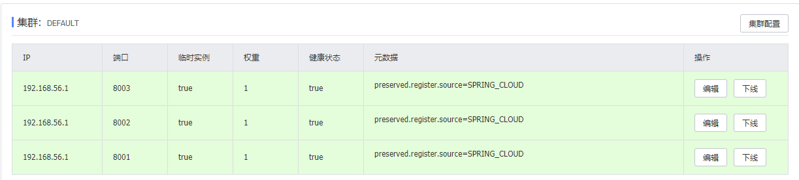

# 1. Nacos 
Nacos系列：基于Nacos的注册中心

- 关于 Nacos 名字：前四个字母分别为 Naming 和 Configuration 的前两个字母，最后的 s 为Service
-  Nacos 就是注册中心 + 配置中心的组合，即（Nacos = Spring Cloud Eureka + Spring Cloud Config）
## 1.1. 注册中心分类
在现有的技术方案中，注册中心主要分为两类，

- 一类是CP类注册中心，
- 另一类是AP类注册中心，Nacos属于后者
- 为什么会有 CP 和 AP 两种不同类型的注册中心呢？这就不得不提到分布式的一个理论：CAP理论。它是由加州大学的计算机科学家 Eric Brewer 提出，在一个分布式系统中，Consistency（一致性）、Availability（可用性）、Partition tolerance（分区容错性）无法同时满足，正所谓“鱼和熊掌与虾不可兼得也”。
- CP类注册中心更强调一致性，而AP类注册中心更强调可用性，
## 1.2. Nacos 结合 Spring
先来看 Nacos + Spring 的使用：

添加 maven 依赖：
```<dependency>
<groupId>com.alibaba.nacos</groupId>
<artifactId>nacos-spring-context</artifactId>
<version>0.2.2-RC1</version>
</dependency>
```
使用 @EnableNacosDiscovery 开启 Nacos Spring 的服务发现功能
```
@Configuration
@EnableNacosDiscovery(globalProperties = @NacosProperties(serverAddr = "127.0.0.1:8848"))
public class NacosDiscovery {
}

```

使用 @NacosInjected 注入 Nacos 的NamingService实例，通过NamingService的registerInstance() 向 Nacos Server 注册一个名称为applicationName的服务，当然，你也可以通过 Nacos Open API 方式注册：
curl -X PUT 'http://127.0.0.1:8848/nacos/v1/ns/instance?serviceName=XXX&ip=XXX&port=XXX'，这里我们介绍使用代码的方式。
```
@Configuration
@EnableNacosDiscovery(globalProperties = @NacosProperties(serverAddr = "127.0.0.1:8848"))
public class NacosDiscovery {

    @NacosInjected
    private NamingService namingService;

    @Value("${server.port}")
    private int serverPort;

    @Value("${spring.application.name}")
    private String applicationName;

    @PostConstruct
    public void registerInstance() throws NacosException {
        namingService.registerInstance(applicationName, "127.0.0.1", serverPort);
    }
}

```

再写一个Controller来验证服务是否再 Nacos Server 上注册了，代码如下：
```
@RestController
@RequestMapping(value = "discovery")
public class NacosDiscoveryController {

    @NacosInjected
    private NamingService namingService;

    @RequestMapping(value = "/get", method = GET)
    @ResponseBody
    public List<Instance> getInstance(@RequestParam String serviceName) throws NacosException {
        return namingService.getAllInstances(serviceName);
    }
}
```
## 1.3. Nacos结合SpringBoot
添加 Starter 依赖：
```
<?xml version="1.0" encoding="UTF-8"?>
<project xmlns="http://maven.apache.org/POM/4.0.0" xmlns:xsi="http://www.w3.org/2001/XMLSchema-instance"
         xsi:schemaLocation="http://maven.apache.org/POM/4.0.0 https://maven.apache.org/xsd/maven-4.0.0.xsd">
    <modelVersion>4.0.0</modelVersion>
    <parent>
        <groupId>org.springframework.boot</groupId>
        <artifactId>spring-boot-starter-parent</artifactId>
        <version>2.0.5.RELEASE</version>
        <relativePath/> <!-- lookup parent from repository -->
    </parent>
    <groupId>com.ada</groupId>
    <artifactId>demo</artifactId>
    <version>0.0.1-SNAPSHOT</version>
    <name>demo</name>
    <description>Demo project for Spring Boot</description>

    <properties>
        <java.version>1.8</java.version>
    </properties>


    <dependencyManagement>
        <dependencies>
            <dependency>
                <groupId>org.springframework.cloud</groupId>
                <artifactId>spring-cloud-dependencies</artifactId>
                <version>Finchley.SR1</version>
                <type>pom</type>
                <scope>import</scope>
            </dependency>
            <dependency>
                <groupId>org.springframework.cloud</groupId>
                <artifactId>spring-cloud-alibaba-dependencies</artifactId>
                <version>0.2.2.RELEASE</version>
                <type>pom</type>
                <scope>import</scope>
            </dependency>
        </dependencies>
    </dependencyManagement>

    <dependencies>
        <dependency>
            <groupId>org.springframework.boot</groupId>
            <artifactId>spring-boot-starter-web</artifactId>
        </dependency>

        <dependency>
            <groupId>org.springframework.boot</groupId>
            <artifactId>spring-boot-starter-test</artifactId>
            <scope>test</scope>
        </dependency>
        <dependency>
            <groupId>org.springframework.boot</groupId>
            <artifactId>spring-boot-starter-web</artifactId>
        </dependency>
        <dependency>
            <groupId>org.springframework.cloud</groupId>
            <artifactId>spring-cloud-starter-alibaba-nacos-discovery</artifactId>
        </dependency>
        <dependency>
            <groupId>org.projectlombok</groupId>
            <artifactId>lombok</artifactId>
            <version>1.18.2</version>
            <optional>true</optional>
        </dependency>
    </dependencies>

    <build>
        <plugins>
            <plugin>
                <groupId>org.springframework.boot</groupId>
                <artifactId>spring-boot-maven-plugin</artifactId>
            </plugin>
        </plugins>
    </build>

</project>

```
注意：版本 0.2.x.RELEASE 对应的是 Spring Boot 2.x 版本，版本 0.1.x.RELEASE 对应的是 Spring Boot 1.x 版本。

在application.properties中添加如下配置信息：
```
spring.application.name=alibaba-nacos-discovery-server
server.port=8001
spring.cloud.nacos.discovery.server-addr=127.0.0.1:8848
```
- 主类

```
@EnableDiscoveryClient
@SpringBootApplication
public class DemoApplication {

    public static void main(String[] args) {
        SpringApplication.run(DemoApplication.class, args);
    }

    @Slf4j
    @RestController
    static class TestController {
        @GetMapping("/hello")
        public String hello(@RequestParam String name) {
            log.info("invoked name = " + name);
            return "hello " + name;
        }
    }
}

```
访问http://127.0.0.1:8848/nacos/
测试结果
 