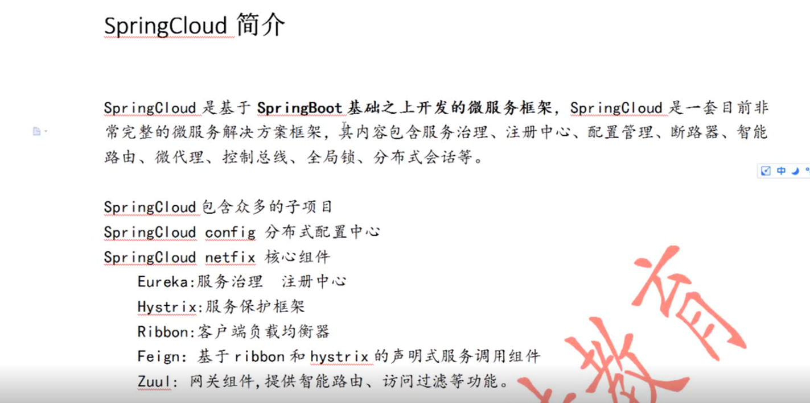
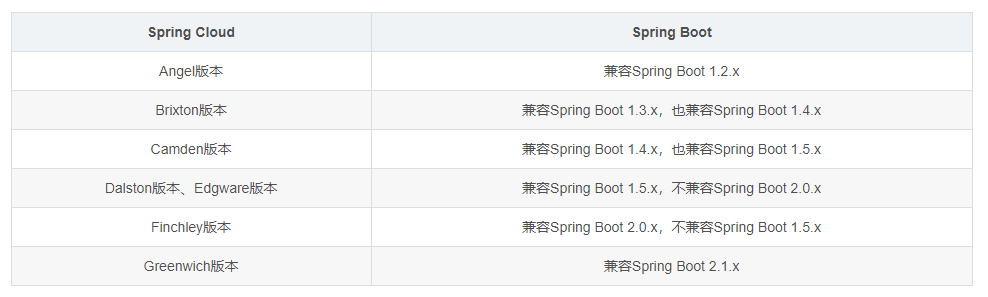

# 1. 微服务架构
那么什么是“微服务架构”呢？简单的说，微服务架构就是将一个完整的应用从数据存储开始垂直拆分成多个不同的服务，每个服务都能独立部署、独立维护、独立扩展，服务与服务间通过诸如RESTful API的方式互相调用
# 2. 服务治理
在简单介绍了Spring Cloud和微服务架构之后，下面回归本文的主旨内容，如何使用Spring Cloud来实现服务治理。

由于Spring Cloud为服务治理做了一层抽象接口，所以在Spring Cloud应用中可以支持多种不同的服务治理框架，比如：Netflix Eureka、Consul、Zookeeper。在Spring Cloud服务治理抽象层的作用下，我们可以无缝地切换服务治理实现，并且不影响任何其他的服务注册、服务发现、服务调用等逻辑。

所以，下面我们通过介绍两种服务治理的实现来体会Spring Cloud这一层抽象所带来的好处
# 3. SpringCloud简介

Netflix图中打错
# 4. 和Spring Boot版本对应
## 4.1. 大版本对应

## 4.2. 更详细版本
