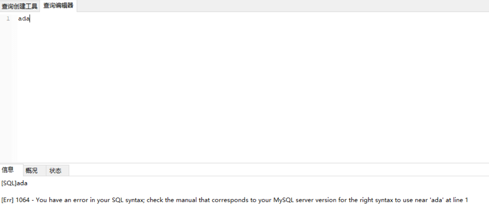
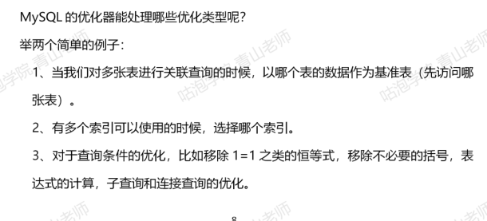

# 1. 一句查询的MySQL是如何执行的

# 2. 通信协议
## 2.1. 通信类型
- 同步
- 异步
一般来说客户端连接到数据库都是同步连接
## 2.2. 连接方式
- 长连接
- 短连接
数据库的连接既可以是长连接，也可以是短连接，而且会把这个连接放到连接池

- 查看当前MySQL的线程连接数
```
SHOW GLOBAL STATUS like "Thread%"
```


```
SHOW GLOBAL VARIABLES LIKE 'wait_timeout'
```


```
show GLOBAL VARIABLES like "interactive_timeout"
```


- 查看最大的连接数
```
SHOW VARIABLES LIKE 'max_connections'
```


## 2.3. 通信方式
- 单工
两台计算机通信的时候，数据的传输时单向的，比如：遥控器
- 半双工
在两台计算机之间，数据的传输是双向的，你可以给我发送，我也可以给你发送，但是在这个通信连接中，同一时间只能由一台服务器在发送数据，你要发的话，也得等我给你发完才能发，比如：对讲机
- 全双工
数据的传输时双向的，并且可以同时传输，比如：打电话

那么，MySQL时采用什么通信方式？
半双工的通信方式
# 3. MySQL的查询流程
## 3.1. 查询缓存
- MySQL的内部是自带一个缓存模块
- 查询MySQL缓存是否开启（MySQL8.0是直接去掉的）
```
show VARIABLES like "query_cache%"
```

## 3.2. 语法解析和预处理


随便输入一个字符的时候，会出现这样的错误，这一步主要是因为会经过MySQL的解析器（Parser）和预处理模块(Preprocessor)

- 词法解析
会把一个完整的SQL语句打碎成一个个单词
- 语法解析 
语法分析会对SQL做一些语法检查，比如单引号有没有闭合，然后根据MySQL的定义的语法规则，生成一个数据结构（解析树）
- 预处理器
会检查生成的解析树，解决解析器无法解析的语义，然后得到一新的解析树
## 3.3. 查询优化
查询优化器的目的就是根据解析树生成不同的执行计划，然后选择一种最优的执行计划，MySQL中使用的基于开销的优化器，就是那种执行计划开销最小，就用哪种
- 处理哪些类型

## 3.4. 执行计划
优化器最终会把解析树变成一个执行计划，执行计划也是一种数据结构
可以在前面加上一个explain 看他的执行计划  
如
```
EXPLAIN SELECT * FROM tree
```


## 3.5. 执行引擎，返回结果
- 执行器，或者叫执行引擎，它是利用存储引擎提供的相应的API来完成对应的操作
- 然后把数据返回给客户端


