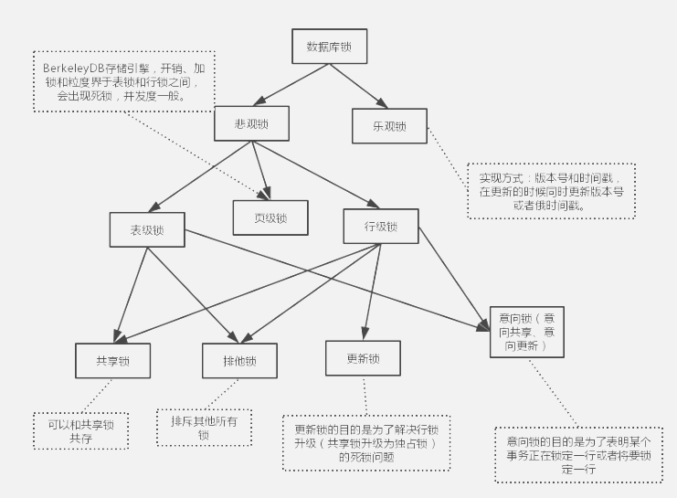

# 1. 概况

说明：
数据库锁一般可以分为两类，一个是悲观锁，一个是乐观锁。

- 乐观锁一般是指用户自己实现的一种锁机制，假设认为数据一般情况下不会造成冲突，所以在数据进行提交更新的时候，才会正式对数据的冲突与否进行检测，如果发现冲突了，则让返回用户错误的信息，让用户决定如何去做。乐观锁的实现方式一般包括使用版本号和时间戳。

悲观锁一般就是我们通常说的数据库锁机制，以下讨论都是基于悲观锁。

-  悲观锁主要表锁、行锁、页锁。在MyISAM中只用到表锁，不会有死锁的问题，锁的开销也很小，但是相应的并发能力很差。innodb实现了行级锁和表锁，锁的粒度变小了，并发能力变强，但是相应的锁的开销变大，很有可能出现死锁。同时inodb需要协调这两种锁，算法也变得复杂。InnoDB行锁是通过给索引上的索引项加锁来实现的，只有通过索引条件检索数据，InnoDB才使用行级锁，否则，InnoDB将使用表锁。

表锁和行锁都分为共享锁和排他锁（独占锁），而更新锁是为了解决行锁升级（共享锁升级为独占锁）的死锁问题。

innodb中表锁和行锁一起用，所以为了提高效率才会有意向锁（意向共享锁和意向排他锁）。
# 2. 概念
- 当并发事务同时访问一个资源时，有可能导致数据不一致，因此需要一种机制来将数据访问顺序化，以保证数据库数据的一致性。
锁就是其中的一种机制。
- 我们可以用商场的试衣间来做个比喻。商场里得每个试衣间都可供多个消费者使用，因此可能出现多个消费者同时试衣服需要使用试衣间。为了避免冲突，试衣间装了锁，某一个试衣服的人在试衣间里把锁锁住了，其他顾客就不能再从外面打开了，只能等待里面的顾客，试完衣服，从里面把锁打开，外面的人才能进去。

# 3. 意向锁
为了表锁和行锁而存在的
知乎上有个解释十分形象，如下：

在mysql中有表锁，读锁锁表，会阻塞其他事务修改表数据。写锁锁表，会阻塞其他事务读和写。
Innodb引擎又支持行锁，行锁分为共享锁，一个事务对一行的共享只读锁。排它锁，一个事务对一行的排他读写锁。
这两中类型的锁共存的问题考虑这个例子：事务A锁住了表中的一行，让这一行只能读，不能写。之后，事务B申请整个表的写锁。如果事务B申请成功，那么理论上它就能修改表中的任意一行，这与A持有的行锁是冲突的。数据库需要避免这种冲突，就是说要让B的申请被阻塞，直到A释放了行锁。
数据库要怎么判断这个冲突呢？

step1：判断表是否已被其他事务用表锁锁表
step2：判断表中的每一行是否已被行锁锁住。
注意step2，这样的判断方法效率实在不高，因为需要遍历整个表。于是就有了意向锁。在意向锁存在的情况下，事务A必须先申请表的意向共享锁，成功后再申请一行的行锁。

在意向锁存在的情况下，上面的判断可以改成

step1：不变
step2：发现表上有意向共享锁，说明表中有些行被共享行锁锁住了，因此，事务B申请表的写锁会被阻塞。
注意：申请意向锁的动作是数据库完成的，就是说，事务A申请一行的行锁的时候，数据库会自动先开始申请表的意向锁，不需要我们程序员使用代码来申请。
## 3.1. 例子：
```
意向锁就是说在屋（比如代表一个表）门口设置一个标识，说明屋子里有人（比如代表某些记录）被锁住了。另一个人想知道屋子
里是否有人被锁，不用进屋子里一个一个的去查，直接看门口标识就行了。

当一个表中的某一行被加上排他锁后，该表就不能再被加表锁。数据库程序如何知道该表不能被加表锁？一种方式是逐条的判断该
表的每一条记录是否已经有排他锁，另一种方式是直接在表这一层级检查表本身是否有意向锁，不需要逐条判断。显然后者效率高。

例12：
----------------------------------------
T1:    begin tran
       select * from table (xlock) where id=10  --意思是对id=10这一行强加排他锁
T2:    begin tran
       select * from table (tablock)     --意思是要加表级锁
       
假设T1先执行，T2后执行，T2执行时，欲加表锁，为判断是否可以加表锁，数据库系统要逐条判断table表每行记录是否已有排他锁，
如果发现其中一行已经有排他锁了，就不允许再加表锁了。只是这样逐条判断效率太低了。

实际上，数据库系统不是这样工作的。当T1的select执行时，系统对表table的id=10的这一行加了排他锁，还同时悄悄的对整个表
加了意向排他锁(IX)，当T2执行表锁时，只需要看到这个表已经有意向排他锁存在，就直接等待，而不需要逐条检查资源了。
```

# 4. 共享锁（S锁）
加锁与解锁

- 当一个事务执行select语句时，数据库系统会为这个事务分配一把共享锁，来锁定被查询的数据。在默认情况下，数据被读取后，数据库系统立即解除共享锁。例如，当一个事务执行查询“SELECT * FROM accounts”语句时，数据库系统首先锁定第一行，读取之后，解除对第一行的锁定，然后锁定第二行。这样，在一个事务读操作过程中，允许其他事务同时更新accounts表中未锁定的行。

- 兼容性：如果数据资源上放置了共享锁，还能再放置共享锁和更新锁。

- 并发性能：具有良好的并发性能，当数据被放置共享锁后，还可以再放置共享锁或更新锁。所以并发性能很好。

- 共享锁(S)表示对数据进行读操作。因此多个事务可以同时为一个对象加共享锁。（如果试衣间的门还没被锁上，顾客都能够同时进去参观）
产生共享锁的sql：
```
select * from ad_plan lock in share mode;
```
## 4.1. 例子：
例1：
```
----------------------------------------
T1:    select * from table (请想象它需要执行1个小时之久，后面的sql语句请都这么想象）
T2:    update table set column1='hello'

过程：

T1运行 （加共享锁)
T2运行
If T1 还没执行完
    T2等......
else
    锁被释放
    T2执行
endif

T2之所以要等，是因为T2在执行update前，试图对table表加一个排他锁，
而数据库规定同一资源上不能同时共存共享锁和排他锁。所以T2必须等T1
执行完，释放了共享锁，才能加上排他锁，然后才能开始执行update语句。

```

```
例2：
----------------------------------------
T1:    select * from table
T2:    select * from table

这里T2不用等待T1执行完，而是可以马上执行。

分析：
T1运行，则table被加锁，比如叫lockA
T2运行，再对table加一个共享锁，比如叫lockB。

两个锁是可以同时存在于同一资源上的（比如同一个表上）。这被称为共
享锁与共享锁兼容。这意味着共享锁不阻止其它session同时读资源，但阻
止其它session update
```

```例3：（死锁的发生）
----------------------------------------
T1:
begin tran
select * from table (holdlock) (holdlock意思是加共享锁，直到事物结束才释放)
update table set column1='hello'

T2:
begin tran
select * from table(holdlock)
update table set column1='world'

假设T1和T2同时达到select，T1对table加共享锁，T2也对加共享锁，当
T1的select执行完，准备执行update时，根据锁机制，T1的共享锁需要升
级到排他锁才能执行接下来的update.在升级排他锁前，必须等table上的
其它共享锁释放，但因为holdlock这样的共享锁只有等事务结束后才释放，
所以因为T2的共享锁不释放而导致T1等(等T2释放共享锁，自己好升级成排
他锁），同理，也因为T1的共享锁不释放而导致T2等。死锁产生了。

```

```例4：
----------------------------------------
T1:
begin tran
select * from table(xlock) (xlock意思是直接对表加排他锁)
update table set column1='hello'

T2:
begin tran
select * from table(xlock)
update table set column1='world'

这样，当T1的select 执行时，直接对表加上了排他锁，T2在执行select时，就需要等T1事物完全执行完才能执行。排除了死锁发生。
但当第三个user过来想执行一个查询语句时，也因为排他锁的存在而不得不等待，第四个、第五个user也会因此而等待。在大并发
情况下，让大家等待显得性能就太友好了，所以，这里引入了更新锁。
```
# 5. 排他锁（独占锁，X锁）
加锁与解锁

- 当一个事务执行insert、update或delete语句时，数据库系统会自动对SQL语句操纵的数据资源使用独占锁。如果该数据资源已经有其他锁（任何锁）存在时，就无法对其再放置独占锁了。

- 兼容性：独占锁不能和其他锁兼容，如果数据资源上已经加了独占锁，就不能再放置其他的锁了。同样，如果数据资源上已经放置了其他锁，那么也就不能再放置独占锁了。

- 并发性能：最差。只允许一个事务访问锁定的数据，如果其他事务也需要访问该数据，就必须等待。

- 排他锁也叫写锁(X)。
- 排他锁表示对数据进行写操作。如果一个事务对对象加了排他锁，其他事务就不能再给它加任何锁了。(某个顾客把试衣间从里面反锁了，其他顾客想要使用这个试衣间，就只有等待锁从里面给打开了)
产生排他锁的sql：
```
select * from ad_plan for update;
SELECT … FOR UPDATE
```
## 5.1. 例子
```例
T1:    update table set column1='hello' where id<1000
T2:    update table set column1='world' where id>1000

假设T1先达，T2随后至，这个过程中T1会对id<1000的记录施加排他锁.但不会阻塞T2的update。

例 (假设id都是自增长且连续的）
T1:    update table set column1='hello' where id<1000
T2:    update table set column1='world' where id>900

如同例，T1先达，T2立刻也到，T1加的排他锁会阻塞T2的update.
```
# 6. 更新锁（U锁）
更新锁在的初始化阶段用来锁定可能要被修改的资源，这可以避免使用共享锁造成的死锁现象。例如，对于以下的update语句：

UPDATE accounts SET balance=900 WHERE id=1

更新操作需要分两步：读取accounts表中id为1的记录 –> 执行更新操作。

如果在第一步使用共享锁，再第二步把锁升级为独占锁，就可能出现死锁现象。例如：两个事务都获取了同一数据资源的共享锁，然后都要把锁升级为独占锁，但需要等待另一个事务解除共享锁才能升级为独占锁，这就造成了死锁。

更新锁有如下特征：

加锁与解锁：

- 当一个事务执行update语句时，数据库系统会先为事务分配一把更新锁。当读取数据完毕，执行更新操作时，会把更新锁升级为独占锁。

- 兼容性：更新锁与共享锁是兼容的，也就是说，一个资源可以同时放置更新锁和共享锁，但是最多放置一把更新锁。这样，当多个事务更新相同的数据时，只有一个事务能获得更新锁，然后再把更新锁升级为独占锁，其他事务必须等到前一个事务结束后，才能获取得更新锁，这就避免了死锁。

- 并发性能：允许多个事务同时读锁定的资源，但不允许其他事务修改它。

## 6.1. 例子

```例5：
----------------------------------------
T1:
begin tran
select * from table(updlock) (加更新锁)
update table set column1='hello'
T2:
begin tran
select * from table(updlock)
update table set column1='world'

更新锁的意思是：“我现在只想读，你们别人也可以读，但我将来可能会做更新操作，我已经获取了从共享锁（用来读）到排他锁
（用来更新）的资格”。一个事物只能有一个更新锁获此资格。

T1执行select，加更新锁。
T2运行，准备加更新锁，但发现已经有一个更新锁在那儿了，只好等。

当后来有user3、user4...需要查询table表中的数据时，并不会因为T1的select在执行就被阻塞，照样能查询，相比起例4，这提高
了效率。
```

```例6:
----------------------------------------
T1:
begin
select * from table(updlock)      (加更新锁）
update table set column1='hello'  (重点：这里T1做update时，不需要等T2释放什么，而是直接把更新锁升级为排他锁，然后执行update)
T2:
begin
select * from table               (T1加的更新锁不影响T2读取）
update table set column1='world'  (T2的update需要等T1的update做完才能执行)

我们以这个例子来加深更新锁的理解，

第一种情况：T1先达，T2紧接到达；在这种情况中，T1先对表加更新锁，T2对表加共享锁，假设T2的select先执行完，准备执行update，
发现已有更新锁存在，T2等。T1执行这时才执行完select，准备执行update，更新锁升级为排他锁，然后执行update，执行完成，事务
结束，释放锁，T2才轮到执行update。

第二种情况：T2先达，T1紧接达；在这种情况，T2先对表加共享锁，T1达后，T1对表加更新锁，假设T2 select先结束，准备
update，发现已有更新锁，则等待，后面步骤就跟第一种情况一样了。

这个例子是说明：排他锁与更新锁是不兼容的，它们不能同时加在同一子资源上。
```
