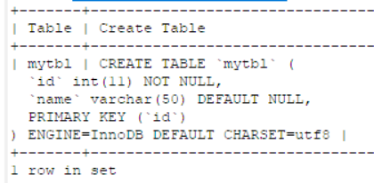

# 1. 引擎种类
## 1.1. InnoDB（默认）
  该存储引擎为MySQL表提供了ACID事务支持、系统崩溃修复能力和多版本并发控制（即MVCC Multi-Version Concurrency Control）的行级锁;该引擎支持自增长列（auto_increment）,自增长列的值不能为空，如果在使用的时候为空则自动从现有值开始增值，如果有但是比现在的还大，则直接保存这个值; 该引擎存储引擎支持外键（foreign key） ,外键所在的表称为子表而所依赖的表称为父表。该引擎在5.5后的MySQL数据库中为默认存储引擎。
### 1.1.1. 特点
InnoDB是MySQL存储引擎中唯一支持事务的。
同时引入了行级锁定、读取过程不产生锁以及外键约束。
基于磁盘存储，并将记录按页的方式进行管理
### 1.1.2. 适合场合
需要事务处理的场景。
需要使用外键。只有InnoDB支持外键约束。
更新密集的场景。
## 1.2. MYISAM(用于高负载的select)


  该引擎基于ISAM数据库引擎，除了提供ISAM里所没有的索引和字段管理等大量功能，MyISAM还使用一种表格锁定的机制来优化多个并发的读写操作，但是需要经常运行OPTIMIZE TABLE命令，来恢复被更新机制所浪费的空间，否则碎片也会随之增加，最终影响数据访问性能。MyISAM还有一些有用的扩展，例如用来修复数据库文件的MyISAMChk工具和用来恢复浪费空间的 MyISAMPack工具。MyISAM强调了快速读取操作，主要用于高负载的select，这可能也是MySQL深受Web开发的主要原因：在Web开发中进行的大量数据操作都是读取操作，所以大多数虚拟主机提供商和Internet平台提供商（Internet Presence Provider，IPP）只允许使用MyISAM格式
### 1.2.1. 特点
不支持事务，不支持外键。
表级锁，支持全文索引。
### 1.2.2. 类型
- 静态型
  指定义的表列的大小是固定（即不含有：xblob、xtext、varchar等长度可变的数据类型），这样MySQL就会自动使用静态MyISAM格式。使用静态格式的表的性能比较高，因为在维护和访问以预定格式存储数据时需要的开销很低；但这种高性能是以空间为代价换来的，因为在定义的时候是固定的，所以不管列中的值有多大，都会以最大值为准，占据了整个空间。

   优点：默认存储格式，字段都是固定长度的。这种存储方式优点的话是存储非常迅速，缓存也方便，同时出现故障也比较容易修复。
   
   缺点：缺点的话因为是固定长度，占用的空间比较大；同时数据存储时如果长度不够的话会采用空格来填充，返回数据的时候将结尾的空格再去掉，这个需要注意下会产生问题。下图的情况说明如果本身数据末尾就有空格的话，会造成结果返回中空格缺失
- 动态型
如果列（即使只有一列）定义为动态的（xblob, xtext, varchar等数据类型），这时MyISAM就自动使用动态型，虽然动态型的表占用了比静态型表较少的空间，但带来了性能的降低，因为如果某个字段的内容发生改变则其位置很可能需要移动，这样就会导致碎片的产生，随着数据变化的增多，碎片也随之增加，数据访问性能会随之降低。
        对于因碎片增加而降低数据访问性这个问题，有两种解决办法：
        a、尽可能使用静态数据类型；
        b、经常使用optimize table table_name语句整理表的碎片，恢复由于表数据的更新和删除导致的空间丢失。如果存储引擎不支持 optimize table table_name则可以转储并        重新加载数据，这样也可以减少碎片；

   优点：空间占用相对较少。
   
   缺点： 如果频繁地更新或删除记录会产生碎片，需要定时清理碎片，以及出现故障时修复困难。
- 压缩型
如果在数据库中创建在整个生命周期内只读的表，则应该使用MyISAM的压缩型表来减少空间的占用。
### 1.2.3. 适合场合
不适合需要事务处理需求的场景，因为MyISAM不支持事务。
选择密集型。MyISAM筛选大量数据时非常迅速。
插入密集型。MyISAM并发插入特性使得可以同时选择和插入数据。
## 1.3. ISAM(mysql5.1之后不再支持)
该引擎在读取数据方面速度很快，而且不占用大量的内存和存储资源；但是ISAM不支持事务处理、不支持外来键、不能够容错、也不支持索引。该引擎在包括MySQL 5.1及其以上版本的数据库中不再支持。
## 1.4. HEAP（也称为MEMORY）
   该存储引擎通过在内存中创建临时表来存储数据。每个基于该存储引擎的表实际对应一个磁盘文件，该文件的文件名和表名是相同的，类型为.frm。该磁盘文件只存储表的结构，而其数据存储在内存中，所以使用该种引擎的表拥有极高的插入、更新和查询效率。这种存储引擎默认使用哈希（HASH）索引，其速度比使用B-+Tree型要快，但也可以使用B树型索引。由于这种存储引擎所存储的数据保存在内存中，所以其保存的数据具有不稳定性，比如如果mysqld进程发生异常、重启或计算机关机等等都会造成这些数据的消失，所以这种存储引擎中的表的生命周期很短，一般只使用一次。
### 1.4.1. 适合场合
表内容变化不频繁，且数据量较小
数据是临时的，需要作为统计操作的中间临时表。
如果存储在Memory表中的数据丢失，对应用不会产生明显的负面影响。
## 1.5. CSV（Comma-Separated Values逗号分隔值）
      使用该引擎的MySQL数据库表会在MySQL安装目录data文件夹中的和该表所在数据库名相同的目录中生成一个.CSV文件（所以，它可以将CSV类型的文件当做表进行处理），这种文件是一种普通文本文件，每个数据行占用一个文本行。该种类型的存储引擎不支持索引，即使用该种类型的表没有主键列；另外也不允许表中的字段为null。
## 1.6. BLACKHOLE（黑洞引擎）
        该存储引擎支持事务，而且支持mvcc的行级锁，写入这种引擎表中的任何数据都会消失，主要用于做日志记录或同步归档的中继存储，这个存储引擎除非有特别目的，否则不适合使用。详见博客《BlackHole 存储引擎》
## 1.7. ARCHIVE
 该存储引擎非常适合存储大量独立的、作为历史记录的数据。区别于InnoDB和MyISAM这两种引擎，ARCHIVE提供了压缩功能，拥有高效的插入速度，但是这种引擎不支持索引，所以查询性能较差一些。
## 1.8. PERFORMANCE_SCHEMA
 该引擎主要用于收集数据库服务器性能参数。这种引擎提供以下功能：提供进程等待的详细信息，包括锁、互斥变量、文件信息；保存历史的事件汇总信息，为提供MySQL服务器性能做出详细的判断；对于新增和删除监控事件点都非常容易，并可以随意改变mysql服务器的监控周期，例如（CYCLE、MICROSECOND）。
## 1.9. Berkeley（BDB）
该存储引擎支持COMMIT和ROLLBACK等其他事务特性。该引擎在包括MySQL 5.1及其以上版本的数据库中不再支持。
## 1.10. Merge
 该引擎将一定数量的MyISAM表联合而成一个整体。参见博客《MySQL Merge存储引擎》
## 1.11. Federated
 该存储引擎可以不同的Mysql服务器联合起来，逻辑上组成一个完整的数据库。这种存储引擎非常适合数据库分布式应用。
## 1.12. Cluster/NDB
 该存储引擎用于多台数据机器联合提供服务以提高整体性能和安全性。适合数据量大、安全和性能要求高的场景。

# 2. 使用
## 2.1. 查看数据库支持的引擎 
`show engines; `


## 2.2. 修改数据库引擎
### 2.2.1. 修改配置文件my.cnf
打开my.cnf，在[mysqld]最后添加为上default-storage-engine=InnoDB，重启数据库服务，数据库默认的引擎修改为InnoDB
### 2.2.2. 创建数据表时声明
```
create table mytbl(   
    id int primary key,   
    name varchar(50)   
)engine=InnoDB;
```

更改数据表的引擎
`alter table “数据库名” engine=innodb;`

查看数据库引擎
`show create table mytbl;`
