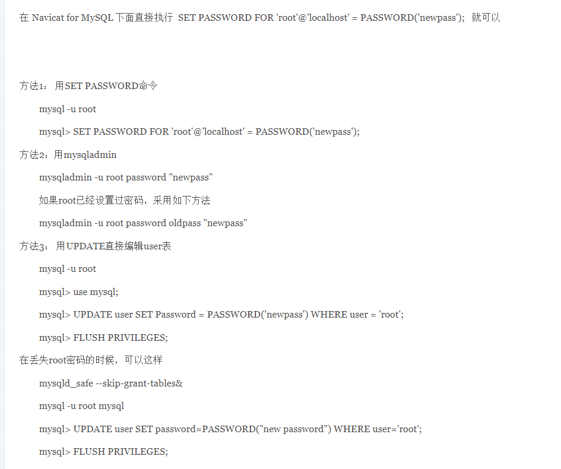

一、修改数据库密码

二、Naviacat注册码
Navicat 8 for MySQL 注册码：
NAVJ-W56S-3YUU-MVHV
NAVE-WAGB-ZLF4-T23K

三、如何用命令调出数据库及创建表
（1）如何进入mysql
a.调出命令行
b.找到mysql的bin目录，输入mysql -u root -p 然后回车输入密码进入mysql中
（2）创建数据库
create database；
看数据库：show databases；
切换到当前数据库：use 数据库名

