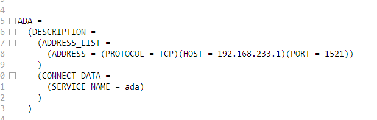
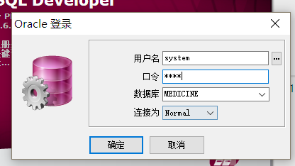

# 1. 创建
```
1//创建表空间（用超级管理员）
create tablespace medicine
logging
datafile 'F:\Oracle\workplace\oracle_sql\medicine_table.dbf' 
// --表空间数据文件位置在oracle服务器（如果是虚拟机，位置在虚拟机上）
size 32m
autoextend on
next 32m maxsize 1024m
extent management local;

2.//创建用户（用超级管理员）
create user root identified by 123
default tablespace medicine
temporary tablespace temp; 

3. 
//给用户授予权限（用超级管理员）
grant connect,resource,dba to root; 

4.
@F:\Oracle\workplace\oracle_sql\medicine_table.sql
@F:\Oracle\workplace\oracle_sql\medicine_data.sql
```

# 2. 导入数据
1.启动oracle


2.通过图形化或者手动方式配置tns文件
（1）手动，文件目录在F:\Oracle\win32_11gR2_client\product\11.2.0


（2）启动pl/sql



