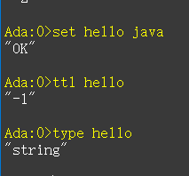
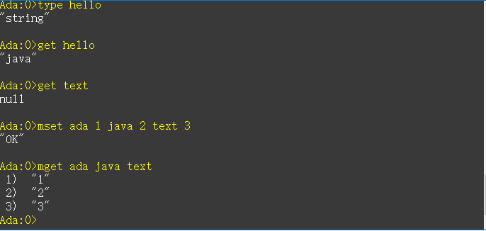

# 1. 预备
## 1.1. 全局命令
- 查看所有键值对
```
keys * 查看所有的键值对
```


- 键总数,返回当前数据库的键值对总数
```
dbsize
```


- 检查键是否存在
```
exists key
```


-  删除键
```
del key{key ......}返回删除的个数 ，否则就返回0
```


- 设置键过期
```
expire key value
ttl 可以返回剩余的过期时间
当键没有设置过期时间的时候：ttl return -1
当键不存在时，return -2；
```


- 查看键的数据类型
```
type key
```



## 1.2. 数据结构和内部编码


## 1.3. 为什么单线程还这么快

- 纯内存操作
- 非阻塞I/O，Redis使用epoll作为I/O多路复用技术的实现
- 既然是单线程，那么久避免了线程之间的切换和竞态产生的消耗

# 2. 字符串
## 2.1. 命令
- 设置值
```
set key value [ex seconds][px milliseconds][nx | xx]
ex seconds:键设置过期时间（秒）
px milliseconds:键设置过期时间（毫秒）
nx:必须不存在才能设置成功（添加）
xx:必须存在才能设置成功（更新）
setex:
setnx:
```
- 获取值
```
get key
```


- 批量设置值
```
mset key value [key value .....]
```


- 批量获取值
```
mget key ....
```


- 计数
```
incr key 用于自增
decr（自减）、incrby（加自定数字）、decrby、incrbyfloat（自增浮点数）
```


- 追加值
```
append key value
```


- 字符串的长度
```
strlen key
```

- 设置并返回原值
```
getset key value 
```

- 设置指定位置的字符
```
setrange key offeset value 
```

- 获取部分字符串
```
getrange key start end
```

## 2.2. 内部编码
## 2.3. 使用场景