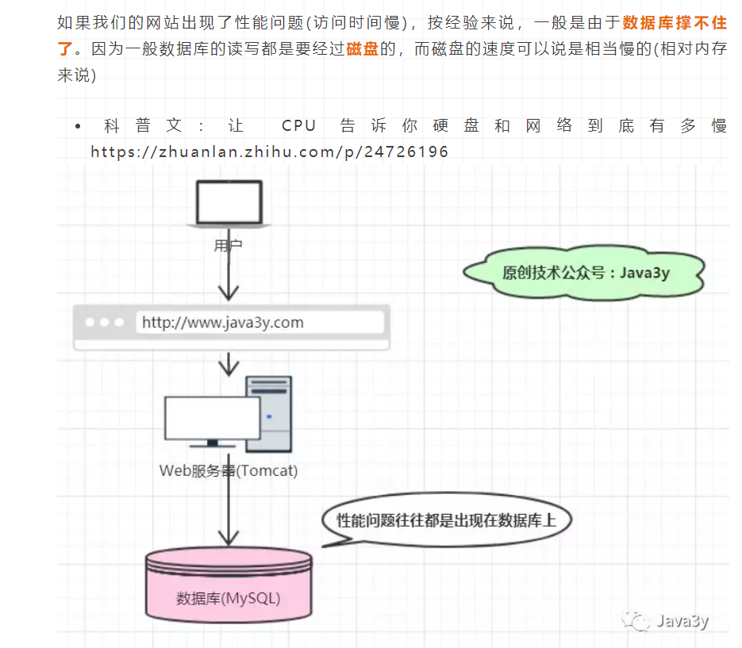

# 1. 什么是Redis?

Redis 是一个基于内存的高性能key-value数据库，由C语言编写
# 2. 为什么要用Redis？（缓存一致性，专业）
从上面可知：Redis是基于内存，常用作于缓存的一种技术，并且Redis存储的方式是以key-value的形式。

我们可以发现这不就是Java的Map容器所拥有的特性吗，那为什么还需要Redis呢？

- Java实现的Map是本地缓存，如果有多台实例(机器)的话，每个实例都需要各自保存一份缓存，缓存不具有一致性

- Redis实现的是分布式缓存，如果有多台实例(机器)的话，每个实例都共享一份缓存，缓存具有一致性。

- Java实现的Map不是专业做缓存的，JVM内存太大容易挂掉的。一般用做于容器来存储临时数据，缓存的数据随着JVM销毁而结束。Map所存储的数据结构，缓存过期机制等等是需要程序员自己手写的。

Redis是专业做缓存的，可以用几十个G内存来做缓存。Redis一般用作于缓存，可以将缓存数据保存在硬盘中，Redis重启了后可以将其恢复。原生提供丰富的数据结构、缓存过期机制等等简单好用的功能

# 3. 为什么要用缓存


# 4. Redis的特点
- Redis本质上是一个Key-Value类型的内存数据库，很像memcached，整个数据库统统加载在内存当中进行操作，定期通过异步操作把数据库数据flush到硬盘上进行保存。因为是纯内存操作，Redis的性能非常出色，每秒可以处理超过 10万次读写操作，是已知性能最快的Key-Value DB
- Redis的出色之处不仅仅是性能，Redis最大的魅力是支持保存多种数据结构，此外单个value的最大限制是1GB，不像memcached只能保存1MB的数据，因此Redis可以用来实现很多有用的功能，比方说用他的List来做FIFO双向链表，实现一个轻量级的高性能消息队列服务，用他的Set可以做高性能的Tag系统等。另外Redis也可以对存入的Key-Value设置expire时间，因此也可以被当作一个功能加强版的memcached来用
- Redis的主要缺点是数据库容量受到物理内存的限制，不能用作海量数据的高性能读写，因此Redis适合的场景主要局限在较小数据量的高性能操作和运算上
# 5. redis的数据结构
```
Redis 命令参考：http://doc.redisfans.com/
try Redis(不用安装Redis即可体验Redis命令)：http://try.redis.io/
```

Redis支持丰富的数据结构，常用的有string、list、hash、set、sortset这几种。学习这些数据结构是使用Redis的基础！
"Redis is written in ANSI C"-->Redis由C语言编写
首先还是得声明一下，Redis的存储是以key-value的形式的。Redis中的key一定是字符串，value可以是string、list、hash、set、sortset这几种常用的

但要值得注意的是：Redis并没有直接使用这些数据结构来实现key-value数据库，而是基于这些数据结构创建了一个对象系统。
简单来说：Redis使用对象来表示数据库中的键和值。每次我们在Redis数据库中新创建一个键值对时，至少会创建出两个对象。一个是键对象，一个是值对象

- 整数集合是set(集合)的底层数据结构之一
- 压缩列表(ziplist)是list和hash的底层实现之一
- 跳跃表(shiplist)是实现sortset(有序集合)的底层数据结构之一

- 在上面的图我们知道string类型有三种编码格式：
int：整数值，这个整数值可以使用long类型来表示，如果是浮点数，那就用embstr或者raw编码。具体用哪个就看这个数的长度了
embstr：字符串值，这个字符串值的长度小于32字节
raw：字符串值，这个字符串值的长度大于32字节


- embstr和raw的区别：

raw分配内存和释放内存的次数是两次，embstr是一次
embstr编码的数据保存在一块连续的内存里面
编码之间的转换：
int类型如果存的不再是一个整数值，则会从int转成raw
embstr是只读的，在修改的时候回从embstr转成raw
# 6. Redis数据库原理
Redis服务器用redisServer结构体来表示，其中redisDb是一个数组，用来保存所有的数据库，dbnum代表数据库的数量(这个可以配置，默认是16)

```
struct redisServer{  

    //redisDb数组,表示服务器中所有的数据库
    redisDb *db;  

    //服务器中数据库的数量
    int dbnum;  

}; 
```
我们知道Redis是C/S结构，Redis客户端通过redisClient结构体来表示：

```
typedef struct redisClient{  

    //客户端当前所选数据库
    redisDb *db;  

}redisClient;
```
Redis客户端连接Redis服务端时的示例图：


键空间：


# 7. 键的过期时间
Redis是基于内存，内存是比较昂贵的，容量肯定比不上硬盘的。就我们现在一台普通的机子，可能就8G内存，但硬盘随随便便都1T了。

因为我们的内存是有限的。所以我们会干掉不常用的数据，保留常用的数据。这就需要我们设置一下键的过期(生存)时间了。

设置键的生存时间可以通过EXPIRE或者PEXPIRE命令。

设置键的过期时间可以通过EXPIREAT或者PEXPIREAT命令。

其实EXPIRE、PEXPIRE、EXPIREAT这三个命令都是通过PEXPIREAT命令来实现的。

我们在redisDb结构体中还发现了dict *expires;属性，存放所有键过期的时间。

举个例子基本就可以理解了：

redis > PEXPIREAT message 1391234400000
(integer) 1
设置了message键的过期时间为1391234400000

新增一个过期时间的键
新增一个过期时间的键
既然有设置过期(生存)时间的命令，那肯定也有移除过期时间，查看剩余生存时间的命令了：

PERSIST(移除过期时间)

TTL(Time To Live)返回剩余生存时间，以秒为单位

PTTL以毫秒为单位返回键的剩余生存时间
# 8. Redis适用的情形
# 9. 使用Redis的优势

- 速度快，因为数据存在内存中，类似于HashMap，HashMap的优势就是查找和操作的时间复杂度都是O(1) 。

- 支持丰富数据类型，支持String，List，Set，Sorted Set，Hash（字符串，哈希，列表，集合，有序集合）

- 支持事务，操作都是原子性，所谓的原子性就是对数据的更改要么全部执行，要么全部不执行 。

- 丰富的特性：可用于缓存，消息，按key设置过期时间，过期后将会自动删除

- 丰富的功能（设置键过期的功能、发布订阅功能、支持Lua脚本功能、提供简单的事务功能、流水线功能）

- 简单稳定
- 客户端语言多
- 持久化
- 主从复制
- 高可用和分布式

# 10. 过期策略
Redis采用的是定期删除+惰性删除策略。

- 为什么不用定时删除策略?

定时删除,用一个定时器来负责监视key,过期则自动删除。虽然内存及时释放，但是十分消耗CPU资源。在大并发请求下，CPU要将时间应用在处理请求，而不是删除key,因此没有采用这一策略.

- 定期删除+惰性删除是如何工作的?

定期删除，Redis默认每个100ms检查，是否有过期的key,有过期key则删除。需要说明的是，Redis不是每个100ms将所有的key检查一次，而是随机抽取进行检查。因此，如果只采用定期删除策略，会导致很多key到时间没有删除。于是，在你获取某个key的时候，Redis会检查一下，这个key是否过期了？如果过期了此时就会删除。

 - 采用定期删除+惰性删除就没其他问题了?

不是，如果定期删除没删除key，也就是说惰性删除没生效。这样，redis的内存会越来越高。那么就应该采用内存淘汰机制

# 11. 内存淘汰机制
如果定期删除漏掉了很多过期key，也没及时去查(没走惰性删除)，大量过期key堆积在内存里，导致redis内存块耗尽了，咋整？

我们可以设置内存最大使用量，当内存使用量超出时，会施行数据淘汰策略。


注：以上资料来自Java3y公众号