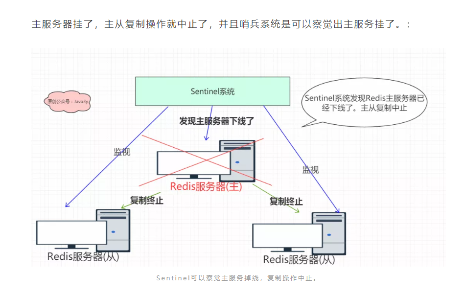
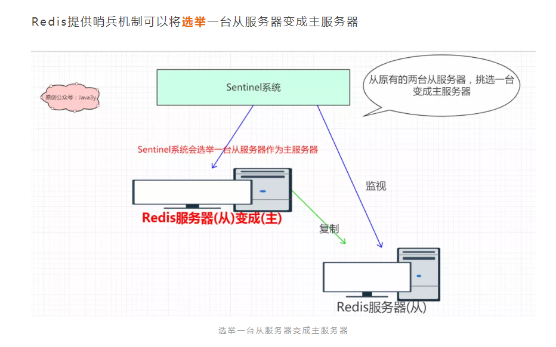
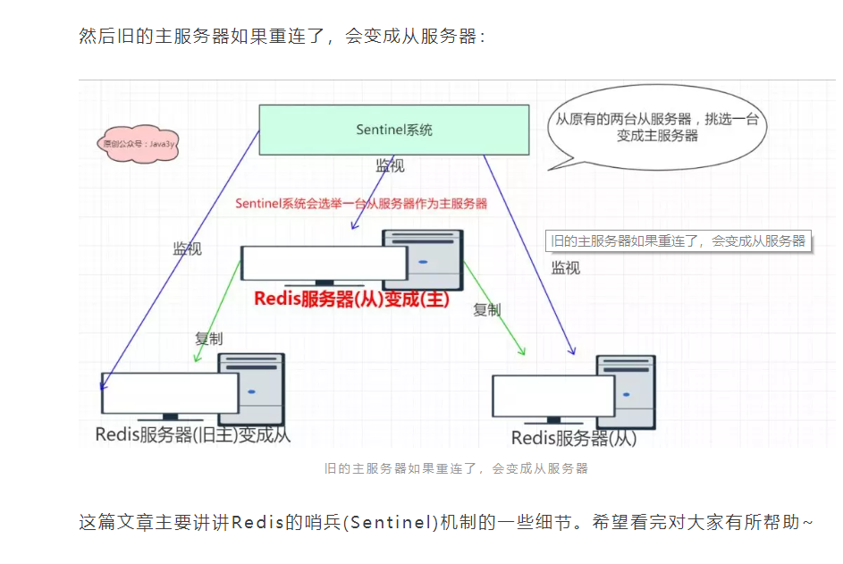
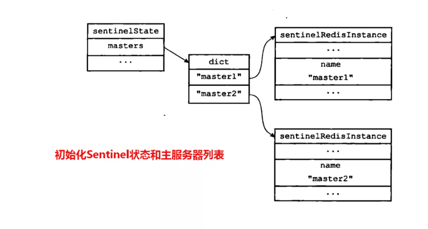
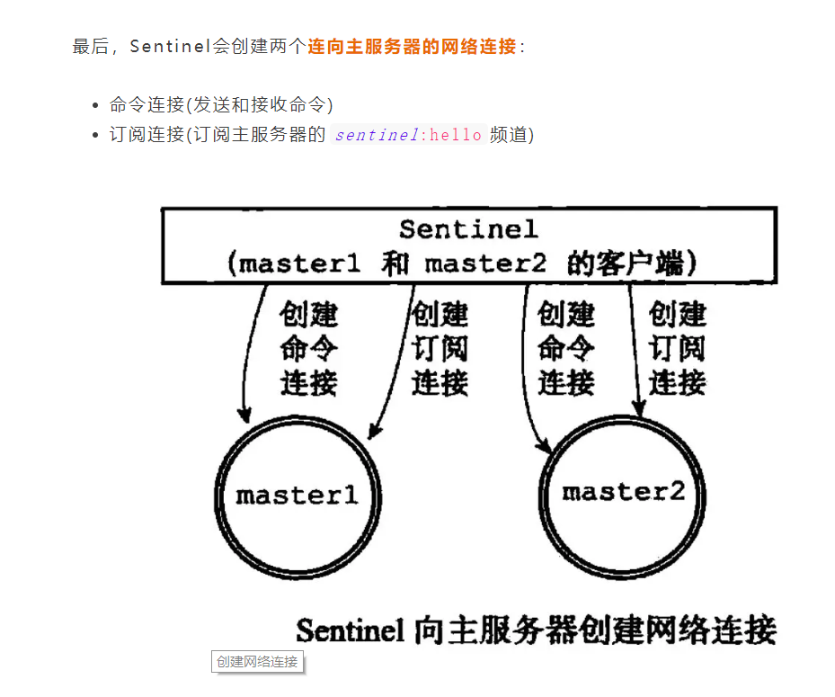
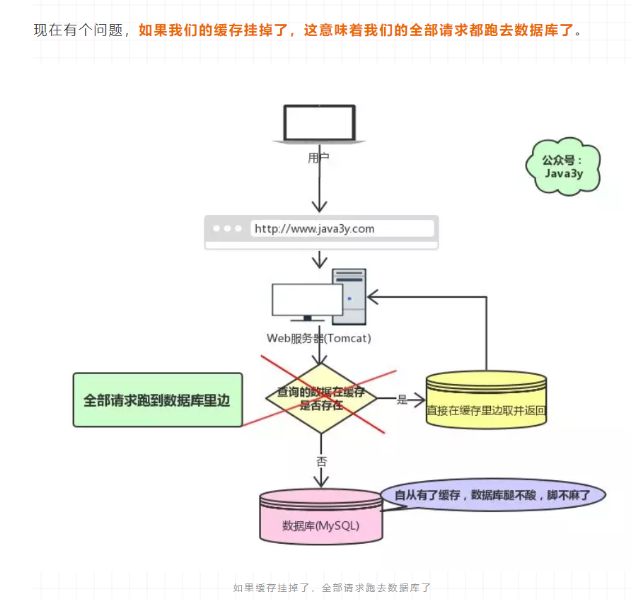
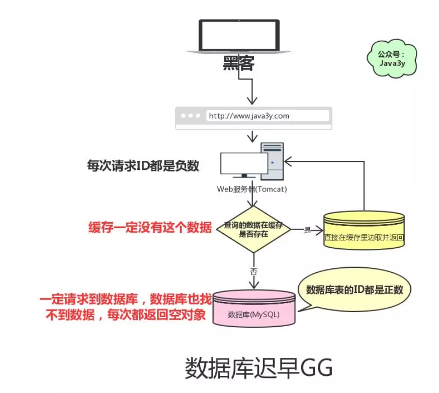

# 1. 主备切换
Redis提供了哨兵(Sentinel)机制供我们解决上面的情况。如果主服务器挂了，我们可以将从服务器升级为主服务器，等到旧的主服务器(挂掉的那个)重连上来，会将它(挂掉的主服务器)变成从服务器

# 2. 哨兵(Sentinel)机制
## 2.1. 启动和初始化Sentinel
首先我们要知道的是：Sentinel本质上只是一个运行在特殊模式下的Redis服务器。因为Sentinel做的事情和Redis服务器是不一样的，所以它们的初始化是有所区别的(比如，Sentinel在初始化的时候并不会载入AOF/RDB文件，因为Sentinel根本就不用数据库)。

然后，在启动的时候会将普通Redis服务器的代码替换成Sentinel专用代码。(所以Sentinel虽然作为Redis服务器，但是它不能执行SET、DBSIZE等等命令，因为命令表的代码被替换了)

接着，初始化Sentinel的状态，并根据给定的配置文件初始化Sentinel监视的主服务器列表。

## 2.2. 获取和更新信息
Sentinel通过主服务器发送INFO命令来获得主服务器属下所有从服务器的地址信息，并为这些从服务器创建相应的实例结构。

在Sentinel运行的过程中，通过命令连接会以每两秒一次的频率向监视的主从服务器的_sentinel_:hello频道发送命令(主要发送Sentinel本身的信息，监听主从服务器的信息)，并通过订阅连接接收_sentinel_:hello频道的信息。

这样一来一回，我们就可以更新每个Sentinel实例结构的信息
## 2.3. 判断主服务器是否下线了
判断主服务器是否下线有两种情况：

- 主观下线

Sentinel会以每秒一次的频率向与它创建命令连接的实例(包括主从服务器和其他的Sentinel)发送PING命令，通过PING命令返回的信息判断实例是否在线
如果一个主服务器在down-after-milliseconds毫秒内连续向Sentinel发送无效回复，那么当前Sentinel就会主观认为该主服务器已经下线了。

- 客观下线

当Sentinel将一个主服务器判断为主观下线以后，为了确认该主服务器是否真的下线，它会向同样监视该主服务器的Sentinel询问，看它们是否也认为该主服务器是否下线。
如果足够多的Sentinel认为该主服务器是下线的，那么就判定该主服务为客观下线，并对主服务器执行故障转移操作

## 2.4. 选举领头Sentinel和故障转移
当一个主服务器认为为客观下线以后，监视这个下线的主服务器的各种Sentinel会进行协商，选举出一个领头的Sentinel，领头的Sentinel会对下线的主服务器执行故障转移操作。

选举领头Sentinel的规则也比较多，总的来说就是先到先得(哪个快，就选哪个)
选举出领头的Sentinel之后，领头的Sentinel会对已下线的主服务器执行故障转移操作，包括三个步骤：
在已下线主服务器属下的从服务器中，挑选一个转换为主服务器
让已下线主服务器属下的所有从服务器改为复制新的主服务器
已下线的主服务器重新连接时，让他成为新的主服务器的从服务器
(这三步实际上就是文章开头的图片)

挑选某一个从服务器作为主服务器也是有策略的，大概如下：

- 跟master断开连接的时长

- slave优先级

- 复制offset

- run id

# 3. 缓存雪崩

在前面学习我们都知道Redis不可能把所有的数据都缓存起来(内存昂贵且有限)，所以Redis需要对数据设置过期时间，并采用的是惰性删除+定期删除两种策略对过期键删除。Redis对过期键的策略+持久化

如果缓存数据设置的过期时间是相同的，并且Redis恰好将这部分数据全部删光了。这就会导致在这段时间内，这些缓存同时失效，全部请求到数据库中。

这就是缓存雪崩：

Redis挂掉了，请求全部走数据库。

对缓存数据设置相同的过期时间，导致某段时间内缓存失效，请求全部走数据库。

缓存雪崩如果发生了，很可能就把我们的数据库搞垮，导致整个服务瘫痪

## 3.1. 如何解决
对于“对缓存数据设置相同的过期时间，导致某段时间内缓存失效，请求全部走数据库。”这种情况，非常好解决：

解决方法：在缓存的时候给过期时间加上一个随机值，这样就会大幅度的减少缓存在同一时间过期。

对于“Redis挂掉了，请求全部走数据库”这种情况，我们可以有以下的思路：

事发前：实现Redis的高可用(主从架构+Sentinel 或者Redis Cluster)，尽量避免Redis挂掉这种情况发生。
事发中：万一Redis真的挂了，我们可以设置本地缓存(ehcache)+限流(hystrix)，尽量避免我们的数据库被干掉(起码能保证我们的服务还是能正常工作的)
事发后：redis持久化，重启后自动从磁盘上加载数据，快速恢复缓存数据。

# 4. 缓存穿透
但是可能有黑客想把我的数据库搞垮，每次请求的ID都是负数。这会导致我的缓存就没用了，请求全部都找数据库去了，但数据库也没有这个值啊，所以每次都返回空出去。

缓存穿透是指查询一个一定不存在的数据。由于缓存不命中，并且出于容错考虑，如果从数据库查不到数据则不写入缓存，这将导致这个不存在的数据每次请求都要到数据库去查询，失去了缓存的意义。

## 4.1. 如何解决缓存穿透？
解决缓存穿透也有两种方案：

- 由于请求的参数是不合法的(每次都请求不存在的参数)，于是我们可以使用布隆过滤器(BloomFilter)或者压缩filter提前拦截，不合法就不让这个请求到数据库层！

当我们从数据库找不到的时候，我们也将这个空对象设置到缓存里边去。下次再请求的时候，就可以从缓存里边获取了。
这种情况我们一般会将空对象设置一个较短的过期时间
