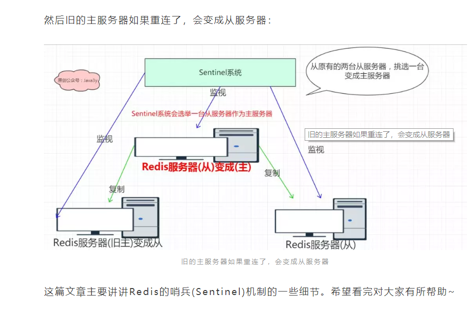

# 1. 主备切换
Redis提供了哨兵(Sentinel)机制供我们解决上面的情况。如果主服务器挂了，我们可以将从服务器升级为主服务器，等到旧的主服务器(挂掉的那个)重连上来，会将它(挂掉的主服务器)变成从服务器

# 2. 哨兵(Sentinel)机制
## 2.1. 启动和初始化Sentinel
首先我们要知道的是：Sentinel本质上只是一个运行在特殊模式下的Redis服务器。因为Sentinel做的事情和Redis服务器是不一样的，所以它们的初始化是有所区别的(比如，Sentinel在初始化的时候并不会载入AOF/RDB文件，因为Sentinel根本就不用数据库)。

然后，在启动的时候会将普通Redis服务器的代码替换成Sentinel专用代码。(所以Sentinel虽然作为Redis服务器，但是它不能执行SET、DBSIZE等等命令，因为命令表的代码被替换了)

接着，初始化Sentinel的状态，并根据给定的配置文件初始化Sentinel监视的主服务器列表。

## 2.2. 获取和更新信息
Sentinel通过主服务器发送INFO命令来获得主服务器属下所有从服务器的地址信息，并为这些从服务器创建相应的实例结构。

在Sentinel运行的过程中，通过命令连接会以每两秒一次的频率向监视的主从服务器的_sentinel_:hello频道发送命令(主要发送Sentinel本身的信息，监听主从服务器的信息)，并通过订阅连接接收_sentinel_:hello频道的信息。

这样一来一回，我们就可以更新每个Sentinel实例结构的信息
## 2.3. 判断主服务器是否下线了
判断主服务器是否下线有两种情况：

- 主观下线

Sentinel会以每秒一次的频率向与它创建命令连接的实例(包括主从服务器和其他的Sentinel)发送PING命令，通过PING命令返回的信息判断实例是否在线
如果一个主服务器在down-after-milliseconds毫秒内连续向Sentinel发送无效回复，那么当前Sentinel就会主观认为该主服务器已经下线了。

- 客观下线

当Sentinel将一个主服务器判断为主观下线以后，为了确认该主服务器是否真的下线，它会向同样监视该主服务器的Sentinel询问，看它们是否也认为该主服务器是否下线。
如果足够多的Sentinel认为该主服务器是下线的，那么就判定该主服务为客观下线，并对主服务器执行故障转移操作

## 2.4. 选举领头Sentinel和故障转移
当一个主服务器认为为客观下线以后，监视这个下线的主服务器的各种Sentinel会进行协商，选举出一个领头的Sentinel，领头的Sentinel会对下线的主服务器执行故障转移操作。

选举领头Sentinel的规则也比较多，总的来说就是先到先得(哪个快，就选哪个)
选举出领头的Sentinel之后，领头的Sentinel会对已下线的主服务器执行故障转移操作，包括三个步骤：
在已下线主服务器属下的从服务器中，挑选一个转换为主服务器
让已下线主服务器属下的所有从服务器改为复制新的主服务器
已下线的主服务器重新连接时，让他成为新的主服务器的从服务器
(这三步实际上就是文章开头的图片)

挑选某一个从服务器作为主服务器也是有策略的，大概如下：

- 跟master断开连接的时长

- slave优先级

- 复制offset

- run id
