# 1. Redis持久化
Redis提供了两种不同的持久化方法来讲数据存储到硬盘里边：

RDB(基于快照)，将某一时刻的所有数据保存到一个RDB文件中。

AOF(append-only-file)，当Redis服务器执行写命令的时候，将执行的写命令保存到AOF文件中。
## 1.1. RDB(快照持久化)
RDB持久化可以手动执行，也可以根据服务器配置定期执行。RDB持久化所生成的RDB文件是一个经过压缩的二进制文件，Redis可以通过这个文件还原数据库的数据。
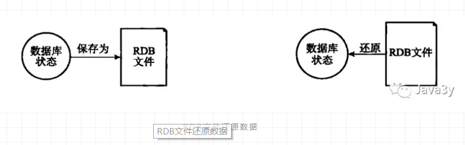
RDB文件还原数据
RDB文件还原数据
有两个命令可以生成RDB文件：

- SAVE会阻塞Redis服务器进程，服务器不能接收任何请求，直到RDB文件创建完毕为止。

- BGSAVE创建出一个子进程，由子进程来负责创建RDB文件，服务器进程可以继续接收请求。

Redis服务器在启动的时候，如果发现有RDB文件，就会自动载入RDB文件(不需要人工干预)
服务器在载入RDB文件期间，会处于阻塞状态，直到载入工作完成。
除了手动调用SAVE或者BGSAVE命令生成RDB文件之外，我们可以使用配置的方式来定期执行：

在默认的配置下，如果以下的条件被触发，就会执行BGSAVE命令

```
    save 900 1              #在900秒(15分钟)之后，至少有1个key发生变化，
    save 300 10            #在300秒(5分钟)之后，至少有10个key发生变化
    save 60 10000        #在60秒(1分钟)之后，至少有10000个key发生变化
```
原理大概就是这样子的(结合上面的配置来看)：

```
struct redisServer{
    // 修改计数器
    long long dirty;

    // 上一次执行保存的时间
    time_t lastsave;

    // 参数的配置
    struct saveparam *saveparams;
};
```
遍历参数数组，判断修改次数和时间是否符合，如果符合则调用besave()来生成RDB文件

Redis服务器的状态

`总结：通过手动调用SAVE或者BGSAVE命令或者配置条件触发，将数据库某一时刻的数据快照，生成RDB文件实现持久化。`
## 1.2. AOF(文件追加)
上面已经介绍了RDB持久化是通过将某一时刻数据库的数据“快照”来实现的，下面我们来看看AOF是怎么实现的。

AOF是通过保存Redis服务器所执行的写命令来记录数据库的数据的
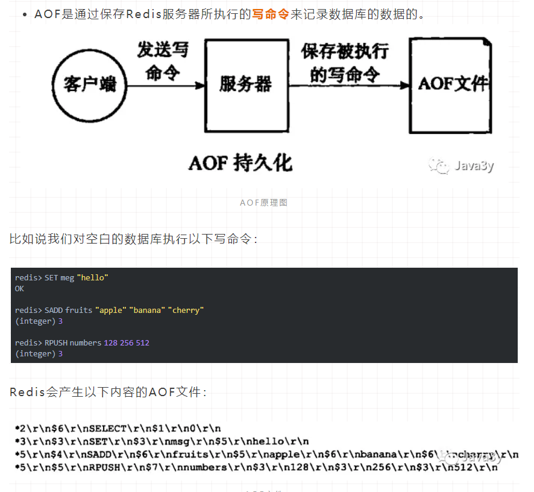

这些都是以Redis的命令请求协议格式保存的。Redis协议规范(RESP)参考资料：

https://www.cnblogs.com/tommy-huang/p/6051577.html

AOF持久化功能的实现可以分为3个步骤：

命令追加：命令写入aof_buf缓冲区

文件写入：调用flushAppendOnlyFile函数，考虑是否要将aof_buf缓冲区写入AOF文件中

文件同步：考虑是否将内存缓冲区的数据真正写入到硬盘

flushAppendOnlyFile函数的行为由服务器配置的appendfsyn选项来决定的：

```
    appendfsync always     # 每次有数据修改发生时都会写入AOF文件。
    appendfsync everysec   # 每秒钟同步一次，该策略为AOF的默认策略。
    appendfsync no         # 从不同步。高效但是数据不会被持久化。
```
从字面上应该就更好理解了，这里我就不细说了…

下面来看一下AOF是如何载入与数据还原的：

创建一个伪客户端(本地)来执行AOF的命令，直到AOF命令被全部执行完毕

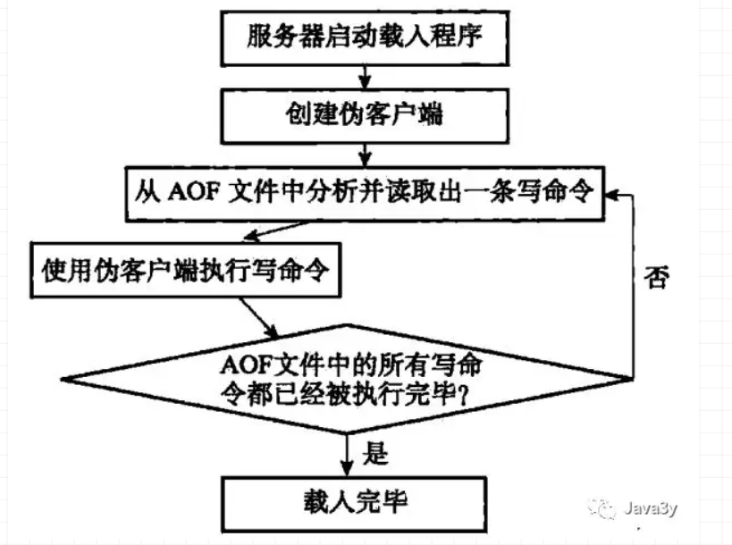

## 1.3. RDB和AOF对过期键的策略
- RDB持久化对过期键的策略：

执行SAVE或者BGSAVE命令创建出的RDB文件，程序会对数据库中的过期键检查，已过期的键不会保存在RDB文件中。
载入RDB文件时，程序同样会对RDB文件中的键进行检查，过期的键会被忽略。

- RDB持久化对过期键的策略：

如果数据库的键已过期，但还没被惰性/定期删除，AOF文件不会因为这个过期键产生任何影响(也就说会保留)，当过期的键被删除了以后，会追加一条DEL命令来显示记录该键被删除了，重写AOF文件时，程序会对RDB文件中的键进行检查，过期的键会被忽略。

复制模式：
主服务器来控制从服务器统一删除过期键(保证主从服务器数据的一致性)
## 1.4. RDB和AOF用哪个？
RDB和AOF并不互斥，它俩可以同时使用。

- RDB的优点：载入时恢复数据快、文件体积小。
RDB的缺点：会一定程度上丢失数据(因为系统一旦在定时持久化之前出现宕机现象，此前没有来得及写入磁盘的数据都将丢失。)

- AOF的优点：丢失数据少(默认配置只丢失一秒的数据)。
AOF的缺点：恢复数据相对较慢，文件体积大

如果Redis服务器同时开启了RDB和AOF持久化，服务器会优先使用AOF文件来还原数据(因为AOF更新频率比RDB更新频率要高，还原的数据更完善)

# 2. Redis事件
## 2.1. 文件事件
文件事件其实就是对Socket操作的抽象，Redis服务器与Redis客户端的通信会产生文件事件，服务器通过监听并处理这些事件来完成一系列的网络操作
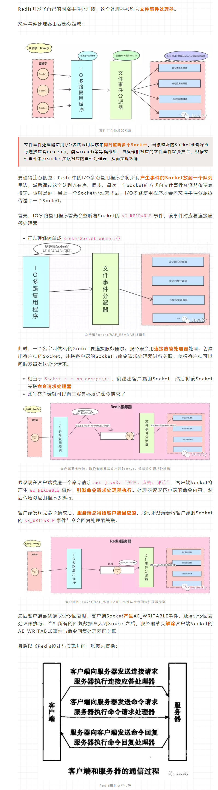
## 2.2. 时间事件
时间事件其实就是对定时操作的抽象，前面我们已经讲了RDB、AOF、定时删除键这些操作都可以由服务端去定时或者周期去完成，底层就是通过触发时间事件来实现的！

持续运行的Redis服务器会定期对自身的资源和状态进行检查和调整，这些定期的操作由serverCron函数负责执行，它的主要工作包括：

更新服务器的统计信息(时间、内存占用、数据库占用)
清理数据库的过期键值对
AOF、RDB持久化
如果是主从服务器，对从服务器进行定期同步
如果是集群模式，对进群进行定期同步和连接
…

Redis服务器将时间事件放在一个链表中，当时间事件执行器运行时，会遍历整个链表。时间事件包括：

- 周期性事件(Redis一般只执行serverCron时间事件，serverCron时间事件是周期性的)

- 定时事件
## 2.3. 时间事件和文件事件
文件事件和时间事件之间是合作关系，服务器会轮流处理这两种事件，并且处理事件的过程中不会发生抢占。
时间事件的实际处理事件通常会比设定的到达时间晚一些

# 3. Redis单线程为什么快？
- 纯内存操作
- 核心是基于非阻塞的IO多路复用机制
- 单线程避免了多线程的频繁上下文切换问题

# 4. 主从架构
Redis也跟关系型数据(MySQL)一样，如果有过多请求还是撑不住的。

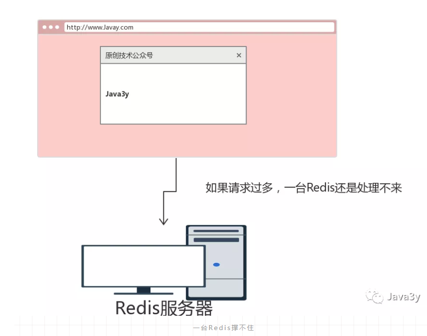
因为Redis如果只有一台服务器的话，那随着请求越来越多：

Redis的内存是有限的，可能放不下那么多的数据

单台Redis支持的并发量也是有限的。

万一这台Redis挂了，所有的请求全走关系数据库了，那就更炸了。

显然，出现的上述问题是因为一台Redis服务器不够，所以多搞几台Redis服务器就可以了

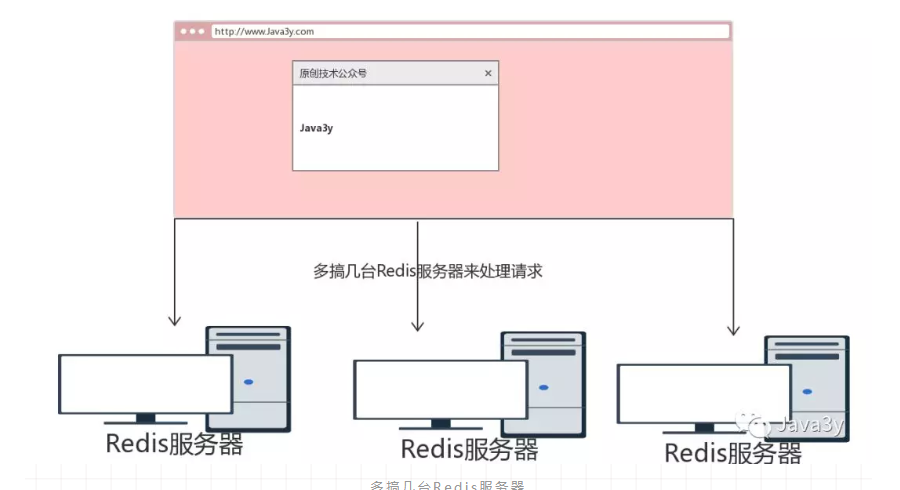
为了实现我们服务的高可用性，可以将这几台Redis服务器做成是主从来进行管理

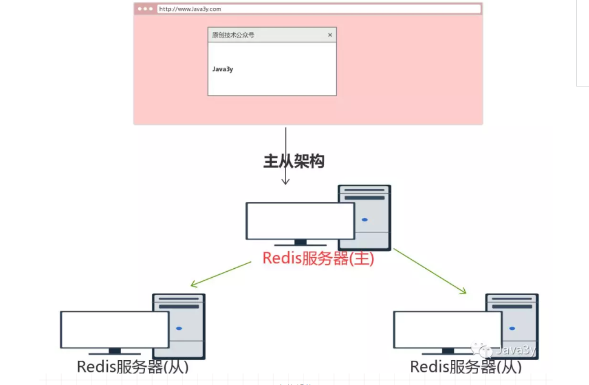

## 4.1. 主从架构的特点
下面我们来看看Redis的主从架构特点：

主服务器负责接收写请求
从服务器负责接收读请求
从服务器的数据由主服务器复制过去。主从服务器的数据是一致的

主从架构的好处：

- 读写分离(主服务器负责写，从服务器负责读)
- 高可用(某一台从服务器挂了，其他从服务器还能继续接收请求，不影响服务)
- 处理更多的并发量(每台从服务器都可以接收读请求，读QPS就上去了)

主从架构除了上面的形式，也有下面这种的(只不过用得比较少)：
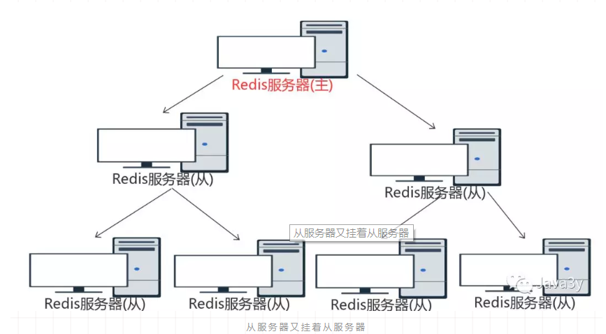
从服务器又挂着从服务器


# 5. 复制功能
主从架构的特点之一：主服务器和从服务器的数据是一致的。

因为主服务器是能接收写请求的，主服务器处理完写请求，会做什么来保证主从数据的一致性呢？如果主从服务器断开了，过一阵子才重连，又会怎么处理呢？下面将会了解到这些细节~

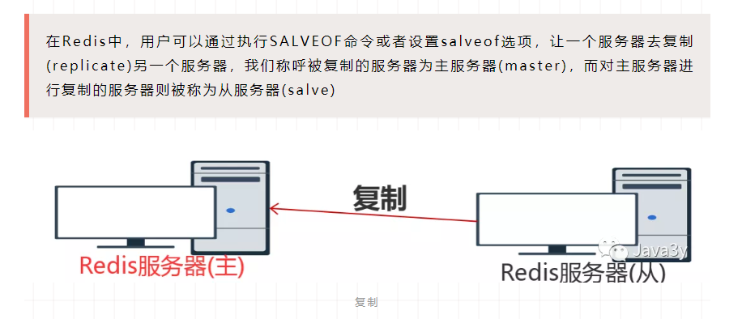

## 5.1. 复制功能的具体实现
复制功能分为两个操作：

- 同步(sync)

将从服务器的数据库状态更新至主服务器的数据库状态

- 命令传播(command propagate)

主服务器的数据库状态被修改，导致主从服务器的数据库状态不一致，让主从服务器的数据库状态重新回到一致状态。

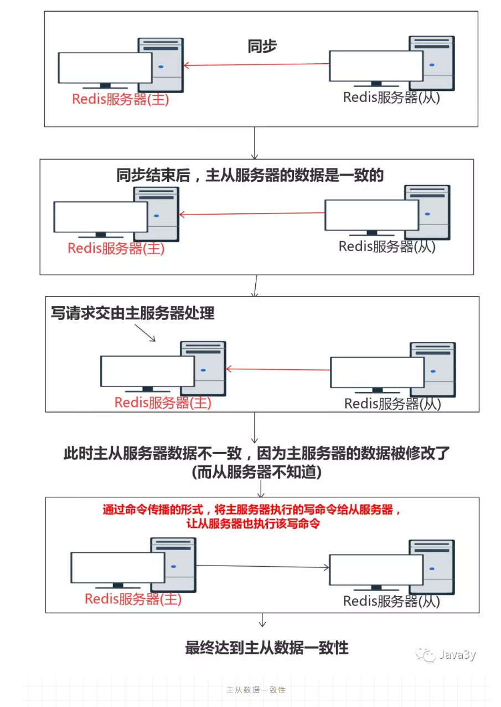
从服务器对主服务器的同步又可以分为两种情况：

- 初次同步：从服务器没有复制过任何的主服务器，或者从服务器要复制的主服务器跟上次复制的主服务器不一样。

 - 断线后同步：处于命令传播阶段的主从服务器因为网络原因中断了复制，从服务器通过自动重连重新连接主服务器，并继续复制主服务器

在Redis2.8以前，断线后复制这部分其实缺少的只是部分的数据，但是要让主从服务器重新执行SYNC命令，这样的做法是非常低效的。(因为执行SYNC命令是把所有的数据再次同步，而不是只同步丢失的数据)

## 5.2. 复制的前置工作
首先我们来看一下前置的工作：

- 从服务器设置主服务器的IP和端口
- 建立与主服务器的Socket连接
- 发送PING命令(检测Socket读写是否正常与主服务器的通信状况)
- 身份验证(看有没有设置对应的验证配置)
- 从服务器给主服务器发送端口的信息，主服务器记录监听的端口
 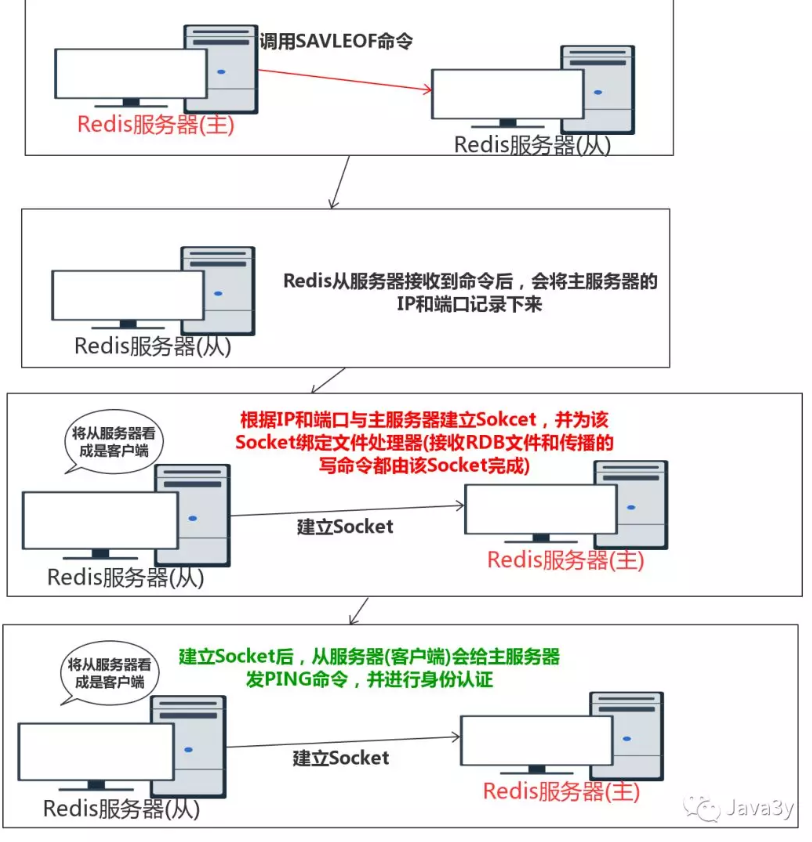

## 5.3. 完整重同步
下面先来看看完整重同步是怎么实现的：

从服务器向主服务器发送PSYNC命令

收到PSYNC命令的主服务器执行BGSAVE命令，在后台生成一个RDB文件。并用一个缓冲区来记录从现在开始执行的所有写命令。

当主服务器的BGSAVE命令执行完后，将生成的RDB文件发送给从服务器，从服务器接收和载入RBD文件。将自己的数据库状态更新至与主服务器执行BGSAVE命令时的状态。

主服务器将所有缓冲区的写命令发送给从服务器，从服务器执行这些写命令，达到数据最终一致性。


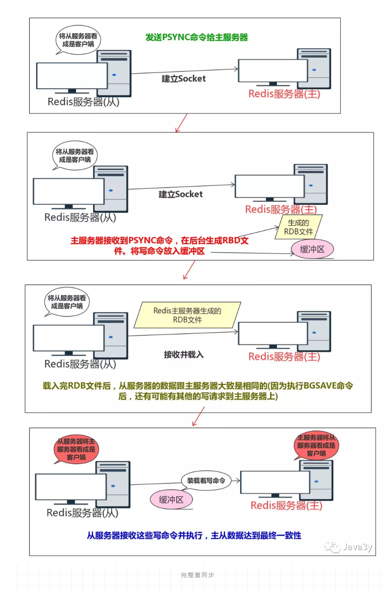

