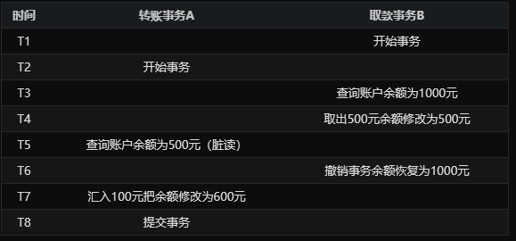
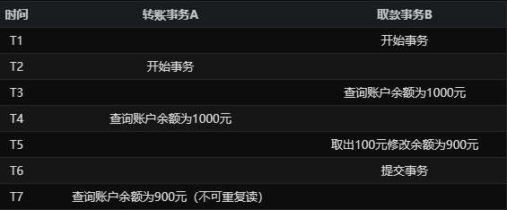
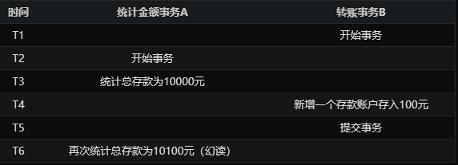
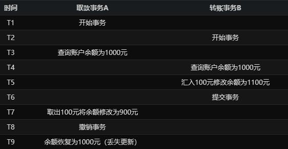
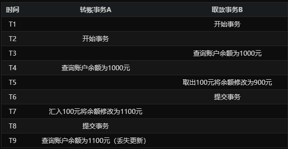

# 1. 脏读（Dirty Read）
A事务读取B事务尚未提交的数据并在此基础上操作，而B事务执行回滚，那么A读取到的数据就是脏数据

# 2. 不可重复读（Unrepeatable Read）
事务A重新读取前面读取过的数据，发现该数据已经被另一个已提交的事务B修改过了

# 3. 幻读（Phantom Read）
事务A重新执行一个查询，返回一系列符合查询条件的行，发现其中插入了被事务B提交的行

# 4. 第1类丢失更新
事务A撤销时，把已经提交的事务B的更新数据覆盖了。

# 5. 第2类丢失更新
事务A覆盖事务B已经提交的数据，造成事务B所做的操作丢失
