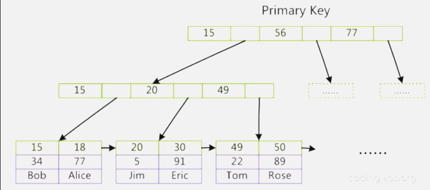
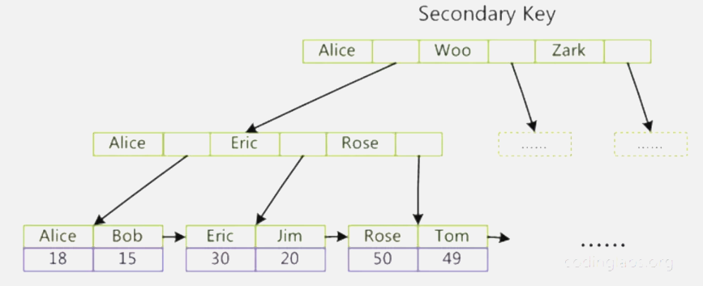
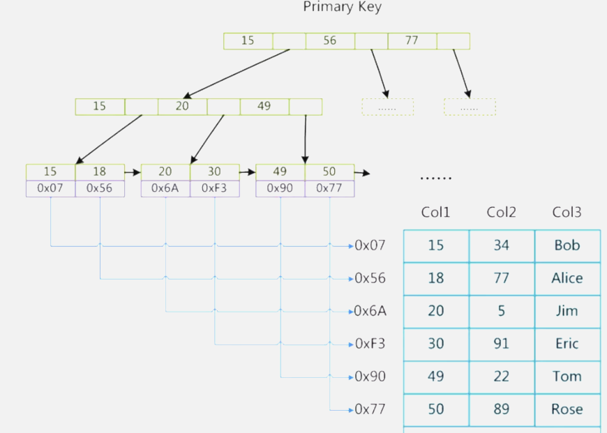

# 1. InnoDB索引实现
使用B+树作为索引结构，数据文件本身就是索引文件。数据文件按照B+树的结构进行组织，叶节点的data域存储完整的数据记录，索引的key即为表的主键。下图为主键索引示意图（盗图一波）。聚集索引使得搜索主键非常高效

数据文件本身按主键索引，因此InnoDB必须要有主键。没有主键怎么指定主键？

下图为辅助索引示意图，InnoDB辅助索引的data域存储的是主键的值。搜索辅助索引需要先根据辅助索引获取到主键值，再根据主键到主索引中获取到对应的数据记录

# 2. MyISAM索引实现
同样也是使用B+树作为索引结构，叶子节点data域存储的是数据记录的地址。数据文件和索引文件是分别存储在xxx.MYD和xxx.MYI（xxx表示数据表名），索引文件xxx.MYI保存数据记录的地址，具体可参考MySQL存储引擎简介。如图所示（盗了个图），为主索引的示意图。MyISAM中检索索引算法为：首先按照B+树搜索算法搜索，如果找到指定的key，取出其data域的值，再以data域值为地址查找对应的数据记录。因此MyISAM的索引方式也称为非聚集索引。

