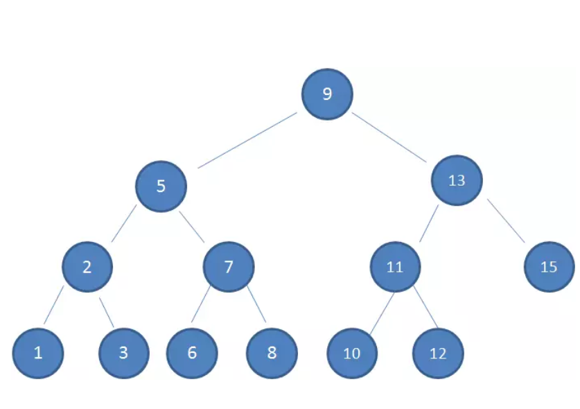
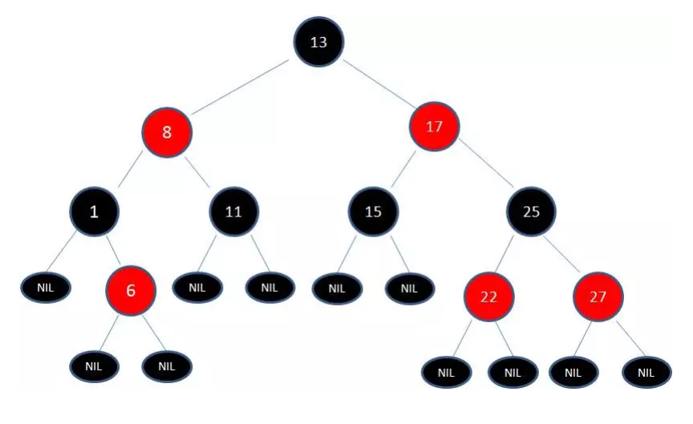
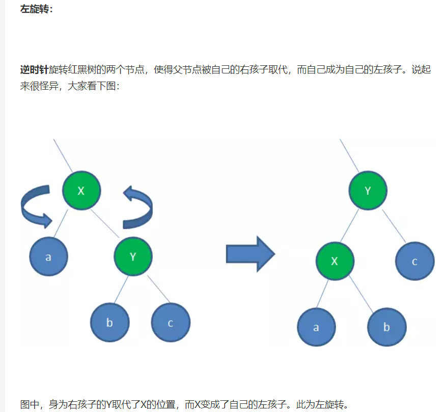
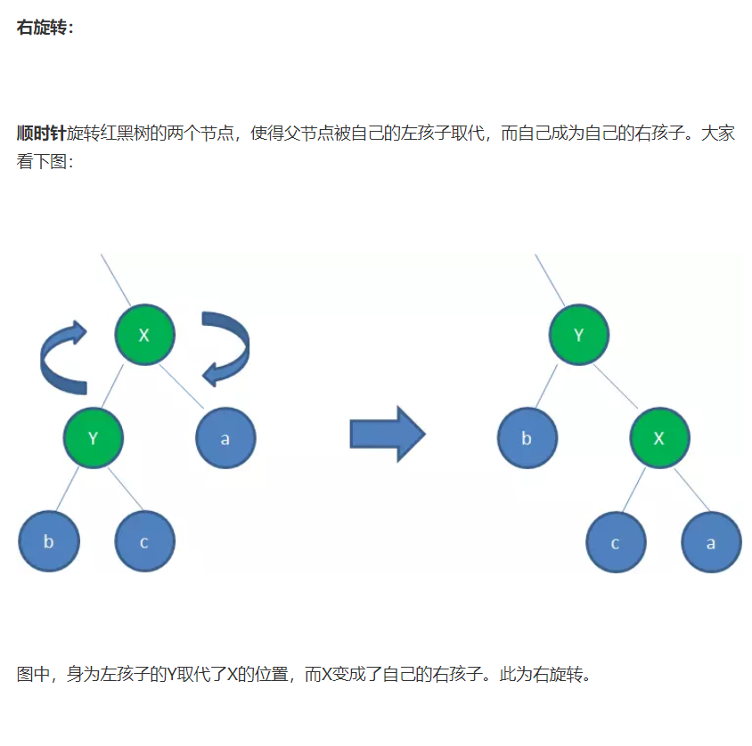

# 1. 二叉查找树（BST）具备什么特性呢？
1.左子树上所有结点的值均小于或等于它的根结点的值。

2.右子树上所有结点的值均大于或等于它的根结点的值。

3.左、右子树也分别为二叉排序树

# 2. 红黑树
节点是红色或黑色。

2.根节点是黑色。

3.每个叶子节点都是黑色的空节点（NIL节点）。

4 每个红色节点的两个子节点都是黑色。(从每个叶子到根的所有路径上不能有两个连续的红色节点)

5.从任一节点到其每个叶子的所有路径都包含相同数目的黑色节点

