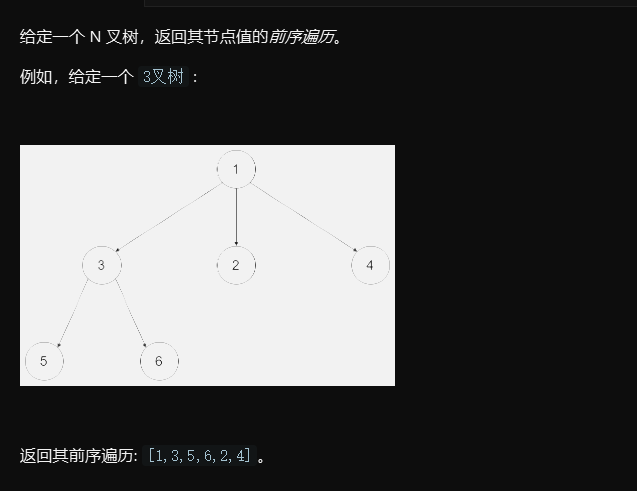

# 1. 题目

# 2. Solution
# 3. Code
```
迭代法：
/*
// Definition for a Node.
class Node {
    public int val;
    public List<Node> children;

    public Node() {}

    public Node(int _val,List<Node> _children) {
        val = _val;
        children = _children;
    }
};
*/
class Solution {
    public List<Integer> preorder(Node root) {
        
        List<Integer> list = new ArrayList<>();
        Stack<Node> stack = new Stack<>();
        if(root == null) return list;
        stack.push(root);
        while(!stack.isEmpty()){
            Node temp = stack.pop();
            list.add(temp.val);
            for(int i = temp.children.size()-1 ;i>=0;i--){
            stack.push(temp.children.get(i));    
            }
            
        } 
        return list;
    }
   
}
```