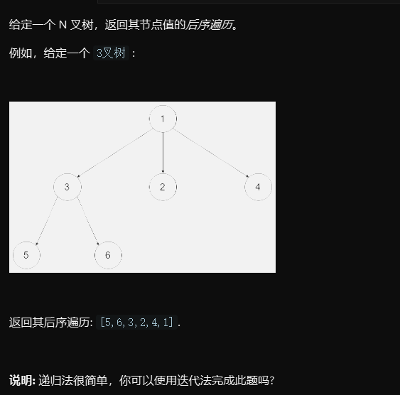

# 1. 题目

# 2. Solution

代码比较好理解。就是借助个栈来存放节点，每当弹出一个节点就把该节点所有孩子压入栈。注意集合中的结果是逆序，需要reverse。

# 3. Code
```
public List<Integer> postorder(Node root) {
    List<Integer> res = new LinkedList<>();
    if (root == null)
        return res;
    Stack<Node> stack = new Stack<>();
    stack.push(root);
    while (!stack.isEmpty()) {

        Node temp = stack.pop();
        res.add(0, temp.val);
        for (Node node : temp.children)
            stack.push(node);
    }
    return res;
}
```

```
/*
// Definition for a Node.
class Node {
    public int val;
    public List<Node> children;

    public Node() {}

    public Node(int _val,List<Node> _children) {
        val = _val;
        children = _children;
    }
};
*/
class Solution {
    public List<Integer> postorder(Node root) {
        
          List<Integer> list = new ArrayList<>();
        Stack<Node> stack = new Stack<>();
        if(root == null) return list;
        stack.push(root);
        while(!stack.isEmpty()){
            Node temp = stack.pop();
            list.add(temp.val);
            for(int i = 0 ;i<=temp.children.size()-1;i++){
            stack.push(temp.children.get(i));    
            }
            
        } 
       
        Collections.reverse(list);
        return list;
        
    }
}
```