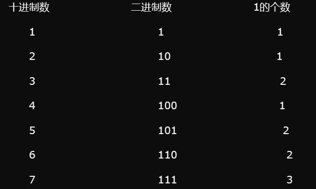

# 1. 题目
给定一个非负整数 num。对于 0 ≤ i ≤ num 范围中的每个数字 i ，计算其二进制数中的 1 的数目并将它们作为数组返回。

示例 1:

输入: 2
输出: [0,1,1]
示例 2:

输入: 5
输出: [0,1,1,2,1,2]
进阶:

给出时间复杂度为O(n*sizeof(integer))的解答非常容易。但你可以在线性时间O(n)内用一趟扫描做到吗？
要求算法的空间复杂度为O(n)。
你能进一步完善解法吗？要求在C++或任何其他语言中不使用任何内置函数（如 C++ 中的 __builtin_popcount）来执行此操作。
# 2. Solution

看上面的一系列数字的二进制中1的个数：

对于一个偶数 n ；其二进制组成最低位为0，所以其1的位数就是除了最低位之外前面那一部分中1的位数，即是i/2中1的位数。

对于一个奇数n，其末位的数一定是1，那么对于n-1，一定是个偶数，并且只需要将n-1的末位0改成1就可以变成 n，因为   a[n] = a[n - 1] +1;

则可以得出上面两个递推关系式。

按照动态规划的思路：

1：问题归纳：用数组a[ i ] 表示 i 的二进制中1的个数。

2：递推关系式　　　　a[n] = a[n/2]     　　　　　　n为偶数

　　　　　　　　　　a[n] = a[n-1] +1　　　　　　 n为奇数

3：初始化：a[0] = 0
# 3. Code
```class Solution {
    public int[] countBits(int num) {
        int[] res = new int[num+1];
        res[0] = 0;
        //先将所有的num转化为偶数处理，因为没有都是处理两个数
        int n = num%2 !=0 ? num-1:num;
        for(int i = 1; i <= n;i++){
            res[i] = res[i-1]+1;
            i++;
            res[i] = res[i/2];
        }
        //最后有个奇数没有处理
        if(num % 2 != 0){
            res[num] = res[n] + 1;
        }
        return res;
    }
}
```