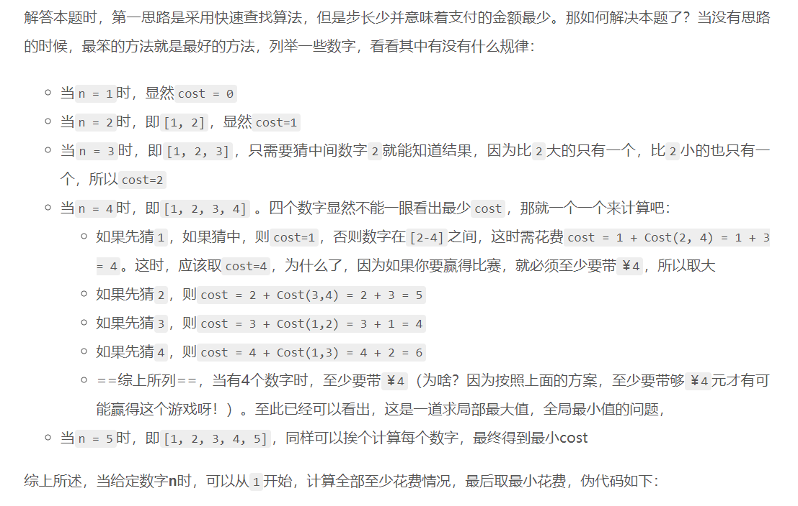

# 1. 题目
我们正在玩一个猜数游戏，游戏规则如下：

我从 1 到 n 之间选择一个数字，你来猜我选了哪个数字。

每次你猜错了，我都会告诉你，我选的数字比你的大了或者小了。

然而，当你猜了数字 x 并且猜错了的时候，你需要支付金额为 x 的现金。直到你猜到我选的数字，你才算赢得了这个游戏。

示例:

n = 10, 我选择了8.

第一轮: 你猜我选择的数字是5，我会告诉你，我的数字更大一些，然后你需要支付5块。
第二轮: 你猜是7，我告诉你，我的数字更大一些，你支付7块。
第三轮: 你猜是9，我告诉你，我的数字更小一些，你支付9块。

游戏结束。8 就是我选的数字。

你最终要支付 5 + 7 + 9 = 21 块钱。
给定 n ≥ 1，计算你至少需要拥有多少现金才能确保你能赢得这个游戏。
# 2. Solution


# 3. Code
```
class Solution {
    public int getMoneyAmount(int n) {
        
        int[][]  result = new int[n+1][n+1];
        
        return dp(result, 1,n);
        
    }
    
    public int dp(int[][] a, int m,int n){
        
        if(m>=n){return 0;} 
        
        if(a[m][n]!=0){return a[m][n];}
        
        int Max = Integer.MAX_VALUE;
        for(int i = m;i<=n;i++){
            
            int temp = i + Math.max(dp(a,m,i-1),dp(a,i+1,n));
            Max = Math.min(temp,Max);
            
        }
        a[m][n] = Max;
        
        return Max;
    }
}
```