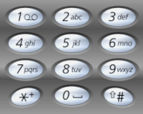

# 1. 题目
给定一个仅包含数字 2-9 的字符串，返回所有它能表示的字母组合。
给出数字到字母的映射如下（与电话按键相同）。注意 1 不对应任何字母。



示例:

输入："23"
输出：["ad", "ae", "af", "bd", "be", "bf", "cd", "ce", "cf"].

# 2. Code
```public static List<String> letterCombinations(String digits) {
        List<String> list = new ArrayList<String>();
        if (digits.length()==0){
            return list;
        }
        backtracking("",digits,0,list);//回溯
        return list;
    }
    /*
     *比如输入1,2。对应的是abc,def。回先从a开始，然后flag+1，依次向下遍历def，
     * 然后依次向上返回返回ad,ae,af，并且添加到结果集中，然后再向上返回到i=0的循环
     * 然后i+1，从b开始，再依次向下遍历def，如同a一样，依次返回所有结果，当所有的遍历完之和，返回到letterCombinations中结束。
     */
    public static void backtracking(String s,String digits,int flag,List<String> list){
        String[] strings = { "", "", "abc", "def", "ghi", "jkl", "mno", "pqrs", "tuv", "wxyz" };
        if (flag >= digits.length()){如果已经遍历完所有输入的数字，说明已经到达底部，需要向上溯源。
            list.add(s);//到达底部说明已经是完整的一个结果，则将此次结果添加到结果集中
            return;//返回，向上回溯
        }
 
        String chars = strings[digits.charAt(flag) - '0'];
        for (int i = 0; i < chars.length(); i++) {//遍历一个数字对应的所有字母
 
            backtracking(s + chars.charAt(i),digits,flag+1,list);//将当前字符加到s上并将flag+1循环下一个数字的字母
        }
    }

```

