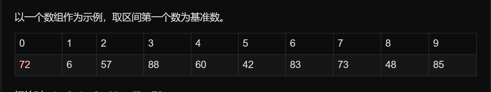

# 1. 基本思想
1．先从数列中取出一个数作为基准数。
2．分区过程，将比这个数大的数全放到它的右边，小于或等于它的数全放到它的左边。
3．再对左右区间重复第二步，直到各区间只有一个数。
虽然快速排序称为分治法，但分治法这三个字显然无法很好的概括快速排序的全部步骤。因此我的对快速排序作了进一步的说明：挖坑填数+分治法：
先来看实例吧，定义下面再给出（最好能用自己的话来总结定义，这样对实现代码会有帮助）。
以一个数组作为示例，取区间第一个数为基准数。


初始时，i = 0;  j = 9;   X = a[i] = 72
由于已经将a[0]中的数保存到X中，可以理解成在数组a[0]上挖了个坑，可以将其它数据填充到这来。
从j开始向前找一个比X小或等于X的数。当j=8，符合条件，将a[8]挖出再填到上一个坑a[0]中。a[0]=a[8]; i++;  这样一个坑a[0]就被搞定了，但又形成了一个新坑a[8]，这怎么办了？简单，再找数字来填a[8]这个坑。这次从i开始向后找一个大于X的数，当i=3，符合条件，将a[3]挖出再填到上一个坑中a[8]=a[3]; j--;
数组变为：

 i = 3;   j = 7;   X=72
再重复上面的步骤，先从后向前找，再从前向后找。
从j开始向前找，当j=5，符合条件，将a[5]挖出填到上一个坑中，a[3] = a[5]; i++;
从i开始向后找，当i=5时，由于i==j退出。
此时，i = j = 5，而a[5]刚好又是上次挖的坑，因此将X填入a[5]。
 
数组变为：

可以看出a[5]前面的数字都小于它，a[5]后面的数字都大于它。因此再对a[0…4]和a[6…9]这二个子区间重复上述步骤就可以了。
对挖坑填数进行总结
1．i =L; j = R; 将基准数挖出形成第一个坑a[i]。
2．j--由后向前找比它小的数，找到后挖出此数填前一个坑a[i]中。
3．i++由前向后找比它大的数，找到后也挖出此数填到前一个坑a[j]中。
4．再重复执行2，3二步，直到i==j，将基准数填入a[i]中。
```
代码如下：

void quick_sort(int s[], int l, int r){
    if(l>=r)
      return ;
    int x=s[l]; 
    while(l<r){
      while(l<r&&s[j]<x)
        j--;
        if(l<r)
          s[i++]=s[j];
    while(l<r&&s[j]>x)
        i++;
        if(l<r)
         s[j--]=s[i];
    }
    s[i]=x;
    quick_sort(s,l,i-1);
    quick_sort(s,i+1,r);
}
```