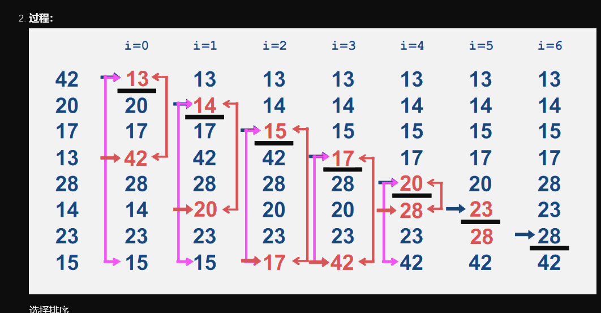

# 1. 基本思想：
在要排序的一组数中，假定前n-1个数已经排好序，现在将第n个数插到前面的有序数列中，使得这n个数也是排好顺序的。如此反复循环，直到全部排好顺序。

代码
```
public static void  insert_sort(int array[]){
	
	
	int temp;
	for(int i = 0 ;i <  array.length ;i++){
		
		for(int j = i + 1; j >  0 ; j-- ){
			
			if(array[j-1] >array[j]){
			   temp = array[j];
			   array[j] = array[j-1];
			   array[j-1] = temp;
			}
			else{
				break;
			}
		}
		
	}
	
}
```
