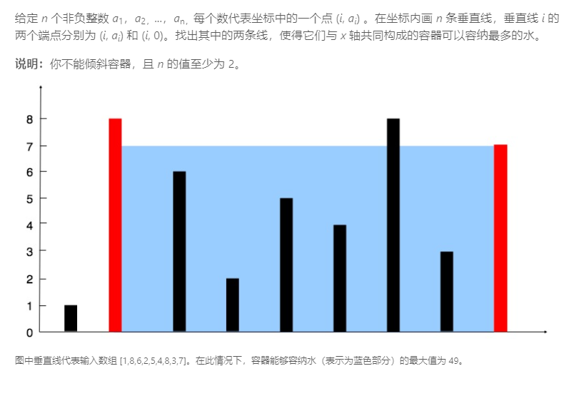
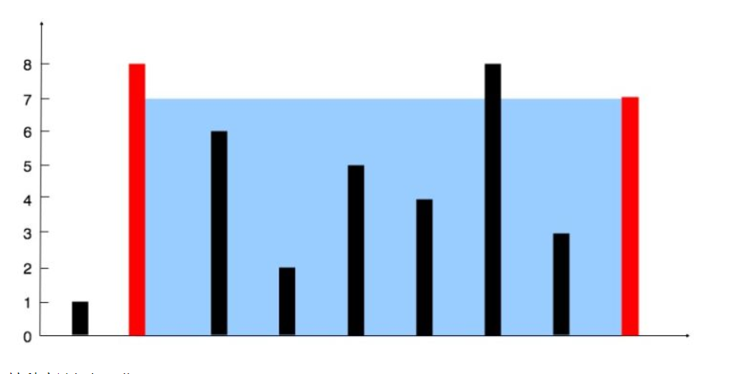

# 1. 题目

示例:

输入: [1,8,6,2,5,4,8,3,7]
输出: 49
# 2. Solution
方法二、双指针法：
算法

这种方法背后的思路在于，两线段之间形成的区域总是会受到其中较短那条长度的限制。此外，两线段距离越远，得到的面积就越大。

我们在由线段长度构成的数组中使用两个指针，一个放在开始，一个置于末尾。 此外，我们会使用变量 maxarea 来持续存储到目前为止所获得的最大面积。 在每一步中，我们会找出指针所指向的两条线段形成的区域，更新 maxarea，并将指向较短线段的指针向较长线段那端移动一步。

查看下面的例子将有助于你更好地理解该算法：

1 8 6 2 5 4 8 3 7

这种方法如何工作？


最初我们考虑由最外围两条线段构成的区域。现在，为了使面积最大化，我们需要考虑更长的两条线段之间的区域。如果我们试图将指向较长线段的指针向内侧移动，矩形区域的面积将受限于较短的线段而不会获得任何增加。但是，在同样的条件下，移动指向较短线段的指针尽管造成了矩形宽度的减小，但却可能会有助于面积的增大。因为移动较短线段的指针会得到一条相对较长的线段，这可以克服由宽度减小而引起的面积减小。


# 3. Code
```
Java 代码实现

public class Solution {
    public int maxArea(int[] height) {
        int maxarea = 0, l = 0, r = height.length - 1;
        while (l < r) {
            maxarea = Math.max(maxarea, Math.min(height[l], height[r]) * (r - l));
            if (height[l] < height[r])
                l++;
            else
                r--;
        }
        return maxarea;
    }
}
复杂度分析

时间复杂度：O(n)，一次通过。
空间复杂度：O(1)，使用恒定的空间。
```